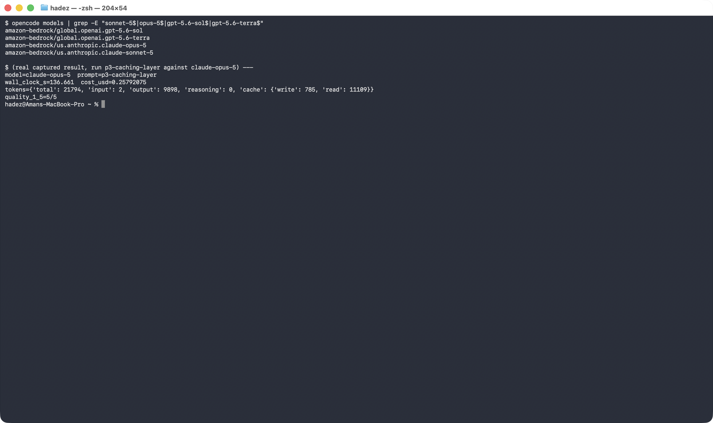
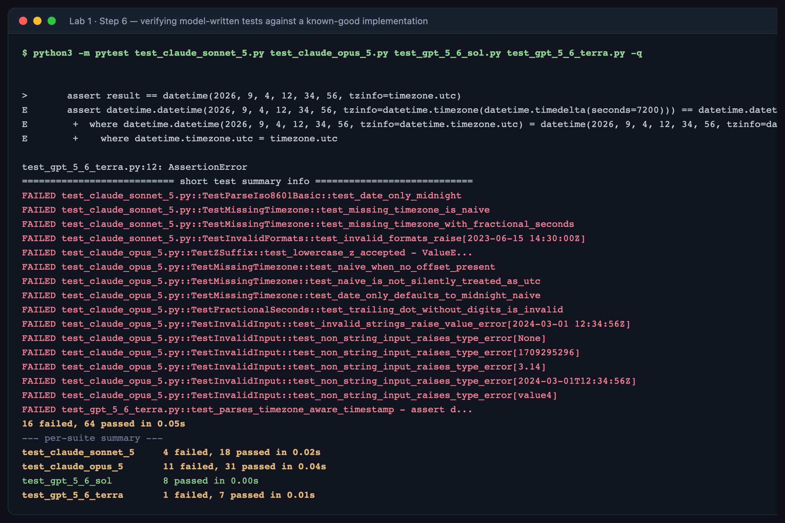
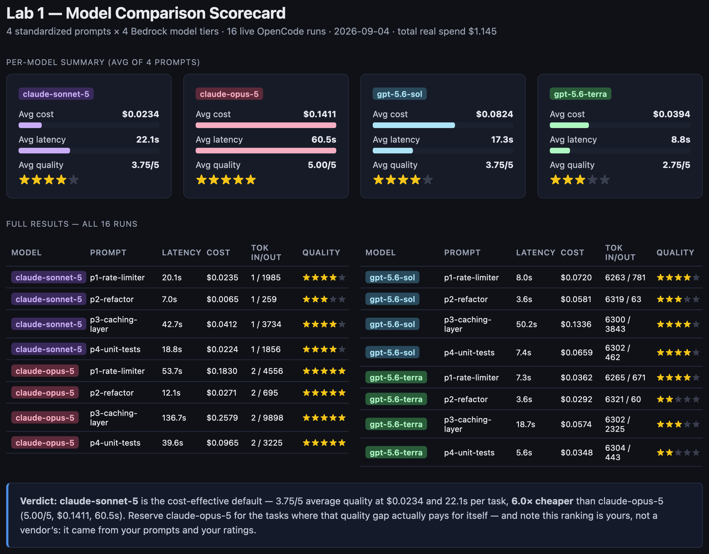

# Lab 1 — API Familiarization & Baseline Testing

**Maps to:** Module 1, *The Multi-Model Imperative*
**Duration:** ~90 minutes
**Status:** Tested end-to-end on macOS (Darwin 25.5.0) against live AWS Bedrock. Every number,
screenshot and test result in this document came from a real run — nothing is illustrative.

---

## 1. Lab Overview & Objectives

Most teams pick a model the way they pick a default font: someone chose it once, and nobody
re-opened the question. This lab replaces that habit with evidence you generated yourself.

You will wire **OpenCode** (an open-source AI coding agent CLI) to **AWS Bedrock**, send four
identical, realistic coding prompts to **four different model tiers across two vendors**, and
capture the real cost, latency and token counts of all sixteen calls. You will then do the part
most benchmarks skip: **actually run the generated code** to find out whether it works, and turn
those findings into a scorecard you can put in front of your team.

The end state is a single HTML dashboard showing cost, latency and quality side by side, backed
by test output you can point at.

**Learning objectives — by the end of this lab you will be able to:**

1. Configure OpenCode to authenticate against AWS Bedrock and confirm that multiple model tiers,
   from more than one vendor, are reachable from your account.
2. Run a controlled benchmark — identical prompts, every model — and capture real per-call cost
   and token accounting from OpenCode's own telemetry rather than a hand-maintained price list.
3. Verify AI-generated code by executing it, and distinguish a **genuine bug** from a
   **specification disagreement** — the single most important skill in this lab.
4. Produce a model comparison scorecard that justifies a model-selection decision on cost,
   latency and measured quality.

> **What this lab deliberately does not do:** it does not tell you which model is "best". It
> gives you a repeatable method for answering that question *for your own workload*, which is a
> different and more durable thing. The numbers below are from one run on one day; your prompts
> and your ratings will move them.

---

## 2. Prerequisites & Environment Setup

### 2.1 Software

| Requirement | Tested with | Notes |
|---|---|---|
| macOS or Linux | Darwin 25.5.0 | Windows works via WSL2 |
| Node.js + npm | Node v26.4.0 / npm 11.17.0 | needed to install OpenCode |
| Python | 3.14.6 | 3.10+ is fine |
| AWS CLI v2 | 2.35.11 | used only to confirm credentials |

### 2.2 AWS access

You need an AWS account with **Bedrock model access approved** for the four models below.
Approval is per-account **and per-region**, and it is not instant — do this before the lab, not
during it. In the AWS console: **Bedrock → Model access → Modify model access**.

- `anthropic.claude-sonnet-5`
- `anthropic.claude-opus-5`
- `openai.gpt-5.6-sol`
- `openai.gpt-5.6-terra`

Your credentials need `bedrock:InvokeModel` and `bedrock-runtime:Converse`.

Confirm credentials resolve:

```bash
aws sts get-caller-identity
```

**Expected output:** a JSON block containing your `Account` and `Arn`. If this errors, fix it
before continuing — nothing later in the lab can succeed without it.

### 2.3 Install OpenCode

```bash
npm install -g opencode-ai
opencode --version
```

**Expected output:** a version string, e.g. `1.18.27`.

> **Tested gotcha:** npm may warn that OpenCode's `postinstall` script was blocked by its
> `allow-scripts` guard. In our testing the CLI worked anyway. Only if `opencode` then
> misbehaves, re-run: `npm install -g --allow-scripts=opencode-ai opencode-ai`

### 2.4 Project directory and Python environment

```bash
mkdir -p opencode-bedrock-labs && cd opencode-bedrock-labs
python3 -m venv .venv
./.venv/bin/pip install --upgrade pip pytest flask
./.venv/bin/python -m pytest --version
```

**Expected output:** `pytest 9.x.x`

> **Why a virtualenv:** Step 6 runs model-generated test suites with pytest. A system Python
> usually has no pytest installed, and `python3 -m pytest` will fail with
> `No module named pytest`. This step exists because that is exactly what happened during
> testing.
>
> **Why Flask:** you are not building a web app. Flask is here because **two of the four models
> spontaneously wrapped their rate limiter in a Flask app** and put `from flask import ...` at
> module level, so their code cannot even be imported without it. That is a finding about model
> behaviour, not a requirement of the task — see Step 5.

### 2.5 Point OpenCode at Bedrock

Create `opencode.json` in the project root:

```json
{
  "$schema": "https://opencode.ai/config.json",
  "provider": {
    "amazon-bedrock": {
      "options": {
        "region": "<YOUR_AWS_REGION>"
      }
    }
  }
}
```

Then export credentials into your shell — **required**, see the gotcha below:

```bash
export AWS_REGION=<YOUR_AWS_REGION>
export AWS_PROFILE=<YOUR_AWS_PROFILE>
```

> **Tested gotcha — the most common failure in this lab:** OpenCode does **not** inherit the AWS
> CLI's implicit default-profile behaviour. If `AWS_PROFILE` is unset, `opencode run` fails with
> `Error: AWS SigV4 authentication requires AWS credentials... AWS access key ID setting is
> missing` — *even in a shell where `aws sts get-caller-identity` works perfectly*. Export
> `AWS_PROFILE` (or `AWS_ACCESS_KEY_ID` / `AWS_SECRET_ACCESS_KEY`) explicitly.

---

## 3. Architecture

The whole lab is one pass down this diagram: prompts in on the left, a scorecard out at the
bottom, with a verification loop that makes the quality column mean something.


*Vector version: [`lab-1-architecture.svg`](artifacts/lab-1/diagrams/lab-1-architecture.svg)*

Text summary of the same flow, if you prefer it linear:

```
prompts/p1..p4.txt  (identical bytes for every model)
        │
        ▼
run_benchmark.py ──> opencode run --agent plan --model <id> --format json
        │
        ├─> us.anthropic.claude-sonnet-5      ┐
        ├─> us.anthropic.claude-opus-5        │ 4 prompts × 4 models
        ├─> global.openai.gpt-5.6-sol         │ = 16 measured calls
        └─> global.openai.gpt-5.6-terra       ┘
        │
        ▼
artifacts/lab-1/runs/<model>__<prompt>.jsonl      (raw event stream per call)
        │
        ├─> tools/extract_responses.py  ──> responses/*.md + code/<prompt>/<model>.py
        │                                        │
        │                                        ▼
        │                                 VERIFICATION (steps 5 & 6)
        │                                 tools/verify_rate_limiters.py   -> 4/4 pass
        │                                 pytest vs. reference impl       -> 64 pass, 16 fail
        │                                        │
        ├─> tools/score.py --interactive  <──────┘  (findings inform the 1–5 rating)
        │                                 ──> quality_scores.csv
        │
        └─> tools/build_dashboard.py      ──> scorecard.csv + dashboard.html  ★ deliverable
```

**Two design decisions worth understanding before you run anything:**

- **`--agent plan`** puts OpenCode in a read-only mode: it can read files but cannot write or
  edit them. Without it, a prompt like *"write a rate limiter"* causes the agent to create files
  in your working directory, and you are benchmarking its file-editing behaviour instead of its
  code generation. With it, the code comes back as response text — which is what you want to
  compare.
- **`--format json`** emits newline-delimited JSON events instead of pretty terminal output. The
  event that matters is `step_finish`, which carries the real cost and token counts computed by
  OpenCode from the actual per-token price of whichever model answered. **You never maintain a
  pricing table**, which is the usual reason home-made benchmarks go stale.

---

## 4. Step-by-Step Instructions

### Step 1 — Confirm all four model tiers are reachable

**Why:** An access or naming problem is far cheaper to find now than fifteen calls into a
benchmark. This also surfaces a genuine naming trap (see the gotcha).

```bash
opencode models | grep -E "^amazon-bedrock/(us\.anthropic\.claude-(sonnet|opus)-5|global\.openai\.gpt-5\.6-(sol|terra))$"
```

**Expected output — four lines, in any order:**

```
amazon-bedrock/global.openai.gpt-5.6-sol
amazon-bedrock/global.openai.gpt-5.6-terra
amazon-bedrock/us.anthropic.claude-opus-5
amazon-bedrock/us.anthropic.claude-sonnet-5
```

If you get fewer than four lines, stop and fix it — see Troubleshooting.



> **Tested gotcha:** the GPT-5.6 tiers appear in OpenCode's catalog **only** under the `global.`
> prefix, while the Claude tiers use `us.`. This is true even though `aws bedrock
> list-inference-profiles` shows `us.openai.gpt-5.6-terra` as ACTIVE. Using `us.openai...` with
> OpenCode gives a "model not found" error that looks like a permissions problem but isn't.

### Step 2 — Write the standardized prompts

**Why:** A benchmark is only a benchmark if every model gets a byte-identical task. The four
prompts are chosen to cover genuinely different kinds of work, because models do not rank the
same way across them — which is the whole point of the exercise.

| Prompt | Kind of work | What it tends to reveal |
|---|---|---|
| p1 rate limiter | algorithmic implementation | correctness, and how much API surface a model invents |
| p2 refactor | small, well-defined edit | whether a model over-engineers a trivial task |
| p3 caching layer | open-ended design | reasoning depth, and cost of verbosity |
| p4 unit tests | test generation | thoroughness, and how it handles ambiguity |

```bash
mkdir -p prompts

cat > prompts/p1-rate-limiter.txt << 'EOF'
Write a rate limiter for a REST API in Python using the token bucket algorithm. Return the code directly in your response text; do not create any files.
EOF

cat > prompts/p2-refactor.txt << 'EOF'
Refactor the following Python function for readability. Keep behavior identical. Return the refactored code directly in your response text; do not create any files.

def calc(a,b,c,d,type):
    if type=="sum":
        x=a+b+c+d
        return x
    elif type=="avg":
        x=(a+b+c+d)/4
        return x
    else:
        return None
EOF

cat > prompts/p3-caching-layer.txt << 'EOF'
Design a caching layer for a read-heavy product catalog service (millions of reads/day, catalog updates a few times per hour). Describe your approach (eviction policy, invalidation strategy, cache-aside vs write-through) and provide the core cache logic in code. Return everything directly in your response text; do not create any files.
EOF

cat > prompts/p4-unit-tests.txt << 'EOF'
Write unit tests (pytest) for a function `parse_iso8601(s: str) -> datetime` that parses ISO-8601 timestamps, covering at least 4 edge cases (e.g. missing timezone, fractional seconds, 'Z' suffix, invalid format). Return the test code directly in your response text; do not create any files.
EOF

ls prompts/
```

**Expected output:** four `.txt` files listed.

Note the closing instruction on every prompt — *"Return the code directly in your response text;
do not create any files."* Combined with `--agent plan`, this is belt-and-braces: you want text
back, not filesystem side effects.

### Step 3 — Run the benchmark across all four models

**Why:** This is the measurement itself. Sixteen calls, one loop, structured output captured to
disk so that every later step works from saved evidence rather than a scrollback buffer.

Save this as `run_benchmark.py`:

```python
import json
import subprocess
import time
from pathlib import Path

MODELS = [
    ("claude-sonnet-5", "amazon-bedrock/us.anthropic.claude-sonnet-5"),
    ("claude-opus-5",   "amazon-bedrock/us.anthropic.claude-opus-5"),
    ("gpt-5.6-sol",     "amazon-bedrock/global.openai.gpt-5.6-sol"),
    ("gpt-5.6-terra",   "amazon-bedrock/global.openai.gpt-5.6-terra"),
]

PROMPTS = [
    ("p1-rate-limiter",  "prompts/p1-rate-limiter.txt"),
    ("p2-refactor",      "prompts/p2-refactor.txt"),
    ("p3-caching-layer", "prompts/p3-caching-layer.txt"),
    ("p4-unit-tests",    "prompts/p4-unit-tests.txt"),
]

OUT_DIR = Path("artifacts/lab-1/runs")
OUT_DIR.mkdir(parents=True, exist_ok=True)

results = []

for model_name, model_id in MODELS:
    for prompt_name, prompt_path in PROMPTS:
        prompt_text = Path(prompt_path).read_text()
        out_file = OUT_DIR / f"{model_name}__{prompt_name}.jsonl"
        print(f"=== {model_name} / {prompt_name} ===", flush=True)

        start = time.time()
        proc = subprocess.run(
            ["opencode", "run", "--agent", "plan", "--model", model_id,
             "--format", "json", prompt_text],
            capture_output=True, text=True, timeout=300,
        )
        wall_clock = time.time() - start

        out_file.write_text(proc.stdout)
        if proc.returncode != 0:
            print(f"  FAILED (exit {proc.returncode}): {proc.stderr[:300]}")
            results.append({
                "model": model_name, "prompt": prompt_name,
                "wall_clock_s": round(wall_clock, 3),
                "status": "FAILED", "error": proc.stderr[:500],
            })
            continue

        text, tokens, cost = "", {}, None
        for line in proc.stdout.splitlines():
            try:
                event = json.loads(line)
            except json.JSONDecodeError:
                continue
            if event.get("type") == "text":
                text += event["part"].get("text", "")
            if event.get("type") == "step_finish":
                tokens = event["part"].get("tokens", {})
                cost = event["part"].get("cost")

        results.append({
            "model": model_name, "prompt": prompt_name,
            "wall_clock_s": round(wall_clock, 3), "status": "OK",
            "cost_usd": cost, "tokens": tokens, "response_chars": len(text),
        })
        print(f"  OK  wall_clock={wall_clock:.2f}s  cost=${cost}  tokens={tokens}", flush=True)

Path("artifacts/lab-1/benchmark_results.json").write_text(json.dumps(results, indent=2))
print("\nDone. Results in artifacts/lab-1/benchmark_results.json")
```

Run it:

```bash
python3 run_benchmark.py
```

**Expected output — 16 blocks, none of them `FAILED`:**

```
=== claude-sonnet-5 / p1-rate-limiter ===
  OK  wall_clock=20.11s  cost=$0.023549  tokens={'total': 13111, 'input': 1, 'output': 1985, 'reasoning': 0, 'cache': {'write': 640, 'read': 10485}}
```

**Budget and time:** the full run took **≈8 minutes** and cost **$1.145** in real Bedrock spend
in our test. Opus is the slow, expensive part — its p3 call alone took 136.7s and $0.258.

> **Tested gotcha — why the same prompt costs different amounts on different runs:** look at the
> `cache` field. The first call to a given model pays a large **cache write** for OpenCode's own
> system prompt and tool definitions (~10–11K tokens on Claude tiers, ~6.3K on GPT-5.6 tiers).
> Later calls hit a warm cache and read it far more cheaply. When we re-ran the p2 prompt against
> Sonnet on a cold cache it cost **$0.031057** (`cache.write: 11202, read: 0`), versus
> **$0.006484** on the warm-cache run recorded in the results table — nearly 5× different for a
> byte-identical prompt. This is not noise to be averaged away; it is a real property of how
> agentic tools bill, and it is worth knowing before you extrapolate a monthly figure from a
> single call.

### Step 4 — Extract responses and code from the raw runs

**Why:** The `.jsonl` files are event streams, not something a human reads or a test runner can
execute. This step splits them into readable Markdown responses and runnable `.py` files, which
Steps 5 and 6 both depend on.

Save as `tools/extract_responses.py`:

```python
#!/usr/bin/env python3
"""Turn raw OpenCode JSONL runs into readable responses + runnable code files."""
import json
import re
import sys
from pathlib import Path

RUNS = Path("artifacts/lab-1/runs")
RESPONSES = Path("artifacts/lab-1/responses")
CODE = Path("artifacts/lab-1/code")

CODE_BLOCK = re.compile(r"```(?:python|py)?\s*\n(.*?)```", re.DOTALL)


def response_text(jsonl_path: Path) -> str:
    """Concatenate every `text` event in an OpenCode --format json run."""
    out = []
    for line in jsonl_path.read_text().splitlines():
        try:
            event = json.loads(line)
        except json.JSONDecodeError:
            continue
        if event.get("type") == "text":
            out.append(event["part"].get("text", ""))
    return "".join(out)


def main() -> int:
    if not RUNS.exists():
        print(f"ERROR: {RUNS} not found - run run_benchmark.py first", file=sys.stderr)
        return 1

    RESPONSES.mkdir(parents=True, exist_ok=True)
    CODE.mkdir(parents=True, exist_ok=True)

    files = sorted(RUNS.glob("*.jsonl"))
    if not files:
        print(f"ERROR: no .jsonl runs in {RUNS}", file=sys.stderr)
        return 1

    extracted = 0
    for jsonl in files:
        model, prompt = jsonl.stem.split("__", 1)
        text = response_text(jsonl)
        (RESPONSES / f"{model}__{prompt}.md").write_text(text)

        blocks = CODE_BLOCK.findall(text)
        if blocks:
            target_dir = CODE / prompt
            target_dir.mkdir(parents=True, exist_ok=True)
            # longest block = the real implementation, not a usage snippet
            best = max(blocks, key=len)
            safe = model.replace("-", "_").replace(".", "_")
            (target_dir / f"{safe}.py").write_text(best)
            extracted += 1
        print(f"{jsonl.stem:<40} {len(text):>6} chars  {len(blocks)} code block(s)")

    print(f"\nWrote {len(files)} responses to {RESPONSES}/")
    print(f"Wrote {extracted} code files to {CODE}/")
    return 0


if __name__ == "__main__":
    raise SystemExit(main())
```

```bash
python3 tools/extract_responses.py
```

**Expected output — 16 lines then a summary:**

```
claude-opus-5__p1-rate-limiter             8536 chars  4 code block(s)
claude-opus-5__p2-refactor                 1493 chars  1 code block(s)
...
gpt-5.6-terra__p4-unit-tests               1383 chars  1 code block(s)

Wrote 16 responses to artifacts/lab-1/responses/
Wrote 16 code files to artifacts/lab-1/code/
```

Notice the character counts already tell a story: Opus wrote **19,777 characters** for the
caching-layer prompt; Terra wrote **175** for the refactor. Verbosity is not quality, but it is
cost — and you are about to find out which it was in each case.

### Step 5 — Verify the rate limiters by running them

**Why:** Reading code and calling it "good" is not verification. A token bucket has a testable
contract: allow up to `capacity` requests immediately, reject the next one, allow again after
enough time has passed to refill. Every model's implementation either satisfies that or it does
not.

Look first at the four extracted implementations:

```bash
grep -nE "^(class |    def )" artifacts/lab-1/code/p1-rate-limiter/*.py
```

**What we found — all four disagreed on the interface for the same algorithm:**

| Model | Entry point | Consume call | Returns | Imports Flask? |
|---|---|---|---|---|
| claude-sonnet-5 | `TokenBucket(capacity, refill_rate)` | `.consume(tokens=1)` | `bool` | **yes** |
| claude-opus-5 | `TokenBucket(capacity, rate)` | `.consume(cost=1.0)` | `Decision` dataclass | no |
| gpt-5.6-sol | `TokenBucket(capacity, refill_rate)` | `.consume(tokens=1.0)` | `tuple[bool, float]` | **yes** |
| gpt-5.6-terra | `TokenBucketRateLimiter(rate, capacity)` | `.allow(key, cost=1)` | `bool` | no |

Two things in that table are worth stopping on.

**First, the argument order.** Terra's constructor takes **`(rate, capacity)`** — the reverse of
everyone else's `(capacity, rate)`. `TokenBucketRateLimiter(5, 2)` and `TokenBucket(5, 2)` are
both valid, both silent, and mean *different things*. This is the kind of defect that survives
code review and shows up in production as a mysteriously wrong throughput limit.

**Second, the uninvited web framework.** Nothing in the prompt mentioned Flask. Two of the four
models decided a "rate limiter for a REST API" meant a Flask app, and put `from flask import
Flask, request, jsonify` at module scope — which means their code raises
`ModuleNotFoundError: No module named 'flask'` on import, before any of your tests run. If you
only read the responses, this is invisible. It appears the moment you try to execute them.

Now exercise all four against one contract. Because each model invented a different API, the
script needs a small adapter table — and **writing that table is the exercise**: it is the
switching cost, made concrete. The tool is at
[`tools/verify_rate_limiters.py`](tools/verify_rate_limiters.py):

```bash
./.venv/bin/python tools/verify_rate_limiters.py
```

**Expected output:**

```
model             verdict  returns     burst  reject  refill
--------------------------------------------------------------
claude_sonnet_5   PASS     bool        True   True    True
claude_opus_5     PASS     Decision    True   True    True
gpt_5_6_sol       PASS     tuple       True   True    True
gpt_5_6_terra     PASS     bool        True   True    True
--------------------------------------------------------------
4/4 implementations satisfy the contract
```

**Read that result carefully, because it is the opposite of the p4 result you are about to
get.** On this task every model was *correct*: all four honour capacity, rejection and refill.
The algorithm was never the hard part. What varied was everything around it — return type
(`bool` vs a `Decision` object vs a tuple), method name (`consume` vs `allow`), argument order,
and whether you get a web framework you did not ask for.

That is the finding to take to your team: for well-known algorithms, model choice is rarely a
correctness question. It is an **integration** question, and the cost lands on whoever has to
adapt the surrounding code — a cost no token-counting benchmark will ever show you.

### Step 6 — Verify the generated test suites against a known-good implementation

**Why:** This is the highest-value step in the lab. For p4 you asked four models to write tests.
To judge those tests you need something correct to run them against — so you write the reference
implementation yourself. Any test that fails is then either a bug in the model's test, or a
place where the model made a different assumption than you did. Telling those two apart is the
skill.

Set up the check:

```bash
mkdir -p artifacts/lab-1/p4-correctness-check
cd artifacts/lab-1/p4-correctness-check

cat > your_module.py << 'EOF'
from datetime import datetime


def parse_iso8601(s: str) -> datetime:
    """Parse an ISO-8601 timestamp. Requires an explicit timezone (offset or 'Z')."""
    if not s or not isinstance(s, str):
        raise ValueError(f"invalid ISO-8601 timestamp: {s!r}")
    normalized = s.replace("Z", "+00:00") if s.endswith("Z") else s
    try:
        dt = datetime.fromisoformat(normalized)
    except ValueError as e:
        raise ValueError(f"invalid ISO-8601 timestamp: {s!r}") from e
    if dt.tzinfo is None:
        raise ValueError(f"timestamp missing timezone: {s!r}")
    return dt
EOF
```

Copy each model's generated test code from `artifacts/lab-1/code/p4-unit-tests/` into
`test_<model>.py` here, making sure each one imports from `your_module`. Then run them all:

```bash
../../../.venv/bin/python -m pytest \
  test_claude_sonnet_5.py test_claude_opus_5.py \
  test_gpt_5_6_sol.py test_gpt_5_6_terra.py -q
```

**Expected output (ours, exactly):**

```
16 failed, 64 passed in 0.05s
```



Per suite:

| Model's test suite | Result | Reading |
|---|---|---|
| gpt-5.6-sol | **8 passed** | everything passes — but only 8 tests written |
| gpt-5.6-terra | 1 failed, 7 passed | the one failure is a **real bug** |
| claude-sonnet-5 | 4 failed, 18 passed | all four are spec disagreements |
| claude-opus-5 | 11 failed, 31 passed | 42 tests — most thorough, most disagreements |

**Now do the actual analysis.** A failing test is a bug *only if it is wrong under every
reasonable reading of the specification.* Apply that rule:

**A genuine bug — gpt-5.6-terra:**

```python
def test_parses_timezone_aware_timestamp() -> None:
    result = parse_iso8601("2026-09-04T12:34:56+02:00")
    assert result == datetime(2026, 9, 4, 12, 34, 56, tzinfo=timezone.utc)
```

`12:34:56+02:00` is `10:34:56` UTC. This assertion claims two different instants are equal. It
is wrong under every reading — no specification makes it true. (Terra even hedged with a comment
offering a correct alternative assertion, then shipped the wrong one as the active line.)

**Not bugs — the Claude failures:** almost all of them come from one honest disagreement. Our
reference implementation *rejects* a timestamp with no timezone; the Claude suites assumed such
a timestamp should parse as a naive datetime. Both are defensible designs. The tests are not
wrong; **the specification was underspecified**, and the models made a reasonable call that
differed from ours. Opus additionally expects `TypeError` (not `ValueError`) for non-string
input, which is arguably better API design than our reference.

**The lesson to carry out of this lab:** Opus produced the most failures *and* earns the highest
quality rating, because it wrote the most thorough tests and its disagreements were principled.
Raw pass rate is a misleading metric. A model that writes eight shallow tests that all pass has
not outperformed one that writes forty-two probing tests, five of which expose an ambiguity in
your own spec.

### Step 7 — Rate quality, and build the scorecard

**Why:** Cost and latency are measured for you. Quality is a judgement — but it should be a
*recorded, reviewable* judgement informed by Steps 5 and 6, not a number you invent while
looking at a table.

The full script is in this repo at [`tools/score.py`](tools/score.py). It has two modes:
`--interactive` walks you through each captured response and records a 1–5 rating into
`artifacts/lab-1/quality_scores.csv`; running it with no flags merges those ratings into
`benchmark_results.json` and writes `scorecard.csv`.

Rate all sixteen responses:

```bash
python3 tools/score.py --interactive
```

You will see each response with its cost and latency, then a prompt for a 1–5 rating against
this rubric:

```
  5 = correct, complete, production-shaped (handles edges, documented, no bugs)
  4 = correct and usable, minor gaps (thin edge cases or docs)
  3 = broadly correct, needs real edits before use
  2 = partially correct / misses a stated requirement
  1 = wrong, or ignored the prompt
```

Let Steps 5 and 6 do the arguing: a suite containing a factually wrong assertion should not
score 5, however tidy it looks.

**Expected output when finished:**

```
Saved 16 scores to artifacts/lab-1/quality_scores.csv
Wrote artifacts/lab-1/scorecard.csv (16 rows)
All results rated.
```

Ratings live in `quality_scores.csv`, so they can be reviewed, revised or challenged by a
colleague — which is the difference between an opinion and evidence.

### Step 8 — Build the comparison dashboard

**Why:** Sixteen rows of raw numbers do not settle an argument. Per-model averages, side by
side, with an explicit verdict, do.

The generator is at [`tools/build_dashboard.py`](tools/build_dashboard.py). It reads
`benchmark_results.json`, computes per-model averages, and renders a self-contained HTML file.

```bash
python3 tools/build_dashboard.py
open artifacts/lab-1/dashboard.html      # Linux: xdg-open
```

**Expected output:**

```
Wrote artifacts/lab-1/dashboard.html
  16 results, 4 models, total spend $1.145
  claude-sonnet-5   avg $0.0234    22.1s  3.75/5
  gpt-5.6-terra     avg $0.0394     8.8s  2.75/5
  gpt-5.6-sol       avg $0.0824    17.3s  3.75/5
  claude-opus-5     avg $0.1411    60.5s  5.00/5
```



**This is your deliverable.** Screenshot it; it is the artifact you take back to your team.

Read the verdict line at the bottom, and notice what it is claiming. On this run, Sonnet reached
**3.75/5 at $0.0234 per task — 6.0× cheaper than Opus** at 5.00/5. That does not make Opus the
wrong choice; it makes Opus a choice you should now be able to *justify per task type*, which is
the entire argument for multi-model routing that Modules 2–4 build on.

---

### Step 9: Do it again yourself, on your own workload, unassisted

**Why:** The scorecard you just built ranks four models on four prompts somebody else chose. That is a demonstration. A scorecard that changes a decision has to be built from prompts your team actually sends.

**Your task.** Rebuild the benchmark with a fifth model tier and a fifth prompt of your own.

- Add `claude-haiku-4-5` (or `gpt-5.6-luna` — Lab 1C found it 15× cheaper than the top tier) to `MODELS`.
- Replace at least one of the four prompts with a real task from your own backlog — something you actually asked a model to do last week.
- Re-run the whole pipeline: benchmark → extract → verify → score → dashboard.

**You get the acceptance criteria and nothing else:**

- `benchmark_results.json` holds 25 results, every one with a real positive `cost_usd`
- every result carries a `quality_1_5` you assigned *after* running the generated code, not after reading it
- `dashboard.html` renders 5 model cards and a verdict line
- you can name the model you would route your own prompt to, and say what it costs per 1,000 calls

**Done when** the validation block in §5 passes with 25 rather than 16, and you can defend the choice to someone who has to pay for it.

No commands are given here. Steps 3–7 have them all; the exercise is assembling the pipeline yourself.

---

## 5. Validation / Verification

Run all three checks. Each one proves a different part of the pipeline actually worked.

```bash
python3 -c "
import json, csv
from pathlib import Path

results = json.load(open('artifacts/lab-1/benchmark_results.json'))
assert len(results) == 16, f'expected 16 results, got {len(results)}'

ok = [r for r in results if r.get('status', 'OK') == 'OK']
assert len(ok) == 16, f'{16 - len(ok)} call(s) failed - re-check Step 3 output'
assert all(r['cost_usd'] and r['cost_usd'] > 0 for r in ok), 'every call needs a real cost'
assert all(r.get('quality_1_5') for r in ok), 'every call needs a quality rating (Step 7)'
print('[1/3] OK: 16/16 calls completed with real cost data and a quality rating')

rows = list(csv.DictReader(open('artifacts/lab-1/scorecard.csv')))
assert len(rows) == 16, f'scorecard.csv should have 16 rows, has {len(rows)}'
print('[2/3] OK: scorecard.csv has all 16 rows')

html = Path('artifacts/lab-1/dashboard.html').read_text()
for model in ('claude-sonnet-5', 'claude-opus-5', 'gpt-5.6-sol', 'gpt-5.6-terra'):
    assert model in html, f'{model} missing from dashboard'
assert 'verdict' in html, 'dashboard has no verdict line'
total = sum(r['cost_usd'] for r in ok)
print(f'[3/3] OK: dashboard renders all 4 models + verdict. Total real spend: \${total:.3f}')
"
```

**Expected output:**

```
[1/3] OK: 16/16 calls completed with real cost data and a quality rating
[2/3] OK: scorecard.csv has all 16 rows
[3/3] OK: dashboard renders all 4 models + verdict. Total real spend: $1.145
```

**You have succeeded when you can answer these three questions from your own dashboard**, not
from this document:

1. Which model gives you the best quality per dollar *on your prompts*?
2. On which single prompt did the cheapest model do just as well as the most expensive one — and
   what does that tell you about routing work by task type?
3. Which model would you not let near production code, and what specific test failure is your
   evidence?

---

## 6. Troubleshooting Tips

**`Error: AWS SigV4 authentication requires AWS credentials... AWS access key ID setting is
missing`**
OpenCode does not fall back to the AWS CLI's implicit default profile. Export credentials
explicitly — `export AWS_PROFILE=<YOUR_AWS_PROFILE>` — even though `aws sts get-caller-identity`
works in the same shell. This is the single most common failure in this lab.

**Step 1 returns fewer than four models — GPT-5.6 tiers missing**
Use the `global.` prefix, not `us.`, for the OpenAI models:
`amazon-bedrock/global.openai.gpt-5.6-sol`. The `us.` variants exist in AWS's inference-profile
list but are not in OpenCode's catalog, so `us.openai...` fails in a way that looks like a
permissions error.

**`AccessDeniedException` on one specific model**
Bedrock model access is granted per-model, per-account, **per-region**. Go to Bedrock → Model
access and request the exact model ID that failed, in the same region as your `AWS_REGION`.
Approval is not always instant.

**`No module named pytest` in Step 6**
You are on system Python. Use the virtualenv from §2.4:
`./.venv/bin/python -m pytest ...`

**`ModuleNotFoundError: No module named 'flask'` in Step 5**
Expected, and itself a finding: two of the four models wrapped their rate limiter in a Flask app
and import it at module level. Install it into the venv (`./.venv/bin/pip install flask`) and
run the verifier with `./.venv/bin/python`, not system `python3`. Note which models did this —
it belongs in your quality rating, since an unrequested framework dependency is a real
integration cost.

**`TypeError` when constructing a model's rate limiter**
Check the argument order against the table in Step 5. gpt-5.6-terra takes `(rate, capacity)`;
the others take `(capacity, rate)`. Positional arguments will silently do the wrong thing rather
than raise, so pass them by keyword.

**A model wrote files into your project directory instead of returning code**
You omitted `--agent plan`. That flag makes the agent read-only. Delete the stray files, re-run
that call with the flag, and note that its cost/latency figures were measuring the wrong thing.

**The same prompt cost noticeably more than the recorded figure**
Check `cache.write` versus `cache.read` in the run's `step_finish` event. A cold prompt cache
adds ~6–11K written tokens. This is expected — see the gotcha in Step 3 — and is itself a useful
finding about how agentic tooling bills.

**`tools/score.py` warns that results are unrated**
`build_dashboard.py` needs `quality_1_5` on every row. Re-run
`python3 tools/score.py --interactive` and rate the entries it lists.

---

## 7. Cleanup Steps

This lab creates **no persistent cloud infrastructure** — that is a deliberate property of the
"no gateway, use Bedrock directly" approach. Bedrock is billed per call, so once the run is
finished there is nothing left accruing cost. There is nothing to tear down in AWS.

Keep your evidence. Remove only the scratch files:

```bash
# scratch and caches - safe to delete
rm -rf __pycache__ .pytest_cache
rm -rf artifacts/lab-1/p4-correctness-check/.pytest_cache
rm -rf artifacts/lab-1/code/p1-rate-limiter/__pycache__

# optional: the virtualenv, if you are done with the whole lab series
rm -rf .venv
```

**Do not delete** `artifacts/lab-1/` — `dashboard.html`, `scorecard.csv`,
`benchmark_results.json` and `runs/` are the deliverable and its supporting proof. If you want
to reset and re-run the benchmark from scratch, delete `artifacts/lab-1/runs/` and
`benchmark_results.json` only; note that this costs another ~$1.15.

Confirm nothing is left running:

```bash
pgrep -fl opencode || echo "no opencode processes running"
```

---

## Optional extensions

- **Add a fifth tier.** Put Claude Haiku 4.5
  (`amazon-bedrock/us.anthropic.claude-haiku-4-5-20251001-v1:0`) into `MODELS` and re-run. Where
  does it land on cost-per-quality? Does it change your verdict?
- **Measure the prompt cache directly.** Run a short prompt twice as two fresh `opencode run`
  calls, then as `opencode run --title X "..."` followed by `opencode run --continue "..."`, and
  compare the `cost` field. Session continuation reuses the cached system prompt and measurably
  cuts the second call's cost.
- **Close the spec gap you found.** Take the missing-timezone ambiguity from Step 6, decide
  explicitly what your team wants, state it in the prompt, and re-run p4. Confirm all four models
  now agree. This is the cheapest possible demonstration that most "model quality" problems are
  really prompt-specification problems.
- **Re-rate blind.** Have a colleague rate the same 16 responses without seeing your
  `quality_scores.csv`, then compare. Where you disagree is where your rubric needs sharpening.
