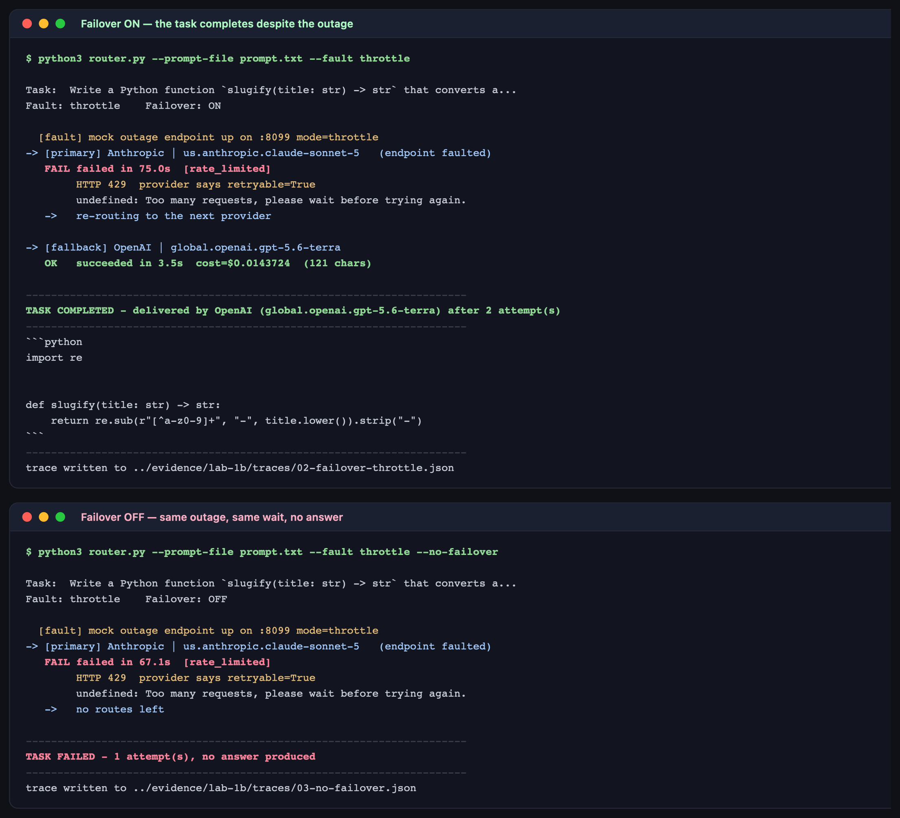

# Lab 1B — Vendor Lock-In & Failover Simulation

**Maps to:** Module 1, *"Mitigating vendor lock-in and managing API latency"*
**Duration:** ~45 minutes
**Prerequisite:** Lab 1 (you need a working OpenCode + Bedrock setup)
**Status:** Tested end-to-end on macOS (Darwin 25.5.0) against live AWS Bedrock. Every timing,
HTTP status and cost quoted below came from a real run — including the failures.

---

## 1. Lab Overview & Objectives

Lab 1 asked *which model should we use?* This lab asks the question that decides whether that
choice is safe: **what happens when the model you chose stops answering?**

You will take a working coding task, inject a **real HTTP-level provider failure** underneath it,
and watch the task fail. Then you will put a cross-vendor failover router in front of it and watch
the identical task complete anyway — answered by a different vendor, with a trace proving the
handoff. Finally you will inject a failure that is *your own fault* and confirm the router
correctly **refuses** to fail over, because a router that re-routes on everything is worse than no
router at all.

The fault is not a mocked Python function. You point OpenCode's Bedrock provider at a local
endpoint that returns genuine `ThrottlingException` responses, so the failure happens inside the
AWS SDK, at the HTTP layer, after OpenCode's own internal retries are exhausted — the same place a
real incident would hit you.

**Learning objectives — by the end of this lab you will be able to:**

1. Inject a realistic, reproducible provider outage into an agentic coding tool without touching
   production infrastructure or waiting for a real incident.
2. Build a routing layer that fails over across **vendors**, and explain why a same-vendor
   fallback does not mitigate vendor lock-in.
3. Classify a provider failure from structured error telemetry (`statusCode`, `isRetryable`) and
   decide correctly whether it justifies re-routing.
4. Produce a failover trace that demonstrates continuity of service during an outage — the
   artifact your platform or SRE team will actually ask for.

> **The uncomfortable point of this lab:** most "multi-model" strategies are really *multi-model
> shopping*, not multi-model *resilience*. If your fallback is another model from the same vendor
> behind the same endpoint, you have bought variety, not availability.

---

## 2. Prerequisites & Environment Setup

### 2.1 From Lab 1

You need everything Lab 1 set up:

- OpenCode installed (tested with `1.18.27`)
- Bedrock model access approved for `anthropic.claude-sonnet-5` **and** `openai.gpt-5.6-terra`
- Python 3.10+ (tested 3.14.6) — the standard library is enough; no pip installs for this lab

```bash
export AWS_REGION=<YOUR_AWS_REGION>
export AWS_PROFILE=<YOUR_AWS_PROFILE>
opencode models | grep -E "claude-sonnet-5|gpt-5\.6-terra"
```

**Expected output — two lines:**

```
amazon-bedrock/global.openai.gpt-5.6-terra
amazon-bedrock/us.anthropic.claude-sonnet-5
```

> Both models are reached through **one** Bedrock endpoint with **one** set of credentials. That
> is what makes cross-vendor failover practical here: no second contract, no second API key, no
> second bill to reconcile.

### 2.2 A free local port

The fault injector listens on `127.0.0.1:8099`. Confirm nothing else has it:

```bash
lsof -nP -iTCP:8099 || echo "port 8099 is free"
```

**Expected output:** `port 8099 is free`

### 2.3 Lab directory

```bash
mkdir -p lab-1b-failover/configs/healthy lab-1b-failover/configs/faulted
mkdir -p artifacts/lab-1b/traces artifacts/lab-1b/screenshots
cd lab-1b-failover
```

### 2.4 Cost and time

Six scenarios, roughly **6 minutes** of wall clock and well under **$0.15** of real Bedrock spend.
Most of the elapsed time is spent *waiting for failures*, which is itself one of the lab's
findings.

---

## 3. Architecture


*Vector version: [`lab-1b-architecture.svg`](artifacts/lab-1b/diagrams/lab-1b-architecture.svg)*

The same flow, linear:

```
prompt.txt  ─────────────────────────────► router.py
                                              │
                    ┌─────────────────────────┴──────────────────────────┐
                    │  attempt 1: PRIMARY   Anthropic claude-sonnet-5     │
                    │  config dir: configs/faulted/  (baseURL overridden) │
                    └─────────────────────────┬──────────────────────────┘
                                              ▼
                              http://127.0.0.1:8099   ← mock_outage.py
                                              │        returns 429 / 503 / 400
                                              ▼        (or hangs, for timeouts)
                          {"type":"error", ... "statusCode":429,
                                             "isRetryable":true}   on STDOUT
                                              │
                                    classify(statusCode, isRetryable)
                                              │
                     ┌────────────────────────┴────────────────────────┐
                     │                                                 │
          failover-worthy?  YES                          failover-worthy?  NO
          (429, 5xx, timeout, conn refused)              (4xx client_error)
                     │                                                 │
                     ▼                                                 ▼
   attempt 2: FALLBACK  OpenAI gpt-5.6-terra              HALT - do not re-route
   config dir: configs/healthy/  → real Bedrock           (it is our bug, not theirs)
                     │                                                 │
                     ▼                                                 ▼
        TASK COMPLETED, delivered by OpenAI                    TASK FAILED, on purpose
                     │
                     ▼
        artifacts/lab-1b/traces/*.json   ★ deliverable
```

**The one mechanism that makes this work:** OpenCode reads `opencode.json` from the directory
given by `--dir`. So each attempt can run under a *different provider configuration* simply by
pointing at a different directory — the primary at a faulted config, the fallback at a healthy
one — without editing files mid-run or restarting anything.

---

## 4. Step-by-Step Instructions

### Step 1 — Establish the healthy baseline

**Why:** Before simulating a failure you need proof of what success looks like, or you cannot tell
a successful failover from a lab that never worked.

Create the two provider configs. They differ by exactly one line:

```bash
cat > configs/healthy/opencode.json << 'EOF'
{
  "$schema": "https://opencode.ai/config.json",
  "provider": {
    "amazon-bedrock": {
      "options": { "region": "us-east-1" }
    }
  }
}
EOF

cat > configs/faulted/opencode.json << 'EOF'
{
  "$schema": "https://opencode.ai/config.json",
  "provider": {
    "amazon-bedrock": {
      "options": {
        "region": "us-east-1",
        "baseURL": "http://127.0.0.1:8099"
      }
    }
  }
}
EOF
```

And the task itself:

```bash
cat > prompt.txt << 'EOF'
Write a Python function `slugify(title: str) -> str` that converts a string into a URL-safe slug: lowercase, spaces and punctuation replaced with single hyphens, no leading or trailing hyphens. Return the code directly in your response text; do not create any files.
EOF
```

Confirm the healthy path works:

```bash
opencode run --dir configs/healthy --agent plan \
  --model amazon-bedrock/us.anthropic.claude-sonnet-5 "Say OK and nothing else"
```

**Expected output:** a short reply containing `OK`. If this fails, fix it before injecting faults —
otherwise you will be debugging your credentials while believing you are watching an outage.

### Step 2 — Build the fault injector

**Why:** A believable outage has to fail where a real one does. Patching a Python function would
prove nothing about how OpenCode, the AWS SDK, and its retry logic behave. A real socket returning
real Bedrock error bodies does.

Save as `mock_outage.py`:

```python
#!/usr/bin/env python3
"""A fake Bedrock endpoint that fails, so you can simulate a provider outage.

Modes:
  throttle      429 ThrottlingException  (rate limited - the realistic incident)
  server-error  503 ServiceUnavailable   (provider down)
  client-error  400 ValidationException  (OUR bug - failover must NOT fire)
  timeout       accepts the connection, never responds (client must give up)

Usage: python3 mock_outage.py [throttle|server-error|client-error|timeout] [port]
"""
import json
import sys
import time
from http.server import BaseHTTPRequestHandler, HTTPServer

MODES = {
    # (http status, Bedrock exception name, message)
    "throttle":     (429, "ThrottlingException",
                     "Too many requests, please wait before trying again."),
    "server-error": (503, "ServiceUnavailableException",
                     "The service is temporarily unavailable."),
    # A 400 is OUR bug, not the provider's. The router must NOT fail over on it.
    "client-error": (400, "ValidationException",
                     "The provided model identifier is invalid."),
    "timeout":      (0,   "", ""),
}

mode = sys.argv[1] if len(sys.argv) > 1 else "throttle"
port = int(sys.argv[2]) if len(sys.argv) > 2 else 8099
if mode not in MODES:
    print(f"unknown mode {mode!r}; pick one of {list(MODES)}", file=sys.stderr)
    raise SystemExit(2)
status, err_type, message = MODES[mode]


class Handler(BaseHTTPRequestHandler):
    def _respond(self):
        if mode == "timeout":
            print(f"HANG {self.command} {self.path}", flush=True)
            time.sleep(600)          # never answer; the client must time out
            return
        body = json.dumps({"__type": err_type, "message": message}).encode()
        self.send_response(status)
        self.send_header("Content-Type", "application/json")
        self.send_header("Content-Length", str(len(body)))
        self.end_headers()
        self.wfile.write(body)
        print(f"HIT {self.command} {self.path} -> {status} {err_type}", flush=True)

    do_GET = do_POST = do_PUT = _respond

    def log_message(self, *args):
        pass                          # keep our own log clean


if __name__ == "__main__":
    print(f"mock outage endpoint listening on 127.0.0.1:{port} mode={mode}", flush=True)
    HTTPServer(("127.0.0.1", port), Handler).serve_forever()
```

Prove the injector works before wiring it in — start it in one terminal:

```bash
python3 mock_outage.py throttle 8099
```

and in another:

```bash
curl -s -i http://127.0.0.1:8099/anything | head -5
```

**Expected output:**

```
HTTP/1.0 429 Too Many Requests
Content-Type: application/json
...
{"__type": "ThrottlingException", "message": "Too many requests, please wait before trying again."}
```

Now point OpenCode at it and watch a real model call fail:

```bash
opencode run --dir configs/faulted --agent plan \
  --model amazon-bedrock/us.anthropic.claude-sonnet-5 "Say OK"
```

**Expected output:**

```
Error: undefined: Too many requests, please wait before trying again.
```

Look at the mock's terminal. You will see **more than one hit** for the same model — OpenCode
retries internally before surfacing the error. That built-in retry is real, and it is also the
reason the primary takes over a minute to fail: it is not hanging, it is being diligent. Stop the
mock with Ctrl-C when you have seen this.

### Step 3 — Understand what a failure actually looks like

**Why:** Your router has to *decide* something, and it can only decide on information it can
read. Where OpenCode reports errors is not where most people look.

Run the faulted call again with `--format json` and inspect both streams. You will find:

- **stderr is empty.** String-matching stderr — the obvious approach — finds nothing.
- **stdout carries one structured event**, which is where the useful fields live:

```json
{
  "type": "error",
  "error": {
    "name": "APIError",
    "data": {
      "message": "undefined: Too many requests, please wait before trying again.",
      "statusCode": 429,
      "isRetryable": true,
      "responseBody": "{\"__type\": \"ThrottlingException\", \"message\": \"...\"}",
      "metadata": { "url": "http://127.0.0.1:8099/model/us.anthropic.claude-sonnet-5/converse-stream" }
    }
  }
}
```

Three fields do all the work:

| Field | Why it matters |
|---|---|
| `statusCode` | 429 vs 503 vs 400 is the whole routing decision |
| `isRetryable` | OpenCode has *already* classified it for you — use it, don't re-derive it |
| `responseBody.__type` | the provider's own exception name, the most precise signal available |

### Step 4 — Build the failover router

**Why:** This is the deliverable. The router is small; the judgement encoded in it is the lesson.

The full script is at [`router.py`](lab-1b-failover/router.py). Two parts matter most.

**The routing table** — note that the fallback is a *different vendor*:

```python
ROUTES = [
    {"role": "primary",  "vendor": "Anthropic",
     "model": "amazon-bedrock/us.anthropic.claude-sonnet-5"},
    {"role": "fallback", "vendor": "OpenAI",
     "model": "amazon-bedrock/global.openai.gpt-5.6-terra"},
]

# Which failure classes justify re-routing to another vendor. A 4xx that is not
# 429 means WE sent a bad request; failing over on that would just run the same
# broken request against a second provider and hide the bug.
FAILOVER_WORTHY = {"rate_limited", "provider_unavailable", "provider_error",
                   "timeout", "connection_refused"}
```

**The classifier** — structured fields first, string matching only as a last resort:

```python
def classify(err: dict, stderr: str, timed_out: bool) -> tuple[str, str]:
    if timed_out:
        return "timeout", "client gave up waiting for the provider"

    status = err.get("statusCode")
    body_type = ""
    try:
        body_type = json.loads(err.get("responseBody", "{}")).get("__type", "")
    except (json.JSONDecodeError, TypeError):
        pass

    if status == 429 or "Throttling" in body_type:
        return "rate_limited", message
    if isinstance(status, int) and 500 <= status < 600:
        return "provider_unavailable", message
    if isinstance(status, int) and 400 <= status < 500:
        return "client_error", message          # <- deliberately NOT failover-worthy
    if err.get("isRetryable") is True:
        return "provider_error", message
    ...
```

> **A subtlety worth stealing for production code.** The router launches OpenCode with
> `start_new_session=True` and, on timeout, kills the whole **process group**. OpenCode spawns a
> local server child; killing only the parent leaves that child holding the pipes open, and your
> "timeout" hangs forever. This was found the hard way while building this lab — the first version
> of the timeout test never returned.

### Step 5 — Run the outage with failover ON

**Why:** This is the money shot: the task survives an outage of its primary provider.

```bash
python3 router.py --prompt-file prompt.txt --fault throttle \
  --trace-out ../artifacts/lab-1b/traces/02-failover-throttle.json
```

**Expected output:**

```
Task:  Write a Python function `slugify(title: str) -> str` that converts a...
Fault: throttle    Failover: ON

  [fault] mock outage endpoint up on :8099 mode=throttle
-> [primary] Anthropic | us.anthropic.claude-sonnet-5   (endpoint faulted)
   FAIL failed in 75.0s  [rate_limited]
        HTTP 429  provider says retryable=True
        undefined: Too many requests, please wait before trying again.
   ->   re-routing to the next provider

-> [fallback] OpenAI | global.openai.gpt-5.6-terra
   OK   succeeded in 3.5s  cost=$0.0143724  (121 chars)

----------------------------------------------------------------------
TASK COMPLETED - delivered by OpenAI (global.openai.gpt-5.6-terra) after 2 attempt(s)
```

Note that the answer is real, working code from a vendor that was never part of the original plan.

### Step 6 — Run the same outage with failover OFF

**Why:** A resilience mechanism you have not seen fail is a belief, not an engineering control.
Run the identical fault with no second route and watch what your users would have experienced.

```bash
python3 router.py --prompt-file prompt.txt --fault throttle --no-failover \
  --trace-out ../artifacts/lab-1b/traces/03-no-failover.json
```

**Expected output:**

```
   FAIL failed in 67.1s  [rate_limited]
   ->   no routes left
----------------------------------------------------------------------
TASK FAILED - 1 attempt(s), no answer produced
```



**Put the two side by side and read the numbers.** Same fault, same primary, same ~70-second wait
while OpenCode exhausts its internal retries. The only difference is whether a second vendor was
configured — and that difference is the entire distance between a degraded response and no
response. **This is what vendor lock-in costs, measured rather than asserted.**

### Step 7 — Prove the router refuses to fail over on your own bug

**Why:** The most common failure mode of failover logic is that it is too eager. If any error
triggers a re-route, then a malformed request costs you two providers' latency and two bills, and
your monitoring shows a "provider incident" that was really a typo in a model ID.

```bash
python3 router.py --prompt-file prompt.txt --fault client-error \
  --trace-out ../artifacts/lab-1b/traces/04-no-failover-on-client-error.json
```

**Expected output:**

```
-> [primary] Anthropic | us.anthropic.claude-sonnet-5   (endpoint faulted)
   FAIL failed in 1.7s  [client_error]
        HTTP 400  provider says retryable=False
        undefined: The provided model identifier is invalid.
   STOP client_error is not failover-worthy - this is a fault in OUR request, not the
        provider. Re-routing would hide the bug.

TASK FAILED - 1 attempt(s), no answer produced
```

**Two things to notice, both measured:**

1. The fallback was **never attempted**. The task failed, and that is the correct outcome.
2. It failed in **1.7 seconds**, against **75.0 seconds** for the 429. OpenCode did not retry the
   400 at all, because `isRetryable` was `false`. The client already knew the difference — the
   router's job was to not throw that knowledge away.

### Step 8 — Complete the failure matrix

**Why:** Two more fault classes exercise different paths through the classifier: a 5xx (provider
genuinely down) and a hang (provider accepts the connection and never answers).

```bash
python3 router.py --prompt-file prompt.txt --fault server-error \
  --trace-out ../artifacts/lab-1b/traces/05-failover-server-error.json

python3 router.py --prompt-file prompt.txt --fault timeout --timeout 30 \
  --trace-out ../artifacts/lab-1b/traces/06-failover-timeout.json
```

**Measured results across all six scenarios:**

| Scenario | Fault | Failover | Primary result | Outcome |
|---|---|---|---|---|
| 01 | none | on | OK in 8.2s, $0.0296 | delivered by **Anthropic** |
| 02 | throttle | on | 429 after 75.0s | delivered by **OpenAI**, 3.5s, $0.0144 |
| 03 | throttle | **off** | 429 after 67.1s | **nothing delivered** |
| 04 | client-error | on | 400 after 1.7s | **nothing delivered, by design** |
| 05 | server-error | on | 503 after 71.7s | delivered by **OpenAI**, 4.1s |
| 06 | timeout | on | timeout at 30.0s cap | delivered by **OpenAI**, 5.2s |

Scenario 06 is worth a second look. The 30-second cap was *our* choice, not the provider's. A
hanging provider will hang for as long as you let it, so **your timeout is the real control** —
without one, "failover" never triggers because the primary never finishes failing.

---

## 5. Validation / Verification

```bash
python3 -c "
import json, glob
from pathlib import Path

traces = {Path(f).name: json.load(open(f))
          for f in glob.glob('../artifacts/lab-1b/traces/*.json')}
assert len(traces) >= 4, f'expected at least 4 traces, found {len(traces)}'

fo = traces['02-failover-throttle.json']
assert fo['delivered'] is True, 'failover run should have delivered an answer'
assert len(fo['attempts']) == 2, 'failover run should show exactly 2 attempts'
assert fo['attempts'][0]['outcome'] == 'failure'
assert fo['attempts'][0]['error_class'] == 'rate_limited'
assert fo['attempts'][0]['status_code'] == 429
assert fo['attempts'][1]['outcome'] == 'success'
assert fo['attempts'][0]['vendor'] != fo['attempts'][1]['vendor'], 'fallback must be cross-vendor'
print(f\"[1/3] OK: outage survived - {fo['attempts'][0]['vendor']} failed (429), \"
      f\"{fo['delivered_by_vendor']} delivered\")

no = traces['03-no-failover.json']
assert no['delivered'] is False, 'no-failover run should NOT have delivered'
assert len(no['attempts']) == 1
print('[2/3] OK: same outage without failover produced no answer (the contrast)')

ce = traces['04-no-failover-on-client-error.json']
assert ce['delivered'] is False
assert len(ce['attempts']) == 1, 'router must NOT attempt the fallback on a 4xx'
assert ce['attempts'][0]['error_class'] == 'client_error'
assert 'halted_because' in ce
print('[3/3] OK: router correctly refused to fail over on a client error')
"
```

**Expected output:**

```
[1/3] OK: outage survived - Anthropic failed (429), OpenAI delivered
[2/3] OK: same outage without failover produced no answer (the contrast)
[3/3] OK: router correctly refused to fail over on a client error
```

**You have succeeded when you can answer these from your own traces:**

1. How long did your primary take to *fail*, and how much of your latency budget does that
   consume before failover even begins?
2. If your fallback had been a second Anthropic model instead of an OpenAI one, which of your six
   scenarios would still have been survivable?
3. What is your policy for a `client_error` — and who gets paged when the router halts instead of
   re-routing?

---

## 6. Troubleshooting Tips

**`mock outage endpoint did not come up on :8099`**
Something already holds the port. Find it with `lsof -nP -iTCP:8099`, stop it, or pass a different
port to `mock_outage.py` and update `baseURL` in `configs/faulted/opencode.json` to match.

**The primary succeeds even though you asked for a fault**
The faulted config was not used. Check that `--dir configs/faulted` is being passed and that the
file really contains the `baseURL` line — `opencode run` silently uses the real endpoint if the
override is absent or misspelled (`baseUrl` is not the same key as `baseURL`).

**The primary hangs forever in `timeout` mode and the script never returns**
You are killing only the parent process. OpenCode spawns a local server child that keeps the
pipes open. Launch with `start_new_session=True` and kill the process **group**
(`os.killpg`) — this is what `router.py` does.

**`error_class` comes back as `unknown_error`**
You are reading stderr. In `--format json` mode OpenCode leaves stderr empty and emits a
`{"type":"error"}` event on **stdout** — parse that instead. See Step 3.

**The fallback fails too, with an access error**
Bedrock model access is per-model and per-region. Your account may be approved for the Claude
tier but not `openai.gpt-5.6-terra`. Re-run the Step 2.1 check; both lines must appear.

**Everything works but the failover takes over a minute**
That is the expected, honest result — OpenCode retries a 429 internally before giving up. If that
is too slow for your use case, that is a finding to take away, not a bug to hide: lower the
per-attempt `--timeout` and measure what it costs you in false failovers.

---

## 7. Cleanup Steps

This lab starts one local process and no cloud infrastructure. `router.py` stops the mock endpoint
itself in a `finally:` block, so a normal run leaves nothing behind — but confirm after an
interrupted run:

```bash
pgrep -fl mock_outage.py && pkill -f mock_outage.py || echo "no mock server running"
pgrep -fl "opencode run" && pkill -f "opencode run" || echo "no opencode processes running"
lsof -nP -iTCP:8099 || echo "port 8099 released"
```

**Expected output:** all three lines confirm nothing is left running.

Keep `artifacts/lab-1b/` — the traces are the deliverable. Remove only scratch:

```bash
rm -rf __pycache__ ../artifacts/lab-1b/traces/raw
```

There is nothing to tear down in AWS. Bedrock billed you per call; the faulted calls never reached
AWS at all, which is why this lab costs cents rather than dollars.

---

## Optional extensions

- **Add a third route.** Put a Claude Haiku tier after the OpenAI fallback and inject faults into
  the first two. Does your trace still read clearly with three hops, and how does total latency
  compare to a single failed call?
- **Make the fault intermittent.** Change `mock_outage.py` to fail only the first N requests, then
  succeed. Does your router recover on the primary, or has it already committed to the fallback?
  Decide which behaviour you actually want.
- **Measure the quality cost of failing over.** The fallback answered in 3.5s for $0.0144 — but is
  its `slugify` as good as the primary's? Score both with Lab 1's rubric. Availability is not free,
  and the price is usually paid in output quality.
- **Fail over on latency, not just errors.** Add a soft deadline: if the primary has not answered
  in N seconds, start the fallback *in parallel* and take whichever returns first. Then measure
  what that costs you in duplicate spend.
