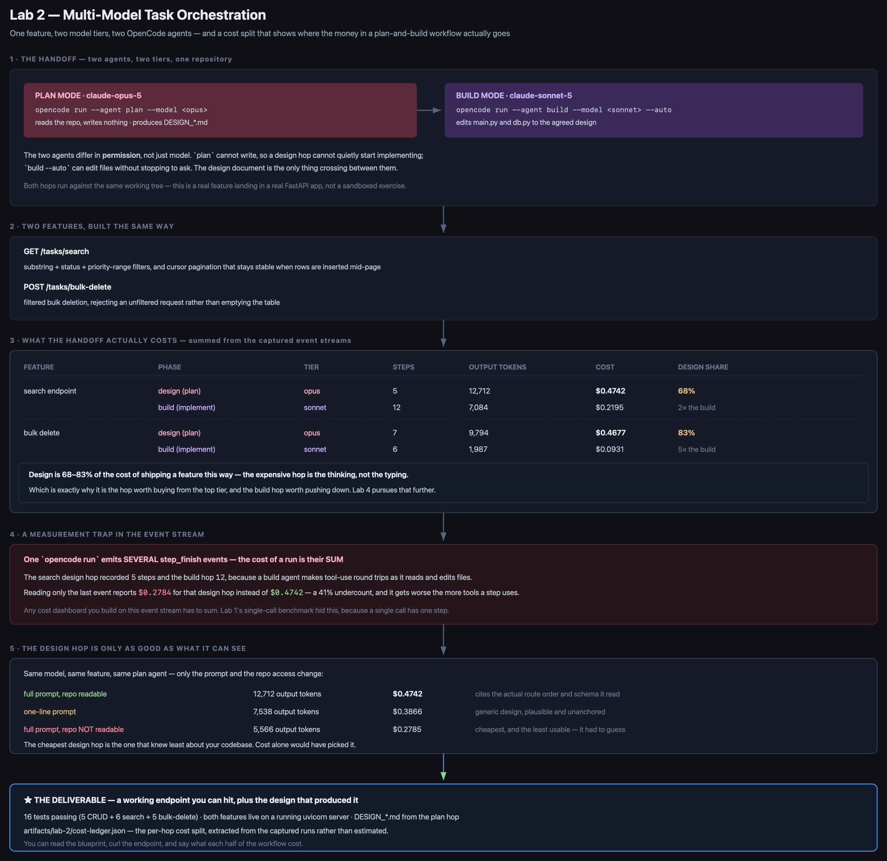
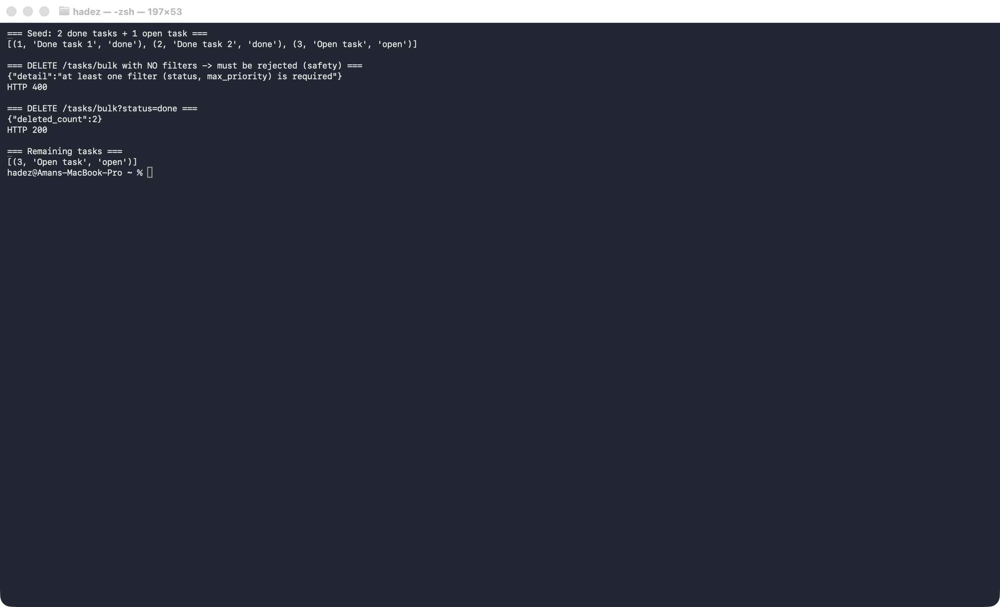

# Lab 2: Multi-Model Task Orchestration in OpenCode

## 1. Lab Overview & Objectives

In this lab, you'll take a real, intentionally incomplete FastAPI service and complete it using a two-model workflow: a high-tier model (Claude Opus 5) designs the missing feature in OpenCode's read-only Plan Mode, and a lower-tier model (Claude Sonnet 5) implements that design in read-write Build Mode. You'll independently verify the result — don't take the agent's word for it — and then repeat the entire cycle yourself on a second feature, unassisted.

**Learning objectives:**
- Split a real engineering task across model tiers using OpenCode's Plan Mode (design, read-only) and Build Mode (implementation, read-write).
- Determine, by direct comparison, what actually drives design quality: prompt detail, or letting the model read your real codebase.
- Independently verify an AI-implemented feature — via an automated test suite and a live, running server — rather than trusting the agent's own "tests pass" claim.
- Run the full design → implement → verify cycle unassisted, on a feature you haven't seen solved.

## 2. Prerequisites & Environment Setup

- Lab 1 completed (OpenCode installed and configured against AWS Bedrock)
- Python 3.10+

```bash
mkdir -p lab-2-taskapi/tests && cd lab-2-taskapi
python3 -m venv .venv
source .venv/bin/activate
pip install fastapi uvicorn httpx pytest
cp ../opencode.json .   # reuse the Bedrock config from Lab 1
```

## 3. Architecture



*Vector version: [`lab-2-architecture.svg`](artifacts/lab-2/diagrams/lab-2-architecture.svg)*

The same flow, linear:

```
 lab-2-taskapi/                     Incomplete FastAPI + SQLite task manager
   main.py         <-- CRUD implemented; GET /tasks/search missing
   db.py           <-- SQLite schema + connection helper
   tests/           <-- acceptance tests; test_search.py currently fails
        │
        ▼
 opencode run --agent plan --model <high-tier: claude-opus-5>
   (read-only: can inspect main.py/tests/, cannot edit anything)
        │
        ▼
 DESIGN_SEARCH_ENDPOINT.md          (committed to the repo)
        │
        ▼
 opencode run --agent build --model <lower-tier: claude-sonnet-5>
   (read-write: implements the design into main.py)
        │
        ▼
 Independent verification (you run this, not the agent):
   - pytest tests/ -v
   - curl against a real, running `uvicorn` server
        │
        ▼
 Step 7: repeat the whole loop yourself, on DELETE /tasks/bulk
```

## 4. Step-by-Step Instructions

### Step 1: Set up the starter project

**Why:** You need a real, runnable codebase with a genuine gap — not a toy example — so the design step has something real to reason about.

`db.py`:

```python
import sqlite3
from pathlib import Path

DB_PATH = Path(__file__).parent / "tasks.db"


def get_conn():
    conn = sqlite3.connect(DB_PATH)
    conn.row_factory = sqlite3.Row
    return conn


def init_db():
    conn = get_conn()
    conn.execute("""
        CREATE TABLE IF NOT EXISTS tasks (
            id INTEGER PRIMARY KEY AUTOINCREMENT,
            title TEXT NOT NULL,
            description TEXT NOT NULL DEFAULT '',
            status TEXT NOT NULL DEFAULT 'open',
            priority INTEGER NOT NULL DEFAULT 3,
            created_at REAL NOT NULL
        )
    """)
    conn.commit()
    conn.close()


def reset_db():
    conn = get_conn()
    conn.execute("DROP TABLE IF EXISTS tasks")
    conn.commit()
    conn.close()
    init_db()
```

`main.py` — CRUD works; the endpoint this lab adds is deliberately missing:

```python
import time
from typing import Optional

from fastapi import FastAPI, HTTPException
from pydantic import BaseModel

from db import get_conn, init_db

app = FastAPI(title="Task Manager API")
init_db()


class TaskCreate(BaseModel):
    title: str
    description: str = ""
    status: str = "open"
    priority: int = 3


class TaskUpdate(BaseModel):
    title: Optional[str] = None
    description: Optional[str] = None
    status: Optional[str] = None
    priority: Optional[int] = None


def row_to_dict(row) -> dict:
    return {
        "id": row["id"], "title": row["title"], "description": row["description"],
        "status": row["status"], "priority": row["priority"], "created_at": row["created_at"],
    }


@app.post("/tasks", status_code=201)
def create_task(task: TaskCreate):
    conn = get_conn()
    cur = conn.execute(
        "INSERT INTO tasks (title, description, status, priority, created_at) VALUES (?, ?, ?, ?, ?)",
        (task.title, task.description, task.status, task.priority, time.time()),
    )
    conn.commit()
    row = conn.execute("SELECT * FROM tasks WHERE id = ?", (cur.lastrowid,)).fetchone()
    conn.close()
    return row_to_dict(row)


@app.get("/tasks/{task_id}")
def get_task(task_id: int):
    conn = get_conn()
    row = conn.execute("SELECT * FROM tasks WHERE id = ?", (task_id,)).fetchone()
    conn.close()
    if row is None:
        raise HTTPException(status_code=404, detail="task not found")
    return row_to_dict(row)


@app.get("/tasks")
def list_tasks():
    conn = get_conn()
    rows = conn.execute("SELECT * FROM tasks ORDER BY id").fetchall()
    conn.close()
    return [row_to_dict(r) for r in rows]


@app.patch("/tasks/{task_id}")
def update_task(task_id: int, update: TaskUpdate):
    conn = get_conn()
    row = conn.execute("SELECT * FROM tasks WHERE id = ?", (task_id,)).fetchone()
    if row is None:
        conn.close()
        raise HTTPException(status_code=404, detail="task not found")
    fields = update.model_dump(exclude_unset=True)
    if fields:
        set_clause = ", ".join(f"{k} = ?" for k in fields)
        conn.execute(f"UPDATE tasks SET {set_clause} WHERE id = ?", (*fields.values(), task_id))
        conn.commit()
    row = conn.execute("SELECT * FROM tasks WHERE id = ?", (task_id,)).fetchone()
    conn.close()
    return row_to_dict(row)


@app.delete("/tasks/{task_id}", status_code=204)
def delete_task(task_id: int):
    conn = get_conn()
    conn.execute("DELETE FROM tasks WHERE id = ?", (task_id,))
    conn.commit()
    conn.close()
    return None


# --- MISSING FEATURE (this is what Lab 2 adds) ---
#
# GET /tasks/search should support:
#   - q: substring match against title (case-insensitive)
#   - status: exact filter
#   - min_priority / max_priority: inclusive range filter
#   - cursor-based pagination that stays stable even if tasks are
#     inserted/deleted between page requests (offset-based pagination
#     is NOT acceptable here - see tests/test_search.py for why)
#   - limit: page size (default 20, max 100)
#   - response must include "next_cursor" (null if no more pages)
#
# Not implemented yet.
```

`tests/conftest.py`:

```python
import sys
from pathlib import Path
sys.path.insert(0, str(Path(__file__).parent.parent))

import pytest
from fastapi.testclient import TestClient
from db import reset_db
import main


@pytest.fixture()
def client():
    reset_db()
    return TestClient(main.app)
```

`tests/test_crud.py`:

```python
def test_create_and_get_task(client):
    r = client.post("/tasks", json={"title": "Write report", "priority": 2})
    assert r.status_code == 201
    task = r.json()
    assert task["title"] == "Write report"
    r2 = client.get(f"/tasks/{task['id']}")
    assert r2.status_code == 200


def test_get_missing_task_404(client):
    assert client.get("/tasks/9999").status_code == 404


def test_list_tasks(client):
    client.post("/tasks", json={"title": "A"})
    client.post("/tasks", json={"title": "B"})
    assert len(client.get("/tasks").json()) == 2


def test_update_task(client):
    created = client.post("/tasks", json={"title": "Old title"}).json()
    r = client.patch(f"/tasks/{created['id']}", json={"status": "done"})
    assert r.json()["status"] == "done"


def test_delete_task(client):
    created = client.post("/tasks", json={"title": "Temp"}).json()
    client.delete(f"/tasks/{created['id']}")
    assert client.get(f"/tasks/{created['id']}").status_code == 404
```

`tests/test_search.py` — the acceptance spec for the missing endpoint (its centerpiece is the last test, which proves pagination stays correct even under a concurrent insert):

```python
import time


def _make(client, title, status="open", priority=3):
    return client.post("/tasks", json={"title": title, "status": status, "priority": priority}).json()


def test_search_by_text_query(client):
    _make(client, "Write quarterly report")
    _make(client, "Fix login bug")
    r = client.get("/tasks/search", params={"q": "report"})
    assert len(r.json()["results"]) == 1


def test_search_by_status(client):
    _make(client, "A", status="open")
    _make(client, "B", status="done")
    r = client.get("/tasks/search", params={"status": "done"})
    assert r.json()["results"][0]["title"] == "B"


def test_search_pagination_returns_next_cursor(client):
    for i in range(5):
        _make(client, f"Task {i}")
        time.sleep(0.01)
    body = client.get("/tasks/search", params={"limit": 2}).json()
    assert len(body["results"]) == 2
    assert body["next_cursor"] is not None


def test_search_pagination_stable_under_concurrent_insert(client):
    original = []
    for i in range(5):
        original.append(_make(client, f"Original {i}"))
        time.sleep(0.01)

    page1 = client.get("/tasks/search", params={"limit": 2}).json()
    assert [t["id"] for t in page1["results"]] == [original[4]["id"], original[3]["id"]]

    time.sleep(0.01)
    _make(client, "Inserted mid-pagination")   # simulates a concurrent write

    page2 = client.get("/tasks/search", params={"limit": 2, "cursor": page1["next_cursor"]}).json()
    assert [t["id"] for t in page2["results"]] == [original[2]["id"], original[1]["id"]], (
        "page 2 must continue from where page 1 left off - if it contains the "
        "newly-inserted task or repeats a page-1 id, pagination is using OFFSET "
        "instead of a stable cursor"
    )


def test_search_limit_capped_at_100(client):
    for i in range(120):
        client.post("/tasks", json={"title": f"Bulk {i}"})
    r = client.get("/tasks/search", params={"limit": 500})
    assert r.status_code == 200
    assert len(r.json()["results"]) <= 100
```

### Step 2: Confirm the starting point is genuinely broken

**Why:** Before asking a model to fix something, confirm what's actually failing — otherwise you can't tell whether the model's fix did anything.

```bash
rm -f tasks.db
python3 -m pytest tests/ -v
```

**Expected output:** the 5 CRUD tests pass; every test in `test_search.py` fails — some with `422` rather than a clean failure, which is your first real clue (FastAPI is matching `/tasks/search` against the existing `/tasks/{task_id}` route and failing to parse `"search"` as an integer).

### Step 3: Plan Mode — have a high-tier model design the fix

**Why:** This task has a real design decision worth getting right before writing code (concurrency-safe pagination), so it goes to the more capable tier first, in read-only mode so it can't jump to code before the design is sound.

```bash
export AWS_REGION=<YOUR_AWS_REGION>
export AWS_PROFILE=<YOUR_AWS_PROFILE>

opencode run --agent plan --model amazon-bedrock/us.anthropic.claude-opus-5 \
  "Read main.py and tests/test_search.py in this repo. Design the missing GET /tasks/search endpoint: the pagination strategy (explain why offset-based pagination fails the concurrent-insert test, and what fixes it), the cursor encoding, the SQL query construction, and the exact JSON response schema. Do not write any code." \
  > plan_output.txt
```

Copy the design portion of `plan_output.txt` into a new file, `DESIGN_SEARCH_ENDPOINT.md`.

**Expected output:** a design that specifies keyset (cursor) pagination — not `OFFSET` — with a composite sort key, and, if the model actually read your files, an independent mention of the same route-ordering issue you saw in Step 2.

### Step 4: Compare — does a shorter prompt produce a worse design?

**Why:** It's tempting to assume more detailed prompts always produce better output. Test that directly.

```bash
opencode run --agent plan --model amazon-bedrock/us.anthropic.claude-opus-5 \
  "Design the GET /tasks/search endpoint described in main.py's comment. Cover pagination, filtering, and the response format."
```

**Expected output:** a design close in substance to Step 3's — the model still has full read/bash access to your repo and can independently discover the route-ordering and pagination issues by exploring, rather than being told about them. Prompt detail mattered less than repo access.

### Step 5: Build Mode — implement the design, then verify it yourself

**Why:** With the design settled, hand it to a faster, cheaper model for implementation — but never trust "the tests pass" without checking yourself.

```bash
opencode run --agent build --model amazon-bedrock/us.anthropic.claude-sonnet-5 --auto \
  "Read DESIGN_SEARCH_ENDPOINT.md and implement it exactly in main.py. Run 'python3 -m pytest tests/ -v' yourself and fix anything that doesn't pass."
```

Then, independently — run this yourself, don't rely on the build step's own summary:

```bash
python3 -m pytest tests/ -v
```

**Expected output:**
```
11 passed
```

### Step 6: Prove it live

**Why:** Passing pytest proves correctness against the cases you thought to write. Watching the real, running server behave correctly under the actual hazard (a concurrent insert) is the more convincing demonstration.

```bash
uvicorn main:app --port 8420 &
sleep 2

for i in 1 2 3 4 5; do
  curl -s -X POST http://127.0.0.1:8420/tasks -H "Content-Type: application/json" \
    -d "{\"title\":\"Original $i\",\"priority\":$i}" > /dev/null
  sleep 0.05
done

echo "--- page 1 ---"
PAGE1=$(curl -s "http://127.0.0.1:8420/tasks/search?q=Original&limit=2")
echo "$PAGE1"
CURSOR=$(echo "$PAGE1" | python3 -c "import json,sys; print(json.load(sys.stdin)['next_cursor'])")

echo "--- concurrent insert while holding page-1 cursor ---"
curl -s -X POST http://127.0.0.1:8420/tasks -H "Content-Type: application/json" \
  -d '{"title":"Original LIVE-DEMO-INSERT"}'

echo "--- page 2, using the page-1 cursor ---"
curl -s "http://127.0.0.1:8420/tasks/search?q=Original&limit=2&cursor=$CURSOR"
```

**Expected output:** page 1 returns tasks 5 and 4 (newest first); page 2 returns tasks 3 and 2 — not a repeat of 5/4, and not the task you just inserted.


### Step 7: Do it again yourself, on a second feature, unassisted

**Why:** One guided pass proves the workflow works when someone else already solved it. Running the whole cycle yourself is what builds the skill.

Add a `DELETE /tasks/bulk` endpoint: delete every task matching a `status` and/or `max_priority` filter, and — a real safety requirement — reject the request with `400` if *no* filter is given, so a caller can't accidentally wipe the whole table.

Here's the acceptance spec to drop into `tests/test_bulk_delete.py` (write your own first if you want the extra practice, or start from this):

```python
def _make(client, title, status="open", priority=3):
    return client.post("/tasks", json={"title": title, "status": status, "priority": priority}).json()


def test_bulk_delete_by_status(client):
    _make(client, "A", status="done")
    _make(client, "B", status="done")
    _make(client, "C", status="open")
    r = client.request("DELETE", "/tasks/bulk", params={"status": "done"})
    assert r.status_code == 200
    assert r.json() == {"deleted_count": 2}
    assert len(client.get("/tasks").json()) == 1


def test_bulk_delete_by_max_priority(client):
    _make(client, "Low1", priority=1)
    _make(client, "Low2", priority=2)
    _make(client, "High", priority=5)
    r = client.request("DELETE", "/tasks/bulk", params={"max_priority": 2})
    assert r.json() == {"deleted_count": 2}


def test_bulk_delete_with_no_filters_is_rejected(client):
    _make(client, "Should survive")
    r = client.request("DELETE", "/tasks/bulk")
    assert r.status_code == 400
    assert len(client.get("/tasks").json()) == 1


def test_bulk_delete_matching_nothing_returns_zero(client):
    _make(client, "Untouched", status="open")
    r = client.request("DELETE", "/tasks/bulk", params={"status": "archived"})
    assert r.json() == {"deleted_count": 0}
```

Then repeat Steps 3-6 on this feature: plan with the high-tier model, implement with the lower-tier model, verify independently with `pytest`, then demonstrate it live:

```bash
curl -X DELETE http://127.0.0.1:8420/tasks/bulk
# expect: 400, "at least one filter is required"

curl -X POST http://127.0.0.1:8420/tasks -H "Content-Type: application/json" -d '{"title":"Done task","status":"done"}'
curl -X DELETE "http://127.0.0.1:8420/tasks/bulk?status=done"
# expect: 200, {"deleted_count": 1}
```



### Step 8: Price the handoff

**Why:** You have now paid for four model calls across two tiers. The whole argument for splitting
design from implementation is economic, so put a number on it rather than trusting the intuition.

Every `opencode run` in this lab was captured with `--format json`, so the cost is already on disk.
[`ledger.py`](lab-2-taskapi/ledger.py) totals it per hop:

```bash
python3 ledger.py
```

**Expected output:**

```
FEATURE           PHASE                 TIER      STEPS  OUT TOK       COST
---------------------------------------------------------------------------
search endpoint   design (plan mode)    opus          5    12712    $0.4742
search endpoint   build (implement)     sonnet       12     7084    $0.2195
bulk delete       design (plan mode)    opus          7     9794    $0.4677
bulk delete       build (implement)     sonnet        6     1987    $0.0931

FEATURE                 DESIGN       BUILD       TOTAL   DESIGN SHARE
---------------------------------------------------------------------------
search endpoint        $0.4742     $0.2195     $0.6937   68%  (2x the build)
bulk delete            $0.4677     $0.0931     $0.5607   83%  (5x the build)
```

**Design is 68–83% of the cost of shipping a feature this way.** The expensive hop is the
thinking, not the typing — which is precisely why it is the one worth buying from the top tier,
and why the build hop is the one worth pushing down. Lab 4 takes that further and measures what
happens when you push every step down.

> **A measurement trap worth knowing before you build any cost dashboard on this data.** One
> `opencode run` emits **several** `step_finish` events — the search design hop recorded 5 and the
> build hop 12, because a build agent makes tool-use round trips as it reads and edits files. The
> cost of a run is their **sum**. Reading only the last event reports `$0.2784` for that design hop
> instead of `$0.4742` — a 41% undercount, and it gets worse the more tools a step uses. Lab 1's
> benchmark hid this because a single non-agentic call has exactly one step.

The ledger also prices the three design variants from Step 4:

```
  full prompt, repo readable            12712    $0.4742
  one-line prompt                        7538    $0.3866
  full prompt, repo NOT readable         5566    $0.2785
```

**The cheapest design hop is the one that knew least about your codebase.** Optimising this
workflow on cost alone would have selected the worst design in the set — which is the argument for
keeping a quality gate in the loop before you start economising.

## 5. Validation / Verification

```bash
python3 -m pytest tests/ -v
```

**Expected output:** `16 passed` — all 5 CRUD tests, all 6 search tests, and all 5 bulk-delete tests, run together, confirming the second feature didn't break the first.

Then confirm the economics you were told about are the economics you actually got:

```bash
python3 -c "
import json, subprocess
subprocess.run(['python3','ledger.py','--json-out','/tmp/lab2-ledger.json'],
               check=True, capture_output=True)
led = json.load(open('/tmp/lab2-ledger.json'))

for feature, phases in led['features'].items():
    s = phases['_summary']
    assert s['design_usd'] > s['build_usd'], f'{feature}: design was not the expensive hop'
    print(f\"[OK] {feature:<18} design \${s['design_usd']:.4f} vs build \${s['build_usd']:.4f} \"
          f\"- design is {s['design_share_pct']:.0f}% of \${s['total_usd']:.4f}\")

steps = [p['steps'] for ph in led['features'].values()
         for k, p in ph.items() if k != '_summary']
assert max(steps) > 1, 'expected multi-step runs - are you summing step_finish events?'
print(f'[OK] runs recorded up to {max(steps)} steps each - cost must be summed, not read once')

best = max(led['variants'], key=lambda v: v['output_tokens'])
cheapest = min(led['variants'], key=lambda v: v['cost_usd'])
assert best['label'] != cheapest['label']
print(f\"[OK] cheapest design variant was '{cheapest['label']}' - not the most thorough one\")
"
```

**Expected output:**

```
[OK] search endpoint    design $0.4742 vs build $0.2195 - design is 68% of $0.6937
[OK] bulk delete        design $0.4677 vs build $0.0931 - design is 83% of $0.5607
[OK] runs recorded up to 12 steps each - cost must be summed, not read once
[OK] cheapest design variant was 'full prompt, repo NOT readable' - not the most thorough one
```

## 6. Troubleshooting Tips

- **A new route returns `422` instead of matching** — check route *declaration order*. FastAPI/Starlette matches routes top-to-bottom; a static path like `/tasks/search` or `/tasks/bulk` must be declared *before* a parameterized path like `/tasks/{task_id}`, or the parameterized route intercepts it and fails trying to parse the static segment as its parameter type.
- **A search query containing `%` or `_` matches far more rows than expected** — these are SQL `LIKE` wildcard characters. Escape user input before interpolating it into a `LIKE` pattern (`ESCAPE '\'` plus manually escaping `\`, `%`, `_` in that order).
- **A `limit` query parameter validated with `Query(20, le=100)` rejects a large value with `422` instead of clamping it** — if your acceptance test expects a `200` even for an oversized `limit`, don't use FastAPI's `le`/`ge` validation for the cap; clamp the value inside the handler instead.
- **Build Mode reports success but a re-run of pytest shows failures** — this happens; it's why Step 5 tells you to verify independently rather than trust the agent's summary. Read the actual failure and re-prompt with the specific gap, rather than re-running the identical instruction.

## 7. Cleanup Steps

```bash
kill %1                                   # stop the uvicorn background process
lsof -i :8420                             # confirm nothing is still listening
rm -f tasks.db
find . -iname "__pycache__" -o -iname ".pytest_cache" | xargs rm -rf
```

---

### Reflect

Using what Lab 1's benchmark showed you about cost and quality per tier, write 3-4 sentences justifying the tier choice in this lab (Opus 5 for design, Sonnet 5 for build). Then note one thing that surprised you in Step 7, when you ran the cycle without a script to follow.
