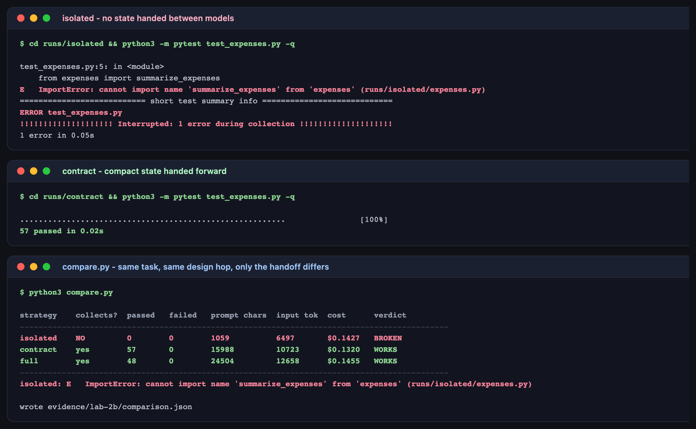

# Lab 2B — Context Continuity Across Model Switches

**Maps to:** Module 2, *"Managing context window efficiency and state continuity across model switches"*
**Duration:** ~60 minutes
**Prerequisite:** Lab 1 (working OpenCode + Bedrock setup)
**Status:** Tested end-to-end on macOS (Darwin 25.5.0) against live AWS Bedrock. Every token count,
cost and test result below came from a real run — including the run that broke.

---

## 1. Lab Overview & Objectives

Every time you switch models you start a new session with an empty context. The model has no idea
what the previous model decided. That is not a bug in the tooling — it is the default condition of
multi-model work, and it is where multi-model pipelines quietly fall apart.

In this lab you will build one small module across **three hops and three different models**:
Opus designs the API, Sonnet implements it, and a different vendor's model writes the tests. Then
you will run that same pipeline three times, changing only **what gets handed between hops**:

- **isolated** — each hop sees only the original task
- **contract** — hops also receive the agreed API contract plus a compact, generated state file
- **full** — hops receive the contract plus the entire implementation source

You will run `pytest` on all three results. One of them will not even import.

**Learning objectives — by the end of this lab you will be able to:**

1. Explain why two competent models, given the same correct task, produce components that do not
   fit together — and demonstrate it with a failing import rather than an anecdote.
2. Build a handoff artifact that carries state between model switches, and explain why a
   *generated* artifact beats a written one.
3. Measure the context cost of a handoff strategy in prompt characters, input tokens and dollars,
   and choose between strategies on evidence.
4. Show, with numbers, that the naive "just paste everything" approach and the naive "each model
   figures it out" approach are both worse than a deliberate compact handoff.

> **The finding that surprises people:** the isolated run was not the cheap-but-broken option. It
> was **broken and more expensive** than the run that worked. Skipping the handoff does not save
> money.

---

## 2. Prerequisites & Environment Setup

### 2.1 From Lab 1

- OpenCode installed (tested `1.18.27`)
- Bedrock model access for `claude-opus-5`, `claude-sonnet-5` and `openai.gpt-5.6-terra`
- Python 3.10+ with `pytest` in a virtualenv (Lab 1 §2.4)

```bash
export AWS_REGION=<YOUR_AWS_REGION>
export AWS_PROFILE=<YOUR_AWS_PROFILE>
opencode models | grep -E "claude-opus-5|claude-sonnet-5|gpt-5\.6-terra"
```

**Expected output — three lines.** If any is missing, request Bedrock model access before
continuing.

### 2.2 Lab directory and the sandbox

```bash
mkdir -p lab-2b-context-continuity/.sandbox
cd lab-2b-context-continuity

cat > opencode.json << 'EOF'
{
  "$schema": "https://opencode.ai/config.json",
  "provider": {
    "amazon-bedrock": {
      "options": { "region": "<YOUR_AWS_REGION>" }
    }
  }
}
EOF
cp opencode.json .sandbox/
```

> **Why the empty `.sandbox/` directory — do not skip this.** `--agent plan` is read-only for
> *writes*, but it can still **read** files. The first version of this lab ran every hop in the
> lab folder, and the design model opened the harness and announced *"I read the lab harness: my
> output here becomes `CONTRACT.md`, consumed by a separate implementer session."* A later hop
> could just as easily have read `CONTRACT.md` straight off disk — which would silently destroy
> the isolated condition and make the whole experiment a lie. Every hop therefore runs with
> `--dir .sandbox`, a directory containing nothing but `opencode.json`. **Everything a model is
> allowed to know must arrive in its prompt, and nowhere else.**

### 2.3 Cost and time

Nine model calls across three runs: about **12 minutes** and **$0.70** of real Bedrock spend. The
Opus design hop is the expensive one (~$0.28) and is deliberately generated **once** and reused.

---

## 3. Architecture


*Vector version: [`lab-2b-architecture.svg`](artifacts/lab-2b/diagrams/lab-2b-architecture.svg)*

```
TASK.md  (identical in all three runs)
    │
    ▼
HOP 1  DESIGN     claude-opus-5      → CONTRACT.md
    │             generated ONCE, reused by every strategy
    │             (so the design is never the variable)
    ▼
HOP 2  IMPLEMENT  claude-sonnet-5    → expenses.py
    │
    │   ┌─ isolated : prompt = TASK only
    │   ├─ contract : prompt = TASK + CONTRACT.md
    │   └─ full     : prompt = TASK + CONTRACT.md
    ▼
    │   STATE.md ← generated from expenses.py with `ast`, not by a model
    ▼
HOP 3  TEST       gpt-5.6-terra      → test_expenses.py
        │
        ├─ isolated : prompt = TASK only              → invents its own API
        ├─ contract : prompt = TASK + CONTRACT + STATE.md   (compact)
        └─ full     : prompt = TASK + CONTRACT + entire source (bulky)
                │
                ▼
        pytest runs/<strategy>/test_expenses.py     ★ the visible contrast
```

Each hop is a **separate `opencode run`**. There is no shared session, no conversation history,
no memory. That is the honest simulation of a model switch — and it is exactly what happens in
practice when a task spans days, teams, or tools.

---

## 4. Step-by-Step Instructions

### Step 1 — Write the task

**Why:** The task has to be specific enough to be gradeable, but leave real design freedom — the
kind of freedom where two reasonable engineers make different, incompatible choices.

```bash
cat > TASK.md << 'EOF'
# Task: expense report summarizer

Build a small Python module that summarizes expense reports.

The module file MUST be named `expenses.py`, and the test file MUST be named
`test_expenses.py` and import from `expenses`.

Requirements:

1. Accept a list of expense records. Each record has: an ISO-8601 date string, a
   numeric amount, a category name, and a 3-letter currency code.
2. Reject records that are malformed (bad date, non-numeric or negative amount,
   missing category, currency that is not exactly 3 uppercase letters).
3. Produce per-category totals for the records that were accepted.
4. Money must be rounded to 2 decimal places, using banker's rounding.
5. Support filtering the input to an inclusive date range before summarizing.
6. Mixed currencies in one summary must be treated as an error - do not sum them.
EOF
```

Note that the **file names are fixed by the task**. That is deliberate. If the module name were
also free, the isolated run would fail for a boring reason (`No module named foo`). Pinning the
filenames forces the interesting failure: the files exist, the imports are attempted, and the
**API contract** is what turns out to be missing.

### Step 2 — Build the handoff orchestrator

**Why:** The experiment needs the three strategies to differ in exactly one respect. Doing this by
hand invites accidental leakage between runs; a script makes the comparison honest.

The full script is at [`handoff.py`](lab-2b-context-continuity/handoff.py). Three parts matter.

**Every hop runs sandboxed, in its own fresh session:**

```python
SANDBOX = HERE / ".sandbox"

def run_model(model: str, prompt: str, timeout: int = 300):
    cmd = ["opencode", "run", "--dir", str(SANDBOX), "--agent", "plan",
           "--model", model, "--format", "json", prompt]
    ...
```

**The design hop is shared, so only the handoff varies:**

```python
    shared_contract = SHARED / "CONTRACT.md"
    if shared_contract.exists():
        contract = shared_contract.read_text()      # reuse - hop 1 is not the variable
    else:
        contract, cost, tokens, elapsed = run_model(OPUS, design_prompt)
        shared_contract.write_text(contract)
```

**The state file is generated from the code, not written by a model:**

```python
def public_api(source: str) -> str:
    """Deterministically summarise a module's public API - no model call needed.

    This is the compact handoff artifact. It is generated from the code that was
    actually written, so it cannot drift from reality the way prose notes do.
    """
    tree = ast.parse(source)
    ...
```

> **This is the single most transferable idea in the lab.** A hand-written "here's what I built"
> note is a second source of truth that starts rotting immediately. A signature list extracted
> from the source with `ast` is true by construction, costs one function call instead of a model
> call, and is roughly 12 lines instead of 300.

### Step 3 — Run the isolated strategy (the one that breaks)

**Why:** Establish the failure first, so the fix has something to fix.

```bash
python3 handoff.py --strategy isolated --out runs/isolated
```

**Expected output:**

```
=== strategy: isolated -> runs/isolated ===
  design     us.anthropic.claude-opus-5    141.3s  $0.2801035  prompt=1246 chars
  implement  us.anthropic.claude-sonnet-5   60.2s  $0.097347  prompt=1047 chars
  test       global.openai.gpt-5.6-terra    14.2s  $0.045345  prompt=1059 chars
  total: $0.422795  input_tokens=6499
```

Every hop succeeded. Nothing errored. Three models each did competent work. Now look at what they
actually produced:

```bash
grep -E "^def |^class " runs/isolated/expenses.py | head -6
grep -E "^from expenses" runs/isolated/test_expenses.py
```

**Expected output:**

```
class ExpenseError(ValueError):
class Expense:
def parse_expense(record: Mapping[str, Any]) -> Expense
def validate_expenses(records: Iterable[Mapping[str, Any]]) -> list[Expense]
def filter_by_date_range(expenses, start=None, end=None) -> list[Expense]
def summarize_by_category(expenses: Iterable[Expense]) -> dict[str, float]

from expenses import summarize_expenses
```

The implementer wrote `summarize()` and `summarize_by_category()`. The test author imported
`summarize_expenses`. **Neither is wrong.** Both are reasonable readings of "produce per-category
totals". They just never agreed — and had no mechanism to.

### Step 4 — Run the contract strategy

**Why:** Same task, same design, same models. The only change is that state is handed forward.

```bash
python3 handoff.py --strategy contract --out runs/contract
```

**Expected output:**

```
=== strategy: contract -> runs/contract ===
  design     (reused runs/_shared/CONTRACT.md - hop 1 is identical under every strategy)
  implement  us.anthropic.claude-sonnet-5  142.5s  $0.0437407  prompt=15271 chars
  test       global.openai.gpt-5.6-terra    23.3s  $0.0882135  prompt=15988 chars
  total: $0.131954  input_tokens=10723
```

Inspect the generated handoff artifact — this is what hop 3 received instead of the whole source:

```bash
cat runs/contract/STATE.md
```

**Expected output:** a short fenced block listing the public classes and function signatures that
actually exist in `expenses.py`. Roughly a dozen lines.

### Step 5 — Run the full-transcript strategy

**Why:** The obvious alternative to a compact handoff is "paste everything". It works. The lab's
job is to show what it costs.

```bash
python3 handoff.py --strategy full --out runs/full
```

**Expected output:**

```
  implement  us.anthropic.claude-sonnet-5  128.2s  $0.0514457  prompt=15271 chars
  test       global.openai.gpt-5.6-terra    20.3s  $0.0940322  prompt=24504 chars
  total: $0.145478  input_tokens=12658
```

The test hop's prompt grew from **15,988 to 24,504 characters** — a 53% increase — because it now
carries the entire implementation instead of its interface.

### Step 6 — Run the tests and see the contrast

**Why:** This is the visible end state: two directories, same task, one that runs and one that
cannot even be collected.

```bash
cd runs/isolated && ../../../.venv/bin/python -m pytest test_expenses.py -q; cd ../..
cd runs/contract && ../../../.venv/bin/python -m pytest test_expenses.py -q; cd ../..
```

**Expected output — isolated:**

```
test_expenses.py:5: in <module>
    from expenses import summarize_expenses
E   ImportError: cannot import name 'summarize_expenses' from 'expenses'
ERROR test_expenses.py
!!!!!!!!!!!!!! Interrupted: 1 error during collection !!!!!!!!!!!!!!
1 error in 0.05s
```

**Expected output — contract:**

```
.........................................................                [100%]
57 passed in 0.02s
```



### Step 7 — Compare the strategies on cost, not just correctness

**Why:** Correctness settles isolated-vs-contract. It does not settle contract-vs-full, and that
is the decision you will actually make repeatedly.

The comparison tool is at [`compare.py`](lab-2b-context-continuity/compare.py). It runs each
strategy's tests and joins the result to the token ledger, counting **only hops 2 and 3** — hop 1
is shared, so including it would flatter the reuse strategies unfairly.

```bash
python3 compare.py
```

**Expected output:**

```
strategy    collects?  passed   failed   prompt chars  input tok  cost      verdict
--------------------------------------------------------------------------------------------
isolated    NO         0        0        1059          6497       $0.1427   BROKEN
contract    yes        57       0        15988         10723      $0.1320   WORKS
full        yes        48       0        24504         12658      $0.1455   WORKS
--------------------------------------------------------------------------------------------
isolated: E   ImportError: cannot import name 'summarize_expenses' from 'expenses' (runs/isolated/expenses.py)
```

**Read that table carefully — two findings, both counterintuitive.**

**Finding 1: the broken run was the expensive one.** `isolated` sent the *shortest* prompts (1,059
characters vs 15,988) and still cost **more** than `contract` — $0.1427 against $0.1320 — while
producing nothing runnable. Starved of context, every hop re-derived the design from scratch and
wrote far more output; the implementer alone cost $0.0973 against $0.0437. Context discipline is
not a tax you pay for quality. On this run it was simply cheaper.

**Finding 2: more context is not better context.** `full` pasted the entire implementation: +53%
prompt characters, +18% input tokens, +10% cost — and produced **48 tests instead of 57**. A
twelve-line extracted signature list outperformed three hundred lines of source. Hand over the
**interface**, not the transcript. This is also the only one of the three that scales: at six hops
the full-transcript prompt grows without bound, while the contract handoff stays flat.

---

### Step 8: Do it again yourself, with a fourth hop, unassisted

**Why:** Three hops is where handoff problems appear. Four is where the *cost* of the naive fix appears, because the full-transcript strategy grows with every hop while the contract strategy does not.

**Your task.** Add a REVIEW hop after the test hop, and run all three strategies again.

The reviewer receives the module and the test file, and must return an improved `test_expenses.py` adding at least three cases the original missed. Under `contract` it sees `STATE.md` plus the contract; under `full` it sees the entire implementation *and* the entire existing test file; under `isolated` it sees only `TASK.md`.

**You get the acceptance criteria and nothing else:**

- `runs/contract/` still collects and passes after the review hop replaces the test file
- `runs/isolated/` still fails — a fourth hop must not accidentally repair the broken chain
- `compare.py` reports the review hop's prompt size for each strategy
- the gap between `contract` and `full` prompt sizes is **larger** at four hops than it was at three

**Done when** you can state the growth rate: how many characters does each strategy's prompt gain per hop, and at what hop count does `full` stop being viable for your context window?

No commands are given here. Steps 2–7 have the pattern; the exercise is extending the chain.

---

## 5. Validation / Verification

```bash
python3 -c "
import json
from pathlib import Path

report = json.loads(Path('../artifacts/lab-2b/comparison.json').read_text())

iso, con = report['isolated'], report['contract']

assert iso['collected'] is False, 'the isolated run was supposed to break'
assert iso['tests_passed'] == 0
assert 'ImportError' in iso['first_error'], iso['first_error']
print('[1/3] OK: isolated run fails at import - the models never agreed on an API')

assert con['collected'] is True and con['usable'] is True
assert con['tests_passed'] > 0 and con['tests_failed'] == 0
print(f\"[2/3] OK: contract run passes {con['tests_passed']} tests, assembled across 3 models\")

assert con['handoff_cost_usd'] < iso['handoff_cost_usd'], 'expected the broken run to cost more'
saving = (1 - con['handoff_cost_usd'] / iso['handoff_cost_usd']) * 100
if 'full' in report:
    f = report['full']
    assert f['test_prompt_chars'] > con['test_prompt_chars']
    growth = (f['test_prompt_chars'] / con['test_prompt_chars'] - 1) * 100
    print(f'[3/3] OK: contract is {saving:.0f}% cheaper than isolated, and '
          f'full-transcript needs {growth:.0f}% more prompt for fewer tests')
else:
    print(f'[3/3] OK: contract is {saving:.0f}% cheaper than the broken isolated run')
"
```

**Expected output:**

```
[1/3] OK: isolated run fails at import - the models never agreed on an API
[2/3] OK: contract run passes 57 tests, assembled across 3 models
[3/3] OK: contract is 8% cheaper than isolated, and full-transcript needs 53% more prompt for fewer tests
```

**You have succeeded when you can answer these from your own runs:**

1. What exactly did your implementer name the summarizing function, and what did your test author
   expect? Would a code reviewer have caught that before CI did?
2. Your `STATE.md` was generated by `ast`. What would have gone wrong if you had asked a model to
   write it instead — and how would you have noticed?
3. Your pipeline is three hops. At six hops, which strategy's prompt is still a fixed size?

---

## 6. Troubleshooting Tips

**`RuntimeError: model returned no fenced code block`**
The model explained its approach instead of emitting code. The prompt must be explicit that no
files can be created and that the reply must be one fenced block and nothing else — see the
closing instructions `handoff.py` appends to the implement and test prompts. The raw reply is
saved as `runs/<strategy>/implement.response.md` so you can see what it did instead without
paying for the call twice.

**The isolated run passes its tests**
Your isolation leaked. Confirm every hop uses `--dir .sandbox` and that `.sandbox/` contains only
`opencode.json` — no `TASK.md`, no `CONTRACT.md`, no `runs/`. In plan mode a model can read any
file it can reach, and it will.

**The design hop reruns and costs $0.28 again**
`runs/_shared/CONTRACT.md` is missing. It is generated once and reused; deleting it forces a new
(and different) design, which invalidates comparisons against earlier runs. Keep it.

**`ModuleNotFoundError: No module named 'expenses'` in every run**
You are running pytest from the wrong directory. The tests import `expenses` as a top-level
module, so pytest must run **inside** `runs/<strategy>/`.

**Costs differ noticeably from the figures above**
Expected. Prompt-cache warmth varies between runs (Lab 1, Step 3). Compare strategies **within
your own session**, where the cache state is comparable, rather than against this document.

**The contract run passes but with far fewer tests than 57**
Test count depends on how thorough the test-authoring model chose to be. The lab's claim is not
"57 tests"; it is that the contract run *collects and passes* while the isolated run cannot
import. Judge on that, and on your own cost columns.

---

## 7. Cleanup Steps

No cloud infrastructure and no long-running processes — every hop is a short-lived `opencode run`.
There is nothing to tear down in AWS.

```bash
# scratch only
rm -rf __pycache__ runs/*/__pycache__ runs/*/.pytest_cache
```

**Keep** `runs/isolated/` and `runs/contract/` side by side — the two directories *are* the
deliverable, and the contrast is the thing worth showing your team. Keep
`runs/_shared/CONTRACT.md` too: deleting it means the next run pays $0.28 for a different design
and your comparisons no longer line up.

To reset and rerun a single strategy cheaply:

```bash
rm -rf runs/contract && python3 handoff.py --strategy contract --out runs/contract
```

---

## Optional extensions

- **Add a fourth hop.** Have a fourth model review the tests and add missing edge cases, receiving
  only `STATE.md` plus the test file's public surface. Does the compact handoff still hold at four
  hops, and what happens to the `full` strategy's prompt size?
- **Corrupt the state file deliberately.** Rename one function in `STATE.md` so it no longer
  matches `expenses.py`, then rerun hop 3. The failure you get is the argument for generating
  handoff artifacts instead of writing them.
- **Swap the vendors around.** Let the OpenAI model implement and a Claude model write the tests.
  Does the isolated run still break, and does it break in the same way? A failure mode that
  survives a vendor swap is structural, not a quirk of one model.
- **Find out who actually drifted.** Grep the shared contract for the entry-point name:
  `grep -c summarize_expenses runs/_shared/CONTRACT.md` returns 6 matching lines. Now check what each isolated
  hop chose. The isolated **test author** independently landed on `summarize_expenses` — the same
  name the designer picked — while the isolated **implementer** went with `summarize`. Two of the
  three models converged on the same natural name without ever talking; the pipeline still broke,
  because "probably agreeing" is not a contract. Ask your team how many of your integrations rest
  on that same probability.
- **Audit a flaw the contract did not prevent.** Both runs round correctly with `Decimal` and
  `ROUND_HALF_EVEN` — and both then return `float` at the API boundary
  (`{category: float(rounded) ...}`), reintroducing binary floating point into money the task
  asked to be rounded exactly. A handoff artifact propagates whatever the design says, including
  its mistakes. What would you add to `CONTRACT.md` to make that impossible, and what does that
  tell you about where the real review effort belongs?
