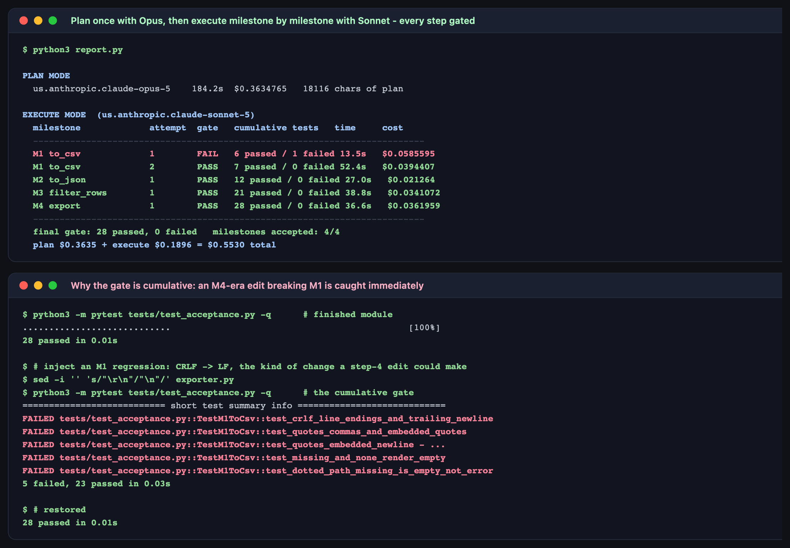

# Lab 3 — Plan-and-Execute Workflows in OpenCode

**Maps to:** Module 3, *Multi-Agent Orchestration & Auto-Tuning*
**Duration:** ~2 hours
**Prerequisite:** Lab 1 (working OpenCode + Bedrock setup with a `pytest` virtualenv)
**Status:** Tested end-to-end on macOS (Darwin 25.5.0) against live AWS Bedrock. Every timing,
cost and test count below came from one real run — including the milestone that failed its gate.

---

## 1. Lab Overview & Objectives

A task big enough to matter cannot be done in one prompt. The usual response is to give the whole
thing to the most capable model and hope — which is expensive, slow, and produces a large diff
nobody has verified.

This lab does it the other way. You buy **reasoning once** from a high-tier model (Opus) in the
form of a build plan, then hand that plan to a **fast, cheap model** (Sonnet) which implements it
**one milestone at a time**. After every milestone an acceptance gate runs — not just that
milestone's tests, but every earlier milestone's too. A step is only accepted when the whole
cumulative suite is green. When a gate fails, the real pytest output goes back into the next
attempt.

You will end up with two things side by side: the blueprint, and the working software it produced.

**Learning objectives — by the end of this lab you will be able to:**

1. Write a Plan Mode prompt that produces a plan another model can execute without ever seeing
   your conversation.
2. Split a build across model tiers so the expensive model is called once and the cheap model
   does the repetitive work — and show what that split cost.
3. Build a verification checkpoint between steps, and explain why the gate must be cumulative
   rather than per-step.
4. Turn a failed gate into a corrected step by feeding the real test output back, rather than
   retrying blind.

> **The result that makes the case:** the plan cost **$0.3635** and the four implementation steps
> together cost **$0.1896**. Reasoning was 66% of the spend and was bought exactly once. Add more
> milestones and that share falls — which is the entire economic argument for the split.

---

## 2. Prerequisites & Environment Setup

### 2.1 From Lab 1

- OpenCode installed (tested `1.18.27`)
- Bedrock access for `claude-opus-5` and `claude-sonnet-5`
- The Lab 1 virtualenv with `pytest` (Lab 1 §2.4)

```bash
export AWS_REGION=<YOUR_AWS_REGION>
export AWS_PROFILE=<YOUR_AWS_PROFILE>
opencode models | grep -E "claude-opus-5|claude-sonnet-5"
```

**Expected output — two lines.**

### 2.2 Lab directory

```bash
mkdir -p lab-3-plan-execute/{tests,.sandbox}
cd lab-3-plan-execute
cp ../opencode.json .
cp ../opencode.json .sandbox/
```

> **The sandbox again.** `--agent plan` blocks writes but still permits **reads**. Both the
> planner and the implementer run with `--dir .sandbox`, a directory holding nothing but
> `opencode.json`. This is not paranoia: in our run the planner's first line was *"I'll inspect
> the sandbox to see what already exists before writing the plan."* It looked. The sandbox was
> empty, so nothing leaked — but had these hops run in the lab folder, the implementer could have
> read `tests/test_acceptance.py` and written code shaped to the grader instead of to the spec.

### 2.3 Cost and time

One Opus planning call and five Sonnet implementation calls: about **6 minutes** of model time
and **$0.55** of real Bedrock spend. Most of the wall clock is the planner thinking.

---

## 3. Architecture


*Vector version: [`lab-3-architecture.svg`](artifacts/lab-3/diagrams/lab-3-architecture.svg)*

```
TASK.md  +  tests/test_acceptance.py   (28 tests, written by the LAB, never shown to a model)
   │
   ▼
PLAN MODE     claude-opus-5, ONE call ──────────────► PLAN.md   18,116 chars   $0.3635
   │                                                     │
   │  the planner is told: the implementer will see       │
   │  only the plan, the task, and the current file       │
   ▼                                                     ▼
EXECUTE MODE  claude-sonnet-5, one call per milestone
   │
   ├── M1 to_csv      ─► write exporter.py ─► gate: TestM1            ( 7 tests)
   ├── M2 to_json     ─► write exporter.py ─► gate: TestM1+M2         (12 tests)
   ├── M3 filter_rows ─► write exporter.py ─► gate: TestM1+M2+M3      (21 tests)
   └── M4 export      ─► write exporter.py ─► gate: all four          (28 tests)
                                                  │
                    gate red ─────────────────────┤
                    last 25 lines of pytest output│ appended to the next attempt's prompt
                                                  ▼
        artifacts/lab-3/execution_ledger.json   ★ every attempt, gate result, cost
        artifacts/lab-3/exporter.py             ★ 197 lines, 28/28 green
```

**The one idea to take away:** the gate is *cumulative*, not per-step. Milestone 4 runs milestone
1's tests. Without that, a later step can quietly break an earlier one and nothing notices until
review — which is precisely the failure mode of "let the agent build the whole thing".

---

## 4. Step-by-Step Instructions

### Step 1 — Write the task and fix the acceptance milestones

**Why:** A plan-and-execute pipeline needs an objective definition of "done" for each step, or the
checkpoint is just another model's opinion.

Create `TASK.md` defining the module and, crucially, **four numbered milestones**. The full file
is in this repo at [`lab-3-plan-execute/TASK.md`](lab-3-plan-execute/TASK.md); it specifies a data
export module with a frozen public API:

```python
class ExportError(ValueError): ...
def to_csv(rows: list[dict], fields: list[str]) -> str: ...
def to_json(rows: list[dict], fields: list[str]) -> str: ...
def filter_rows(rows: list[dict], where: dict) -> list[dict]: ...
def export(rows, *, fmt, fields, where=None, path=None) -> str: ...
```

with milestones M1 `to_csv`, M2 `to_json`, M3 `filter_rows`, M4 `export`.

The signatures are frozen in the task **on purpose**. Lab 2B showed what happens when two models
each invent their own API; here the interface is given so the interesting variable is whether the
*behaviour* is right.

### Step 2 — Write the acceptance suite yourself

**Why:** This is the gate. If a model writes it, you are grading the work against the same
understanding that produced it, and a shared misreading passes silently.

`tests/test_acceptance.py` holds 28 tests in four classes — `TestM1ToCsv` (7), `TestM2ToJson` (5),
`TestM3FilterRows` (9), `TestM4Export` (7). It is in this repo at
[`tests/test_acceptance.py`](lab-3-plan-execute/tests/test_acceptance.py) and it tests the sharp
edges: RFC4180 quoting, embedded newlines, CRLF terminators, dotted paths into nested dicts,
missing-vs-`None`, operator suffixes, and type-mismatched comparisons that must exclude a row
rather than raise.

**Before running any model, prove the suite is satisfiable.** Write a throwaway reference
implementation and run it:

```bash
../.venv/bin/python -m pytest tests/test_acceptance.py -q
```

**Expected output:** `28 passed`

Skipping this is how you end up blaming a model for a bug in your own gate. Ours is kept at
[`.reference/exporter.py`](lab-3-plan-execute/.reference/exporter.py) for exactly this check —
delete your copy of `exporter.py` afterwards so the models start from nothing.

### Step 3 — Write the Plan Mode template

**Why:** The planner's output is consumed by a model with no memory of this conversation. The
template has to say so, or the plan will assume context that will not exist.

The key section of [`plan.py`](lab-3-plan-execute/plan.py):

```python
PLAN_TEMPLATE = """{task}

You are the PLANNER. Do not write the implementation.

Produce an ordered build plan that another engineer - working with a faster, less
capable model, one milestone at a time - can follow without ever seeing this
conversation. For each of the four milestones M1..M4, give:

1. **Goal** - one sentence on what exists when the milestone is done.
2. **Design decisions** - the choices the implementer would otherwise get wrong:
   data structures, helper functions, how a missing nested path is represented
   internally, and how that sentinel differs from a real `None` value.
3. **Implementation notes** - the specific functions to add or change, and any
   shared helper the later milestones will depend on.
4. **Self-check** - what the implementer should manually confirm before moving on.

Rules for the plan:
- Milestones build on each other. State explicitly what M2, M3 and M4 each reuse
  from earlier milestones, so the implementer does not reinvent or break it.
- Call out the traps in this spec that a fast model will otherwise miss.
- The implementer will be given ONLY this plan, the task, and the current file.
  Anything you leave implicit will be guessed.
"""
```

The last rule is the one that earns its keep. It changes the planner's job from *describe the
solution* to *close every gap a weaker model would otherwise fill by guessing*.

Both scripts reach Bedrock the same way every lab in this course does — by shelling out to the
OpenCode CLI, once per hop:

```python
subprocess.run(
    ["opencode", "run", "--dir", str(SANDBOX), "--agent", "plan",
     "--model", model, "--format", "json", prompt],
    capture_output=True, text=True, timeout=timeout)
```

`--dir` selects the sandbox, `--agent plan` keeps the call read-only, and `--format json` gives
the `step_finish` event that every cost figure in this lab comes from (Lab 1, Step 3). There is no
SDK and no direct Bedrock call anywhere in this course.

### Step 4 — Run Plan Mode

**Why:** One expensive call, up front, whose output every later step reuses.

```bash
python3 plan.py
```

**Expected output:**

```
planning with us.anthropic.claude-opus-5 ...
  wrote PLAN.md  18116 chars  184.3s  $0.3634765
```

Now read `PLAN.md` before running anything else. **This is what you paid for**, and in our run the
planner found a structural trap unprompted:

> The acceptance suite imports every public name at module import time, in one statement, for
> *every* milestone run. So from **M1 onward**, `exporter.py` must define `ExportError`, `to_csv`,
> `to_json`, `filter_rows` and `export` at module level — stubs raising `NotImplementedError` are
> fine. A *missing name* makes the import fail and every test errors out.

A fast model told only *"implement M1"* writes one function, and all 28 tests error on collection
— not because the CSV logic is wrong, but because the module will not import. Opus reasoned about
how the grader would behave and defended against it. That insight is the difference between the
pipeline working and stalling on milestone one.

### Step 5 — Run Execute Mode

**Why:** Now the cheap model does the repetitive work, one milestone at a time, with a gate
between each.

The executor is [`execute.py`](lab-3-plan-execute/execute.py). Each step's prompt carries exactly
four things — the task, the plan, the current `exporter.py`, and (only on a retry) the real
pytest output:

```python
MILESTONES = [
    ("M1", "to_csv",      "TestM1ToCsv"),
    ("M2", "to_json",     "TestM2ToJson"),
    ("M3", "filter_rows", "TestM3FilterRows"),
    ("M4", "export",      "TestM4Export"),
]

def run_gate(upto: int):
    """Run acceptance classes for milestones 1..upto."""
    classes = " or ".join(cls for _, _, cls in MILESTONES[:upto])
    proc = subprocess.run(
        [sys.executable, "-m", "pytest", "tests/test_acceptance.py", "-k", classes, "-q"], ...)
```

Run it:

```bash
../.venv/bin/python execute.py
```

**Expected output:**

```
executing 4 milestones with us.anthropic.claude-sonnet-5

  M1 to_csv       attempt 1  FAIL  6 passed / 1 failed   13.5s  $0.0585595
     gate failed - retrying with the pytest output
  M1 to_csv       attempt 2  PASS  7 passed / 0 failed   52.4s  $0.0394407
  M2 to_json      attempt 1  PASS  12 passed / 0 failed  27.0s  $0.021264
  M3 filter_rows  attempt 1  PASS  21 passed / 0 failed  38.8s  $0.0341072
  M4 export       attempt 1  PASS  28 passed / 0 failed  36.6s  $0.0361959

  final gate: 28 passed, 0 failed   milestones accepted: 4/4
  execute cost: $0.189567
```



Three things in that output are worth stopping on.

**The cumulative count rises: 7 → 12 → 21 → 28.** Every step re-runs everything before it.

**M1 failed its gate and recovered.** Attempt 1 passed 6 of 7 M1 tests. The executor appended the
real pytest failure to the next prompt and attempt 2 passed all 7. The retry is not "try again" —
it carries the failing assertion, which is why one extra call fixed it. Cost of the correction:
**4 cents**.

**The executor stops rather than looping.** `--max-retries` defaults to 1. A model that cannot
pass a gate in two attempts is not going to grind its way there; it will burn money. Failing loudly
after a bounded number of attempts is a feature.

### Step 6 — Prove the gate is doing real work

**Why:** A gate that has never caught anything is indistinguishable from no gate. Break the
finished module the way a late step plausibly would, and watch it get caught.

```bash
# the finished module is green
../.venv/bin/python -m pytest tests/test_acceptance.py -q

# introduce an M1-era regression during "M4": change the CSV line terminator
cp exporter.py /tmp/exporter.good
sed -i '' 's/"\r\n"/"\n"/' exporter.py
../.venv/bin/python -m pytest tests/test_acceptance.py -q
```

**Expected output:**

```
FAILED tests/test_acceptance.py::TestM1ToCsv::test_crlf_line_endings_and_trailing_newline
FAILED tests/test_acceptance.py::TestM1ToCsv::test_quotes_commas_and_embedded_quotes
FAILED tests/test_acceptance.py::TestM1ToCsv::test_quotes_embedded_newline
FAILED tests/test_acceptance.py::TestM1ToCsv::test_missing_and_none_render_empty
FAILED tests/test_acceptance.py::TestM1ToCsv::test_dotted_path_missing_is_empty_not_error
5 failed, 23 passed in 0.03s
```

Restore it:

```bash
cp /tmp/exporter.good exporter.py
../.venv/bin/python -m pytest tests/test_acceptance.py -q      # 28 passed
```

One character of line terminator broke **five** M1 tests. Under a per-step gate, milestone 4 would
have run only `TestM4Export`, all seven would have passed, and the pipeline would have reported
success while shipping broken CSV. That is the entire case for making the gate cumulative.

### Step 7 — Read the ledger

**Why:** The visible deliverable is not only the working module. It is the auditable record of what
each step cost and what the gate said.

```bash
python3 report.py
```

`artifacts/lab-3/execution_ledger.json` records, per attempt: the model, cost, elapsed time, gate
result, cumulative test counts, and (for failures) **which tests the gate caught**.

| Phase | Model | Calls | Cost | Share |
|---|---|---|---|---|
| Plan | claude-opus-5 | 1 | $0.3635 | 66% |
| Execute | claude-sonnet-5 | 5 | $0.1896 | 34% |
| **Total** | | **6** | **$0.5530** | |

The plan is written once and reused by every step. At four milestones the planner is two thirds of
the bill; at ten milestones it would be under a third, for the same single call. **The reasoning
does not have to be re-bought per step** — that is what the split buys you.

### Step 8 — Run the software the plan produced

**Why:** The point of the exercise is working software, not a green test suite.

```bash
../.venv/bin/python -c "
from exporter import export
rows = [{'id': 1, 'name': 'Ada',   'user': {'email': 'ada@example.com'}, 'score': 91.5},
        {'id': 2, 'name': 'Grace', 'user': {'email': 'g@example.com'},   'score': 78.0}]
print(export(rows, fmt='csv', fields=['name', 'user.email'], where={'score__gt': 80}))
print(export(rows, fmt='json', fields=['id', 'name']))
"
```

**Expected output:**

```
name,user.email
Ada,ada@example.com

[{"id": 1, "name": "Ada"}, {"id": 2, "name": "Grace"}]
```

Dotted paths resolve into nested dicts, the filter runs before formatting, and CSV comes back with
CRLF terminators — all of it built by a fast model following a plan it never discussed with anyone.

---

### Step 9: Do it again yourself, on a new module, unassisted

**Why:** You ran plan-and-execute once on milestones somebody else defined. Defining the milestones is the part that transfers — a plan is only as good as the checkpoints it can be graded against.

**Your task.** Build `paths.py` end to end with the same two-model workflow.

It should provide `normalise(path)` (collapse `.`/`..` without touching the filesystem, reject escaping a root), `match_glob(path, pattern)` (support `*`, `?`, `**`), and `common_root(paths)`. Decompose it into **your own** four milestones, write a milestone-marked acceptance suite first, and only then run the plan hop.

**You get the acceptance criteria and nothing else:**

- your acceptance suite passes against a reference implementation you wrote yourself, before any model call
- `plan.py` produces a `PLAN.md` that names all four milestones and states what each later one reuses
- `execute.py` reaches 4/4 accepted with the cumulative gate green
- `execution_ledger.json` shows the plan/execute cost split for your module

**Done when** you can compare your split against this lab's ($0.3635 plan / $0.1896 execute) and say whether design was a bigger or smaller share of *your* feature — and why.

No commands are given here. Steps 3–8 have them; the exercise is choosing the milestones.

---

## 5. Validation / Verification

```bash
python3 -c "
import json
from pathlib import Path

ledger = json.loads(Path('../artifacts/lab-3/execution_ledger.json').read_text())
plan   = json.loads(Path('plan_meta.json').read_text())

assert ledger['final_gate']['green'] is True, 'final acceptance gate must be green'
assert ledger['final_gate']['passed'] == 28
assert ledger['milestones_accepted'] == 4
print(f\"[1/4] OK: 4/4 milestones accepted, {ledger['final_gate']['passed']}/28 tests green\")

counts = [a['tests_passed'] for m in ledger['milestones'] for a in m['attempts'] if a['gate_passed']]
assert counts == sorted(counts) and counts[-1] == 28, f'gate must be cumulative, got {counts}'
print(f'[2/4] OK: the gate is cumulative - {\" -> \".join(map(str, counts))}')

retried = [m for m in ledger['milestones'] if len(m['attempts']) > 1]
for m in retried:
    assert m['attempts'][0]['gate_passed'] is False
    assert m['attempts'][-1]['gate_passed'] is True
print(f'[3/4] OK: {len(retried)} milestone(s) failed a gate and recovered via test feedback')

total = ledger['total_cost_usd'] + plan['cost_usd']
share = plan['cost_usd'] / total * 100
assert plan['cost_usd'] > ledger['total_cost_usd'], 'planning should dominate at this size'
print(f'[4/4] OK: plan \${plan[\"cost_usd\"]:.4f} ({share:.0f}%) + execute '
      f'\${ledger[\"total_cost_usd\"]:.4f} = \${total:.4f}')
"
```

**Expected output:**

```
[1/4] OK: 4/4 milestones accepted, 28/28 tests green
[2/4] OK: the gate is cumulative - 7 -> 12 -> 21 -> 28
[3/4] OK: 1 milestone(s) failed a gate and recovered via test feedback
[4/4] OK: plan $0.3635 (66%) + execute $0.1896 = $0.5530
```

**You have succeeded when you can answer these from your own run:**

1. Which milestone failed its gate, and would you have caught that failure by reading the diff?
2. What did your planner say that a fast model would plausibly have got wrong — and can you point
   at the paragraph?
3. At what number of milestones does your plan stop being the majority of the bill?

---

## 6. Troubleshooting Tips

**Every test errors with `ImportError` on milestone 1**
The module does not define all five public names yet. This is the trap the planner is supposed to
catch — check whether your `PLAN.md` mentions stubbing the not-yet-implemented functions. If it
does not, your Plan Mode template is under-specified; add the rule that the implementer sees only
the plan.

**`RuntimeError: no code block returned`**
The model explained itself instead of emitting code. The step prompt must end with an explicit
instruction to return the complete file as a single fenced block and nothing else — see
`STEP_TEMPLATE` in `execute.py`.

**A milestone fails the gate twice and the run stops**
Working as designed (`--max-retries` defaults to 1). Read `failing_tests` in the ledger. If the
same assertion fails both times, the gap is usually in the plan rather than the implementation —
fix `PLAN.md` and re-run that milestone, rather than raising the retry count.

**The planner's first line is about inspecting the sandbox**
Expected, and harmless *because* the sandbox is empty. If you see the model referring to your
tests, your hops are not sandboxed — check that both scripts pass `--dir .sandbox` and that
`.sandbox/` contains only `opencode.json`.

**Costs differ noticeably from the table**
Expected. Prompt-cache warmth varies between runs (Lab 1, Step 3), and the plan's length drives
every later prompt. Compare plan-vs-execute share within your own run rather than against this
document.

**The gate passes but the module is obviously wrong**
Your acceptance suite is too weak — that is a finding about your tests, not the models. Add the
missing case and re-run; the pipeline will now fail where it should.

---

## 7. Cleanup Steps

No cloud infrastructure and no long-running processes. There is nothing to tear down in AWS.

```bash
rm -rf __pycache__ .pytest_cache tests/__pycache__
rm -f /tmp/exporter.good
```

**Keep** `PLAN.md`, `exporter.py` and `artifacts/lab-3/` — the blueprint, the software and the
ledger are the deliverable, and the pairing is the point.

To re-run execution without re-paying for planning (the expensive part):

```bash
../.venv/bin/python execute.py           # reuses the existing PLAN.md
```

To start completely fresh:

```bash
rm -f PLAN.md plan_meta.json exporter.py && python3 plan.py && ../.venv/bin/python execute.py
```

---

## Optional extensions

- **Downgrade the planner.** Re-run `plan.py` with Sonnet as the planner, then execute that plan
  with Sonnet as well. Does the cheaper plan still catch the import-time stub trap? This is the
  most direct measurement of what the high-tier model is actually for.
- **Weaken the gate on purpose.** Change `run_gate` to run only the current milestone's class
  instead of 1..N, then re-run. Introduce the CRLF regression from Step 6 during M4 and confirm the
  pipeline reports success while shipping broken CSV — the failure mode the cumulative gate exists
  to prevent.
- **Add a fifth milestone.** Extend `TASK.md` and the acceptance suite with an M5 (streaming
  export for large row counts, say) and re-run. Watch the planner's share of total cost fall
  without a second planning call.
- **Let the executor repair the plan.** When a milestone fails twice, feed the failure back to
  Opus and ask it to revise that section of `PLAN.md`, then retry execution. Measure whether
  repairing the plan is cheaper than more implementation attempts — this is the seed of the
  auto-tuning loop in Lab 3C.
