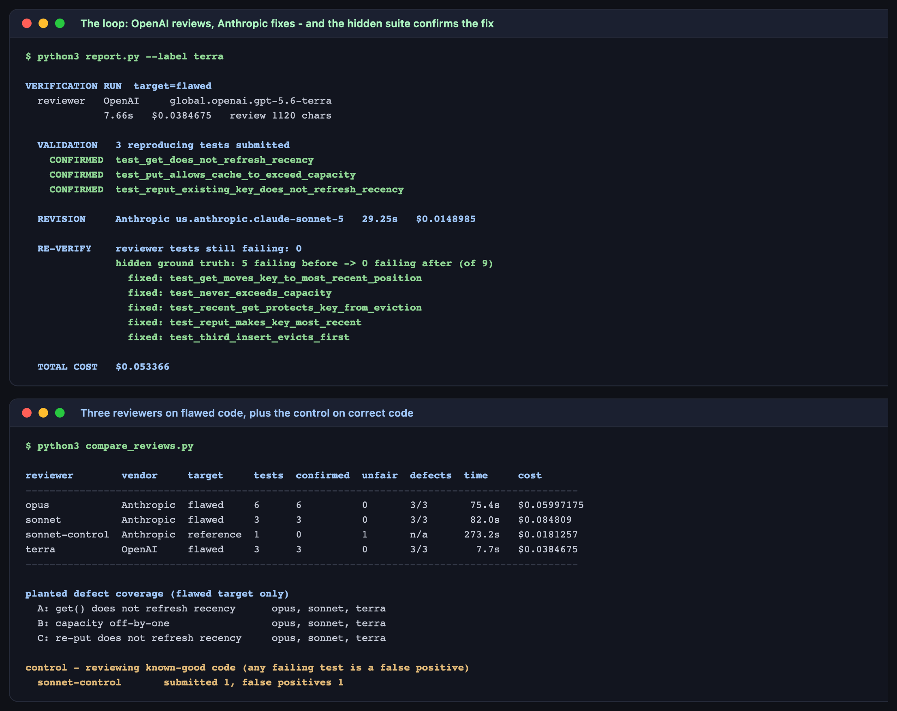

# Lab 3B — Cross-Model Verification System

**Maps to:** Module 3, *"Designing collaborative AI systems with cross-model verification"*
**Duration:** ~75 minutes
**Prerequisite:** Lab 1 (working OpenCode + Bedrock setup with a `pytest` virtualenv)
**Status:** Tested end-to-end on macOS (Darwin 25.5.0) against live AWS Bedrock. Every finding,
timing and cost below came from real runs — including a result that contradicts the usual pitch
for cross-vendor review.

---

## 1. Lab Overview & Objectives

Asking a second model to review the first one's code is easy. The hard part is the question nobody
asks: **how do you know the review is right?**

A model handed code and asked "what's wrong with this?" will find something. It is fluent,
confident, and unfalsifiable. Accepting that output is not verification — it is a second opinion
you have no way to check.

This lab builds a verification system where **every claimed defect must ship a failing test**. The
harness then runs each of those tests twice: once against the flawed module, once against a known-
correct reference. A finding counts only if it **fails the first and passes the second**. Anything
else — a test that fails on correct code, or one that reproduces nothing — is rejected
automatically.

You will run that loop with reviewers from two vendors, fix the confirmed defects with a third
call, and confirm the fix against a hidden ground-truth suite no model ever sees.

**Learning objectives — by the end of this lab you will be able to:**

1. Build a generate → critique → revise → re-verify loop across models from different vendors.
2. Make a review falsifiable by requiring a reproducing test with every finding, and explain why
   an unprovable claim is worse than a missed one.
3. Automatically separate a confirmed defect from a confident-sounding false positive.
4. Judge, on evidence rather than vendor marketing, what a second model actually adds.

> **The result that made this lab more interesting than planned:** all three reviewers — one
> OpenAI, two Anthropic — found all three planted defects, and none of the 12 submitted tests was
> a false positive. Cross-vendor did **not** out-find same-vendor. What varied was cost and
> latency. The value came from the harness, not the vendor.

---

## 2. Prerequisites & Environment Setup

### 2.1 From Lab 1

- OpenCode installed (tested `1.18.27`)
- Bedrock access for `claude-sonnet-5`, `claude-opus-5` and `openai.gpt-5.6-terra`
- The Lab 1 virtualenv with `pytest`

```bash
export AWS_REGION=<YOUR_AWS_REGION>
export AWS_PROFILE=<YOUR_AWS_PROFILE>
opencode models | grep -E "claude-sonnet-5|claude-opus-5|gpt-5\.6-terra"
```

**Expected output — three lines.**

### 2.2 Lab directory

```bash
mkdir -p lab-3b-cross-verification/{tests,reviews,.sandbox,.reference}
cd lab-3b-cross-verification
cp ../opencode.json . && cp ../opencode.json .sandbox/
```

Every model call runs with `--dir .sandbox` — an empty directory. In plan mode a model can read
files, and a reviewer that can read `tests/test_hidden.py` is not reviewing, it is copying.

### 2.3 Cost and time

Four model calls (three reviews, one revision): about **4 minutes** and **$0.20** of real Bedrock
spend. The full loop with a single reviewer costs **$0.053**.

---

## 3. Architecture


*Vector version: [`lab-3b-architecture.svg`](artifacts/lab-3b/diagrams/lab-3b-architecture.svg)*

```
SPEC.md  +  lru_cache.py (3 planted defects)
   │
   ▼
1 CRITIQUE   reviewer model reads spec + code
   │         returns  ## Findings  +  a pytest file of reproducing tests
   ▼
2 VALIDATE   run each submitted test in an isolated temp dir, twice:
   │
   │            against lru_cache.py (flawed)      → a real defect FAILS
   │            against .reference/lru_cache.py    → a fair test PASSES
   │
   │         CONFIRMED   = fails flawed  AND  passes reference
   │         UNFAIR      = fails both        → the reviewer's test is wrong
   │         NO DEFECT   = passes flawed     → reproduced nothing
   ▼
3 REVISE     fixer model gets the code + only the CONFIRMED findings
   │         returns the corrected module
   ▼
4 RE-VERIFY  reviewer's tests + tests/test_hidden.py (never shown to any model)
   │
   ▼
   reviews/<label>/{review.md, test_review.py, lru_cache_fixed.py, report.json}   ★
```

**The one idea to take away:** the reviewer is not trusted. It is *tested*. Requiring a
reproducing test converts an opinion into something the harness can check without a human reading
a word of the review.

---

## 4. Step-by-Step Instructions

### Step 1 — Write the specification

**Why:** A review needs a contract to review against. "Does this look right?" produces style notes;
"does this satisfy rule 5?" produces defects.

[`SPEC.md`](lab-3b-cross-verification/SPEC.md) defines an `LRUCache` with seven numbered contract
rules. The three that matter here:

> 3. **`get` counts as a use.** A successful `get` makes that key the most recently used.
> 4. **`put` counts as a use.** Storing a key — new or already present — makes it most recently used.
> 5. The cache never holds more than `capacity` entries.

Numbering the rules is not cosmetic. It gives the reviewer something specific to cite and gives you
something specific to check the citation against.

### Step 2 — Plant the defects

**Why:** If the starter might be correct, the lab might produce nothing, and you cannot tell a
reviewer that missed a bug from one that had nothing to find. Planting known defects makes the
exercise deterministic — and gives you ground truth.

[`lru_cache.py`](lab-3b-cross-verification/lru_cache.py) contains three:

| | Defect | Effect |
|---|---|---|
| **A** | `get()` returns the value without touching `_order` | LRU silently degrades to FIFO |
| **B** | `put()` evicts on `if len(self._order) > self.capacity` | cache holds `capacity + 1` entries |
| **C** | re-putting an existing key returns early without refreshing recency | stale recency on updates |

All three are the kind that survive review: the code reads naturally, the docstrings are accurate,
and capacity validation is genuinely correct. **Nothing is obviously broken.**

### Step 3 — Write the hidden ground truth

**Why:** You need an answer key that no model can see, to check both the reviewer's claims and the
fix.

[`tests/test_hidden.py`](lab-3b-cross-verification/tests/test_hidden.py) has 9 tests: 4 covering
behaviour the flawed module already gets right, and 5 targeting the planted defects.

Run it against the starter:

```bash
../.venv/bin/python -m pytest tests/test_hidden.py -q
```

**Expected output:**

```
5 failed, 4 passed in 0.03s
```

**That 4-passed number is the point of the exercise.** A module failing everything looks broken. A
module passing its basic round-trips, its capacity validation and its value updates looks healthy —
and is not. That is the code review actually has to catch.

Confirm the reference is genuinely correct before trusting it as the validator:

```bash
cp lru_cache.py /tmp/flawed.py && cp .reference/lru_cache.py lru_cache.py
../.venv/bin/python -m pytest tests/test_hidden.py -q      # 9 passed
cp /tmp/flawed.py lru_cache.py
```

### Step 4 — Write the review prompt that demands proof

**Why:** This single instruction is what turns a chat response into a verification system.

The core of [`verify.py`](lab-3b-cross-verification/verify.py):

```python
REVIEW_TEMPLATE = """You are the VERIFIER. ...

Review the code against every numbered rule in the contract. For each defect you
find, you must provide a pytest test that REPRODUCES it - a test that fails on the
code above and would pass on a correct implementation.

Return exactly two things:

1. A markdown section `## Findings` ...
2. A single fenced ```python block containing a complete pytest file. ...

Do not rewrite the module. Do not fix anything. Only find and prove defects.
Claim a defect only if your test demonstrates it - an unprovable claim is worse
than a missed one."""
```

The last sentence changes the incentive. Without it, a reviewer is rewarded for sounding thorough.
With it, an unprovable claim costs the reviewer credibility — and the harness will catch it.

Every call in this lab — reviewer and fixer alike — reaches Bedrock through the OpenCode CLI, the
same way as every other lab in this course:

```python
subprocess.run(
    ["opencode", "run", "--dir", str(SANDBOX), "--agent", "plan",
     "--model", model, "--format", "json", prompt],
    capture_output=True, text=True, timeout=timeout)
```

Swapping vendors is the `--model` argument and nothing else. That is what makes the cross-vendor
comparison in Step 7 a fair one: identical harness, identical prompt, identical parsing — only the
model id changes.

### Step 5 — Build the validator

**Why:** The reviewer's tests are themselves unverified code. Running them against the flawed module
alone tells you nothing: a test asserting `2 + 2 == 5` also fails.

```python
def classify(all_tests, failed_flawed, failed_reference):
    """CONFIRMED = fails on the flawed module AND passes on the correct one."""
    confirmed = sorted(failed_flawed - failed_reference)
    unfair    = sorted(failed_flawed & failed_reference)   # fails on correct code too
    nothing   = sorted(all_tests - failed_flawed)          # reproduced no defect
    return {"confirmed": confirmed, "unfair_tests": unfair, "no_defect_shown": nothing}
```

Each run happens in a fresh temp directory with the module copied in as `lru_cache.py`, so the two
runs cannot contaminate each other.

### Step 6 — Run the cross-vendor loop

**Why:** This is the deliverable: an OpenAI model reviewing code, an Anthropic model fixing it, and
a hidden suite confirming the result.

```bash
../.venv/bin/python verify.py --reviewer terra --fixer sonnet
```

**Expected output:**

```
[1/4] critique   OpenAI / global.openai.gpt-5.6-terra
      wrote review.md + test_review.py   7.7s  $0.0384675
[2/4] validate   running the reviewer's tests against flawed + reference
      3 tests submitted   CONFIRMED 3   unfair 0   no-defect 0
        confirmed: test_get_does_not_refresh_recency
        confirmed: test_put_allows_cache_to_exceed_capacity
        confirmed: test_reput_existing_key_does_not_refresh_recency
[3/4] revise     Anthropic / us.anthropic.claude-sonnet-5
      wrote lru_cache_fixed.py   29.2s  $0.0148985
[4/4] re-verify  reviewer's tests + the hidden ground-truth suite
      reviewer tests still failing: 0
      hidden suite: 5 failing before -> 0 failing after  (of 9)
```



Read `reviews/terra/review.md`. The findings cite the contract rule **and** the expression at fault:

> 1. Contract rule 3: `return self._data[key]` in `get` returns without moving a successful lookup
>    to most-recently-used.
> 3. Contract rule 5: `if len(self._order) > self.capacity:` checks capacity before insertion with
>    `>` rather than evicting when the new entry would exceed capacity.

That is a review you can act on without re-deriving the analysis yourself.

### Step 7 — Compare reviewers, and read the result honestly

**Why:** The reason to do cross-model verification is usually stated as "another vendor catches
what yours misses." Test it rather than assuming it.

```bash
../.venv/bin/python verify.py --reviewer sonnet --no-revise
../.venv/bin/python verify.py --reviewer opus   --no-revise
../.venv/bin/python compare_reviews.py
```

**Expected output:**

```
reviewer        vendor     target     tests  confirmed  unfair  defects  time     cost
--------------------------------------------------------------------------------------------
opus            Anthropic  flawed     6      6          0       3/3       75.4s   $0.05997175
sonnet          Anthropic  flawed     3      3          0       3/3       82.0s   $0.084809
terra           OpenAI     flawed     3      3          0       3/3        7.7s   $0.0384675

planted defect coverage (flawed target only)
  A: get() does not refresh recency      opus, sonnet, terra
  B: capacity off-by-one                 opus, sonnet, terra
  C: re-put does not refresh recency     opus, sonnet, terra
```

**Three things to take from this table, one of which is inconvenient.**

**The inconvenient one: cross-vendor added no findings.** Every reviewer found every defect. If
your argument for a second vendor is "it catches bugs the first cannot," this task does not support
it. Say so, and go looking for a task that does, rather than repeating the claim.

**What did differ was price and latency.** Terra produced the same three confirmed findings in
**7.7s for $0.0385** against Sonnet's **82.0s for $0.0848** — the same result, 10× faster and 2.2×
cheaper. For a check you intend to run on every pull request, that is the number that decides
whether it happens at all.

**Zero false positives out of 12 submitted tests.** Not one test failed against the correct
reference. Asked to prove their claims, none of the three models invented a defect. That is the
strongest result here, and it is a property of the *harness*: the requirement to submit a
reproducing test suppressed the hallucinated finding before it reached a human.

**So the honest conclusion is not "use another vendor". It is: design the verification harness
first, then choose the model on cost and latency.**

### Step 8 — Run the control: review code that is already correct

**Why:** Every reviewer above found real defects. That tells you they can find bugs. It does not
tell you whether they *invent* them — and a reviewer that manufactures findings on clean code will
waste more engineering time than it saves. Point one at the correct implementation and see.

```bash
../.venv/bin/python verify.py --reviewer sonnet --target reference --label sonnet-control --timeout 540
```

**Expected output:**

```
[1/4] critique   Anthropic / us.anthropic.claude-sonnet-5
      wrote review.md + test_review.py   273.2s  $0.0181257
[2/4] validate   running the reviewer's tests against flawed + reference
      1 tests submitted   CONFIRMED 0   unfair 1   no-defect 0
        UNFAIR (fails on correct code too): test_init_accepts_bool_true_as_valid_positive_integer_capacity
      CONTROL: reviewing known-good code. 1 of 1 submitted tests fail on correct code = false positives
```

**This is the most interesting result in the lab, and it is not the one you would predict.**

First, the reviewer refused to pad. From `reviews/sonnet-control/review.md`:

> I verified rules 2–7 hold under extensive fuzzing and found no provable defect in `get`, `put`,
> eviction, `__len__`, or `keys_in_lru_order` — I'm not claiming issues there since I cannot
> demonstrate a failing case.

Six of seven rules: examined, nothing claimed. That is the behaviour the "an unprovable claim is
worse than a missed one" instruction was written to produce.

Second, its single claim was **not stupid**. It argued that rule 1 — *"capacity must be a positive
integer"* — should accept `LRUCache(True)`, because in Python `bool` is a subclass of `int`:

```bash
python3 -c "print(isinstance(True, int))"     # True
```

The reference explicitly rejects bools, so the harness ran the test, saw it fail against correct
code, and labelled it a false positive. **Mechanically that is right. Substantively, the reviewer
found a genuine hole in the specification** — rule 1 does not say whether `True` counts as a
positive integer, and two careful engineers would disagree.

So read the `unfair` column carefully. It does not mean *the reviewer was wrong*. It means *the
claim could not be proven against the reference*, and the cause is sometimes an ambiguous spec
rather than a hallucinating model. Here the verification loop earned its keep twice: it stopped an
unproven claim from being auto-accepted as a defect, and it surfaced a specification gap that no
amount of testing the implementation would have found.

Note also the cost of thoroughness: reviewing correct code took **273 seconds** against 82 for the
flawed module. Finding nothing is harder than finding something.

---

## 5. Validation / Verification

```bash
../.venv/bin/python -c "
import json
from pathlib import Path

r = json.loads(Path('reviews/terra/report.json').read_text())
v = r['validation']

assert r['reviewer']['vendor'] != r['revision']['vendor'], 'reviewer and fixer must differ'
print(f\"[1/4] OK: cross-vendor loop - {r['reviewer']['vendor']} reviewed, \"
      f\"{r['revision']['vendor']} fixed\")

assert len(v['confirmed']) >= 3, f\"expected 3+ confirmed defects, got {len(v['confirmed'])}\"
assert len(v['unfair_tests']) == 0, 'a reviewer test failed against correct code'
print(f\"[2/4] OK: {len(v['confirmed'])} defects confirmed, \"
      f\"{len(v['unfair_tests'])} false positives\")

rq = r['reverify']
assert len(rq['reviewer_tests_still_failing']) == 0, 'the fix did not satisfy the reviewer'
print('[3/4] OK: every reproducing test passes on the revised module')

assert len(rq['hidden_failing_before']) == 5, 'ground truth should start at 5 failures'
assert len(rq['hidden_failing_after']) == 0, 'the fix did not clear the hidden suite'
print(f\"[4/4] OK: hidden ground truth {len(rq['hidden_failing_before'])} failing before -> \"
      f\"{len(rq['hidden_failing_after'])} after, for \${r['total_cost_usd']}\")
"
```

**Expected output:**

```
[1/4] OK: cross-vendor loop - OpenAI reviewed, Anthropic fixed
[2/4] OK: 3 defects confirmed, 0 false positives
[3/4] OK: every reproducing test passes on the revised module
[4/4] OK: hidden ground truth 5 failing before -> 0 after, for $0.053366
```

Note what step 4 proves that step 3 cannot. The reviewer's own tests passing only shows the fix
satisfied *the reviewer*. The hidden suite — which no model has seen — is what shows the fix
satisfied *the specification*.

**You have succeeded when you can answer these from your own run:**

1. Which contract rule did each of your confirmed findings cite, and does the citation hold up when
   you read the code yourself?
2. Did any reviewer submit a test that failed against the reference? What was wrong with it?
3. Your reviewer's tests all pass on the revised module. What would that have proven if the hidden
   suite had still been red?

---

## 6. Troubleshooting Tips

**`reviewer returned no test file`**
The model wrote prose only. The prompt must demand a single fenced Python block containing a
complete pytest file, and say explicitly that unprovable claims do not count.

**Every submitted test lands in `no_defect_shown`**
The reviewer wrote tests that pass on the flawed code — it described defects it did not
reproduce. Check that the code in the prompt is the flawed module and not the reference.

**A test is classified `UNFAIR`**
It failed against the correct reference too, so it is not evidence of a defect. **Read it before
dismissing it.** Sometimes the reviewer misread a rule; sometimes — as in Step 8's control, where
a reviewer argued `LRUCache(True)` should be accepted because `isinstance(True, int)` is `True` —
the claim is defensible and your *specification* is the ambiguous part. The harness is telling you
the claim is unproven against the reference, not that the reviewer is wrong.

**The reviewer returns findings but no test file**
A valid outcome, not an error: a reviewer with nothing to prove has no tests to write. `verify.py`
records this as `reviewer_reported_no_defects` and exits cleanly. If you see it against the
*flawed* module, the reviewer missed everything — investigate the prompt.

**The hidden suite is still red after the revision**
The fixer addressed the reviewer's tests without satisfying the spec — it optimised for the
visible check. This is exactly why the hidden suite exists. Feed the remaining ground-truth
failures back as a second review round.

**A review against correct code runs for a very long time**
Expected — finding nothing is harder than finding something, and the effect is large. Sonnet took
**82s** on the flawed module and **273s** on the correct one. Terra, which reviewed the flawed
module in **7.7s**, exceeded both a 600-second and a 900-second timeout against the reference in
two separate attempts and never returned. Set `--timeout` generously for control runs (540s+), and
do not read a long run as a crash.

**Costs differ from the table**
Expected — prompt-cache warmth varies (Lab 1, Step 3). Compare reviewers within your own session.

---

## 7. Cleanup Steps

No cloud infrastructure, no long-running processes. Nothing to tear down in AWS.

```bash
rm -rf __pycache__ tests/__pycache__ .pytest_cache /tmp/flawed.py
```

**Keep** `reviews/` — the review, its reproducing tests, the corrected module and the report are
the deliverable. **Keep** `lru_cache.py` in its flawed state: it is the starting point, and a
future run needs it broken.

To re-run one reviewer cleanly:

```bash
rm -rf reviews/terra && ../.venv/bin/python verify.py --reviewer terra --fixer sonnet
```

---

## Optional extensions

- **Close the spec hole the control found.** Rule 1 does not say whether `True` is a positive
  integer. Decide, write it into `SPEC.md` explicitly, and re-run the control. The claim that was
  a "false positive" should now be impossible to make — which is what fixing a specification, as
  opposed to arguing with a reviewer, actually looks like.
- **Measure the false-positive rate across vendors.** Step 8 ran the control with one model.
  Run it for each reviewer (`--target reference --timeout 900`) and compare how many unproven
  claims each submits against clean code. That number matters more than defect-detection rate for
  anything you intend to run on every pull request — and note that Terra never returned from this
  condition at all in two attempts.
- **Drop the proof requirement.** Re-run a review asking only for prose findings, then adjudicate
  each claim by hand. Count how many you can actually confirm. The gap between that number and the
  test-backed run is the value of the harness, stated in defects rather than adjectives.
- **Let the reviewer see the fix.** Add a second critique round on `lru_cache_fixed.py`. Does the
  reviewer accept its own earlier findings as resolved, or invent new ones now that the obvious
  defects are gone?
- **Plant a defect no test can reach.** Add a thread-safety or unbounded-memory flaw that a unit
  test cannot demonstrate, and see whether the reviewer reports it — knowing your harness will
  reject it for lack of proof. This is the real limit of test-backed verification, and worth
  knowing before you rely on it.
