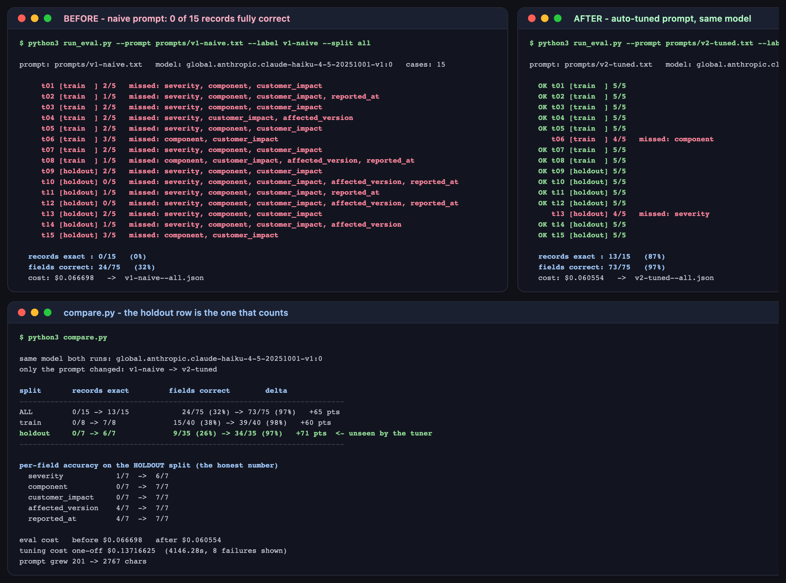

# Lab 3C — Auto-Tuning Prompts for Lower-Tier Models

**Maps to:** Module 3, *"Auto-Tuning: using high-tier models to systematically optimize prompts and extraction schemas for lower-tier models"*
**Duration:** ~60 minutes of work, plus ~50 minutes of unattended eval runs
**Prerequisite:** Lab 1 (working OpenCode + Bedrock setup with a Python virtualenv)
**Status:** Tested end-to-end on macOS (Darwin 25.5.0) against live AWS Bedrock. Every accuracy
figure, cost and residual failure below came from real runs.

---

## 1. Lab Overview & Objectives

The reflex, when a cheap model performs badly, is to reach for a bigger one. This lab tests the
alternative: keep the cheap model and fix the *prompt* — using a high-tier model to do the fixing.

You will build a structured-extraction task where the business rules live in the expected answers
and nowhere else, watch Claude Haiku fail it badly, hand its failures to Claude Opus, and re-run
**the same Haiku** against **the same eval set** with the rewritten prompt.

The measurement that matters is on a **holdout split the tuner never sees**. Without it, "tuning"
is just a high-tier model copying the answer key into the prompt, and the improvement means
nothing.

**Learning objectives — by the end of this lab you will be able to:**

1. Build a scored eval set with a train/holdout split, and explain why the split is what makes an
   improvement claim credible.
2. Use a high-tier model to analyse a weak model's failures and rewrite its prompt or extraction
   schema, without letting it memorise the test cases.
3. Report a before/after accuracy figure that survives scrutiny, distinguishing generalisation
   from overfitting.
4. Decide, with numbers rather than instinct, whether a task needs a better model or a better
   prompt.

> **Headline result from the tested run:** on the 7 holdout cases, the same cheap model went from
> **9/35 fields (26%)** to **34/35 fields (97%)**. Nothing was upgraded. Haiku was never swapped
> for anything larger. The gap was never capability — it was that nobody had told it the rules.

---

## 2. Prerequisites & Environment Setup

### 2.1 From Lab 1

- OpenCode installed (tested `1.18.27`)
- Bedrock model access for `claude-haiku-4-5` **and** `claude-opus-5`
- The Lab 1 virtualenv (only the standard library is used here, but the venv keeps things tidy)

```bash
export AWS_REGION=<YOUR_AWS_REGION>
export AWS_PROFILE=<YOUR_AWS_PROFILE>
opencode models | grep -E "claude-haiku-4-5|claude-opus-5"
```

**Expected output** includes both tiers. This lab uses
`amazon-bedrock/global.anthropic.claude-haiku-4-5-20251001-v1:0` as the cheap worker and
`amazon-bedrock/us.anthropic.claude-opus-5` as the tuner.

### 2.2 Lab directory

```bash
mkdir -p lab-3c-auto-tuning/{prompts,runs,.sandbox}
cd lab-3c-auto-tuning
cp ../opencode.json . && cp ../opencode.json .sandbox/
```

Every call runs with `--dir .sandbox`, an otherwise-empty directory. Plan mode can read files, and
a model that can read `evalset.json` is not being evaluated — it is looking up answers.

### 2.3 Cost and time — read this before you start

| | |
|---|---|
| Baseline eval (15 cases) | ~25 min, **$0.067** |
| Tuning (1 Opus call) | ~69 min, **$0.137** |
| Tuned eval (15 cases) | ~25 min, **$0.061** |
| **Total** | **~2 hours wall clock, $0.27** |

The eval runs are sequential and unattended — start one, go and do something else. The Opus tuning
call in particular took **4,146 seconds**. Set expectations accordingly rather than assuming it has
hung; the troubleshooting section covers how to tell the difference.

---

## 3. Architecture


*Vector version: [`lab-3c-architecture.svg`](artifacts/lab-3c/diagrams/lab-3c-architecture.svg)*

```
evalset.json   15 tickets x 5 fields = 75 scored field checks
   │                8 train  ── the only cases the tuner is ever shown
   │                7 holdout ── never shown to anything but the cheap model
   ▼
1 BASELINE    haiku-4.5 + prompts/v1-naive.txt   ->  runs/v1-naive--all.json
   │
   ▼
2 TUNE        opus-5 reads ONLY the 8 train failures
   │          "state rules, not answers"          ->  prompts/v2-tuned.txt
   ▼
3 RE-RUN      the SAME haiku-4.5, the SAME 15 cases, the SAME scorer
   │                                              ->  runs/v2-tuned--all.json
   ▼
4 COMPARE     train delta  = it learned something
              holdout delta = it learned a RULE          ★ the number that counts
```

**The one control that makes this an experiment:** the tuner is shown 8 failures and forbidden to
restate them. Everything it produces must be a general rule, because it is graded on 7 inputs it
has never seen.

---

## 4. Step-by-Step Instructions

### Step 1 — Build the eval set, with a holdout split

**Why:** An eval set without a holdout can only tell you that tuning happened, not that it worked.

Each case is a free-text support ticket plus the exact structured record it should produce.
[`evalset.json`](lab-3c-auto-tuning/evalset.json) has 15, tagged `train` or `holdout`:

```json
{
  "id": "t03",
  "split": "train",
  "input": "sev2 - SSO token refresh intermittently 401s on release 3.1. Internal staff only for now.",
  "expected": {
    "severity": "high",
    "component": "auth",
    "customer_impact": false,
    "affected_version": "3.1",
    "reported_at": null
  }
}
```

**The rules live in the expected answers, not in any prompt.** `sev2` maps to `high`. "SSO token
refresh" collapses to the enum value `auth`. "Internal staff only" means `customer_impact` is
`false`. "release 3.1" normalises to a bare `3.1`. No date is stated, so `reported_at` is `null`
rather than a guess.

Discovering and encoding those rules is precisely the work this lab automates.

### Step 2 — Write the naive prompt

**Why:** The baseline has to be a prompt a competent engineer would plausibly write on a first
pass — not a strawman.

```bash
cat > prompts/v1-naive.txt << 'EOF'
Extract the following fields from the support ticket below and return them as JSON:
severity, component, customer_impact, affected_version, reported_at.

Return only the JSON object.

Ticket:
{ticket}
EOF
```

201 characters. It names the fields and asks for JSON. It says nothing about enum vocabularies,
how to normalise a severity label, whether `customer_impact` is a boolean or a description, or how
to represent an absent value — because a first draft rarely does.

### Step 3 — Score the baseline

**Why:** You cannot claim an improvement without a number to improve on, and the scorer must be
fixed before you see any results.

[`run_eval.py`](lab-3c-auto-tuning/run_eval.py) calls the cheap model once per case through the
OpenCode CLI, exactly as every other lab in this course does:

```python
subprocess.run(
    ["opencode", "run", "--dir", str(SANDBOX), "--agent", "plan",
     "--model", CHEAP, "--format", "json", prompt],
    capture_output=True, text=True, timeout=timeout)
```

It scores **exact match per field** — 5 fields × 15 cases = 75 independent checks — and separately
counts records where all five are right.

```bash
../.venv/bin/python run_eval.py --prompt prompts/v1-naive.txt --label v1-naive --split all
```

**Expected output:**

```
     t01 [train  ] 2/5   missed: severity, component, customer_impact
     t02 [train  ] 1/5   missed: severity, component, customer_impact, reported_at
     ...
     t15 [holdout] 3/5   missed: component, customer_impact

  records exact : 0/15   (0%)
  fields correct: 24/75   (32%)
  cost: $0.066698   ->  v1-naive--all.json
```

**Zero records fully correct.** Now look at what it actually produced, because the *shape* of the
failure is what the tuner will work from:

```bash
python3 -c "
import json
d = json.load(open('runs/v1-naive--all.json'))
r = d['results'][0]
print('got     :', json.dumps(r['got']))
print('expected:', json.dumps(r['expected']))
"
```

**Expected output:**

```
got     : {"severity": "P1", "component": "checkout", "customer_impact": "payments failing", ...}
expected: {"severity": "critical", "component": "billing", "customer_impact": true, ...}
```

Haiku is not being stupid. It echoed the ticket's own severity label, invented a sensible-sounding
component name, and put a *description* in a field the schema wanted as a boolean. Every one of
those is a reasonable reading of a prompt that never said otherwise.

### Step 4 — Tune the prompt, with the holdout withheld

**Why:** This is the step that separates auto-tuning from cheating.

[`tune.py`](lab-3c-auto-tuning/tune.py) sends Opus the current prompt and the **train failures
only**, with two hard constraints:

```python
# TRAIN ONLY. The holdout split is the honesty check and must stay unseen.
train = [r for r in run["results"] if r["split"] == "train"]
failures = [r for r in train if not r["record_exact"]]
```

and, in the prompt to the tuner:

> Do NOT enumerate or restate the specific cases above. This prompt is scored on inputs you have
> not seen, so a lookup table of these examples is worthless. **State rules, not answers.**

```bash
../.venv/bin/python tune.py
```

**Expected output:**

```
tuning with us.anthropic.claude-opus-5 on 8 train failures (8 train cases; holdout withheld) ...
  wrote prompts/v2-tuned.txt  (2767 chars, was 201)  4146.3s  $0.13716625
```

`tune.py` refuses to write a prompt that has lost the `{ticket}` placeholder — a tuner that
rewrites the template into something unrunnable should fail loudly, not silently.

Now verify it generalised rather than memorised:

```bash
grep -c "{ticket}" prompts/v2-tuned.txt
for probe in "checkout is down" "2px off centre" "SSO token refresh" "2.4.0"; do
  echo "leaked '$probe': $(grep -c "$probe" prompts/v2-tuned.txt)"
done
```

**Expected output:** the placeholder appears once, and every leak probe returns `0`. Not one
verbatim string from a training ticket survives into the tuned prompt.

Read what Opus inferred instead:

```
2. component — exactly one of: "api", "auth", "billing", "infra", "search", "ui", "other".
   Classify the functional domain, never copy the ticket's wording (no endpoint paths,
   feature names, or screen names).
   - ui: visual appearance, layout, styling, copy, or client-side rendering — this wins
     over the feature's domain whenever the complaint is about how something looks.

3. customer_impact — JSON boolean true or false. Never a string, never a description.
```

That `ui` tiebreak is the interesting one. Nothing in the task statement says a cosmetic complaint
about an invoice screen is `ui` rather than `billing`; Opus derived that from the failures and
wrote it down as a rule.

### Step 5 — Re-run the same cheap model

**Why:** Change exactly one variable. Same model, same eval set, same scorer, new prompt.

```bash
../.venv/bin/python run_eval.py --prompt prompts/v2-tuned.txt --label v2-tuned --split all
```

**Expected output:**

```
  OK t01 [train  ] 5/5
  ...
     t06 [train  ] 4/5   missed: component
  ...
     t13 [holdout] 4/5   missed: severity
  OK t15 [holdout] 5/5

  records exact : 13/15   (87%)
  fields correct: 73/75   (97%)
  cost: $0.060554   ->  v2-tuned--all.json
```

### Step 6 — Compare, and read the holdout row

**Why:** The train row shows the tuner did something. Only the holdout row shows it learned a rule.

```bash
../.venv/bin/python compare.py
```

**Expected output:**

```
same model both runs: global.anthropic.claude-haiku-4-5-20251001-v1:0
only the prompt changed: v1-naive -> v2-tuned

split       records exact         fields correct        delta
--------------------------------------------------------------------------
ALL         0/15 -> 13/15            24/75 (32%) -> 73/75 (97%)   +65 pts
train       0/8 -> 7/8             15/40 (38%) -> 39/40 (98%)   +60 pts
holdout     0/7 -> 6/7             9/35 (26%) -> 34/35 (97%)   +71 pts  <- unseen by the tuner
--------------------------------------------------------------------------

per-field accuracy on the HOLDOUT split (the honest number)
  severity            1/7  ->  6/7
  component           0/7  ->  7/7
  customer_impact     0/7  ->  7/7
  affected_version    4/7  ->  7/7
  reported_at         4/7  ->  7/7
```



**The holdout gain (+71 points) is larger than the train gain (+60).** The tuned prompt is not
merely fitted to the cases it was shown — it does *better* on the cases it was not. That is what a
genuine rule looks like when it generalises.

The per-field breakdown says where the win came from: the two enum fields, `component` and
`customer_impact`, went from **never** correct to **always** correct. Those are exactly the fields
the naive prompt was silent about.

### Step 7 — Read the two remaining failures before declaring victory

**Why:** 97% is not 100%, and the residue is more informative than the win.

```bash
python3 -c "
import json
d = json.load(open('runs/v2-tuned--all.json'))
for r in d['results']:
    if not r['record_exact']:
        w = [f for f, ok in r['per_field'].items() if not ok]
        print(f\"{r['id']} [{r['split']}] missed {w}\")
        print('  input:', r['input'])
        for f in w:
            print(f\"  {f}: got {json.dumps((r['got'] or {}).get(f))}  \"
                  f\"expected {json.dumps(r['expected'][f])}\")
"
```

**Expected output:**

```
t06 [train] missed ['component']
  input: Nice-to-have: add pagination to the internal admin invoice list. No rush.
  component: got "other"  expected "billing"

t13 [holdout] missed ['severity']
  input: Staging database replica lagging 4h. Internal only, no customer effect. sev2.
  severity: got "medium"  expected "high"
```

**These two fail for completely different reasons, and only one of them is the model's fault.**

**t13 is a genuine lapse.** The tuned prompt states plainly that `sev2` maps to `high`. The rule
was present, unambiguous, and ignored — most likely because "internal only, no customer effect"
pulled the model toward a lower severity. Tuning raised the floor; it did not make a small model
infallible. If this field matters, that is an argument for a validation layer, not a longer prompt.

**t06 is arguably a defect in the ground truth.** "Add pagination to the internal admin invoice
list" is a feature request for back-office tooling. Haiku answered `other`; the eval set demands
`billing`. Opus's own rule said to use `other` only when nothing else plausibly fits — and a
reasonable engineer could score this either way. **The eval set is under-specified here, and the
model is being marked wrong for a judgement call.**

Read your residual failures before blaming the model. In this run, one of the two was the eval
set's fault.

---

## 5. Validation / Verification

```bash
../.venv/bin/python -c "
import json
from pathlib import Path

before = json.loads(Path('runs/v1-naive--all.json').read_text())
after  = json.loads(Path('runs/v2-tuned--all.json').read_text())
tune   = json.loads(Path('runs/tune_meta.json').read_text())

assert before['summary']['model'] == after['summary']['model'], 'the model must not change'
print('[1/4] OK: identical model in both runs -', before['summary']['model'].split('/')[-1])

def hold(run):
    rows = [r for r in run['results'] if r['split'] == 'holdout']
    return sum(r['fields_correct'] for r in rows), len(rows) * 5

bf, bt = hold(before); af, at = hold(after)
assert bt == at and bt == 35
print(f'[2/4] OK: holdout field accuracy {bf}/{bt} ({bf/bt:.0%}) -> {af}/{at} ({af/at:.0%})')

assert af > bf, 'the tuned prompt must beat the naive one on unseen cases'
gain_hold  = (af/at - bf/bt) * 100
tr = lambda run: [r for r in run['results'] if r['split'] == 'train']
gain_train = (sum(r['fields_correct'] for r in tr(after))
              - sum(r['fields_correct'] for r in tr(before))) / 40 * 100
print(f'[3/4] OK: +{gain_hold:.0f} pts on holdout vs +{gain_train:.0f} pts on train '
      f'- generalised, not memorised')

tuned = Path('prompts/v2-tuned.txt').read_text()
assert tuned.count('{ticket}') == 1, 'the tuned prompt lost its placeholder'
leaks = [c['input'][:24] for c in json.loads(Path('evalset.json').read_text())
         if c['split'] == 'train' and c['input'][:24] in tuned]
assert not leaks, f'training cases leaked into the prompt: {leaks}'
print(f'[4/4] OK: no training case text in the tuned prompt; tuning cost \${tune[\"cost_usd\"]}')
"
```

**Expected output:**

```
[1/4] OK: identical model in both runs - global.anthropic.claude-haiku-4-5-20251001-v1:0
[2/4] OK: holdout field accuracy 9/35 (26%) -> 34/35 (97%)
[3/4] OK: +71 pts on holdout vs +60 pts on train - generalised, not memorised
[4/4] OK: no training case text in the tuned prompt; tuning cost $0.13716625
```

Check 3 is the one worth understanding. If the holdout gain were far *smaller* than the train
gain, the tuner would have fitted the cases it was shown and you would have learned nothing about
unseen input. Here the holdout gain is larger.

**You have succeeded when you can answer these from your own run:**

1. Which rule in your tuned prompt fixed the `customer_impact` field, and could you have written
   it yourself without seeing the failures?
2. Your holdout gain — is it bigger or smaller than your train gain, and what would each imply?
3. Of your residual failures, how many are the model's fault and how many are your eval set's?

---

## 6. Troubleshooting Tips

**A run appears to hang**
It probably has not. A single Haiku extraction call took **60–100 seconds** in testing, so a
15-case eval takes ~25 minutes, and the Opus tuning call took **4,146 seconds** (69 minutes). For
comparison, a trivial `opencode run` returns in about 8 seconds — the latency here is the task, not
the harness. Run evals in the background and raise `--timeout` rather than killing them.

**`tuner returned no fenced prompt block`**
Opus explained its reasoning instead of emitting the prompt. Its raw reply is saved to
`runs/tuner-raw.md` so you can see what happened without paying for the call twice.

**`ERROR: tuned prompt lost the {ticket} placeholder`**
The tuner rewrote the template into something with nowhere to put the input. `tune.py` refuses to
write it. Re-run; if it recurs, strengthen the "keep the literal placeholder exactly once"
instruction.

**Accuracy barely moves after tuning**
Check the tuner actually saw failures — `runs/tune_meta.json` records `train_failures_shown`. If
that is 0, your baseline was already passing the train split and there was nothing to learn from.
Make the eval set harder or move harder cases into `train`.

**Holdout gain is much smaller than train gain**
That is overfitting, and the split has done its job by revealing it. The usual cause is a tuner
that smuggled the specific cases into the prompt despite the instruction — grep the tuned prompt
for input fragments, as in Step 4.

**Scores differ from the numbers in this document**
Expected. These are live model calls, not fixtures. The claim to reproduce is the *shape* —
enum-discipline fields improving dramatically, holdout tracking train — not the exact 97%.

---

## 7. Cleanup Steps

No cloud infrastructure and no long-running processes. Nothing to tear down in AWS.

```bash
rm -rf __pycache__ .pytest_cache
```

**Keep** `prompts/v1-naive.txt`, `prompts/v2-tuned.txt` and both files in `runs/` — the pair of
prompts and the pair of scored runs *are* the deliverable, and the before/after claim is not
auditable without them.

To re-tune from scratch without re-running the baseline:

```bash
rm -f prompts/v2-tuned.txt && ../.venv/bin/python tune.py
```

---

## Optional extensions

- **Fix the eval set, not the model.** Decide what `component` should be for an internal admin
  feature request, write it into the expected answers, and re-run. Does t06 now pass — and did
  changing the ground truth change any other score? This is what maintaining an eval set actually
  feels like.
- **Tune a second round.** Feed the two residual failures back through `tune.py` to produce a v3.
  Watch whether holdout accuracy improves, plateaus, or *drops* as the prompt grows — the point at
  which extra instruction starts costing accuracy is worth finding on a task you control.
- **Swap the cheap model, keep the prompt.** Run `v2-tuned.txt` against `gpt-5.6-terra` without
  re-tuning. How much of the gain was a general rule, and how much was fitted to Haiku's
  particular habits?
- **Price the alternative.** Run the naive prompt against a *larger* model and compare accuracy and
  cost against tuned-Haiku. If tuned-Haiku wins on both, you have the concrete version of this
  lab's argument to take to your team — and if it does not, you have found a task where the model
  genuinely was the constraint.
