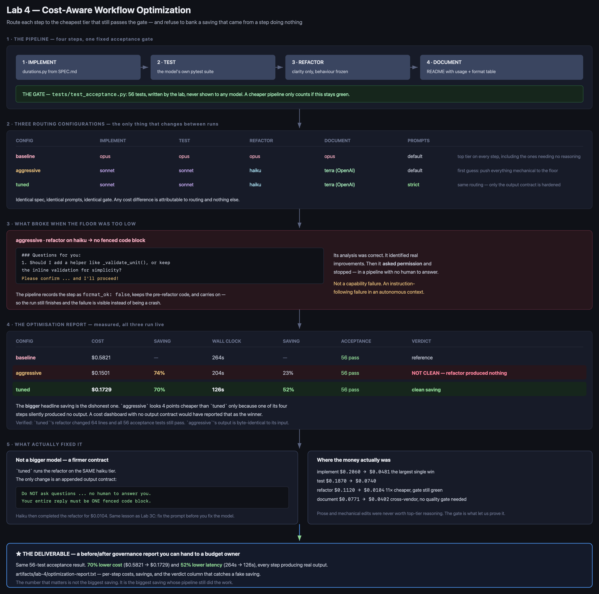
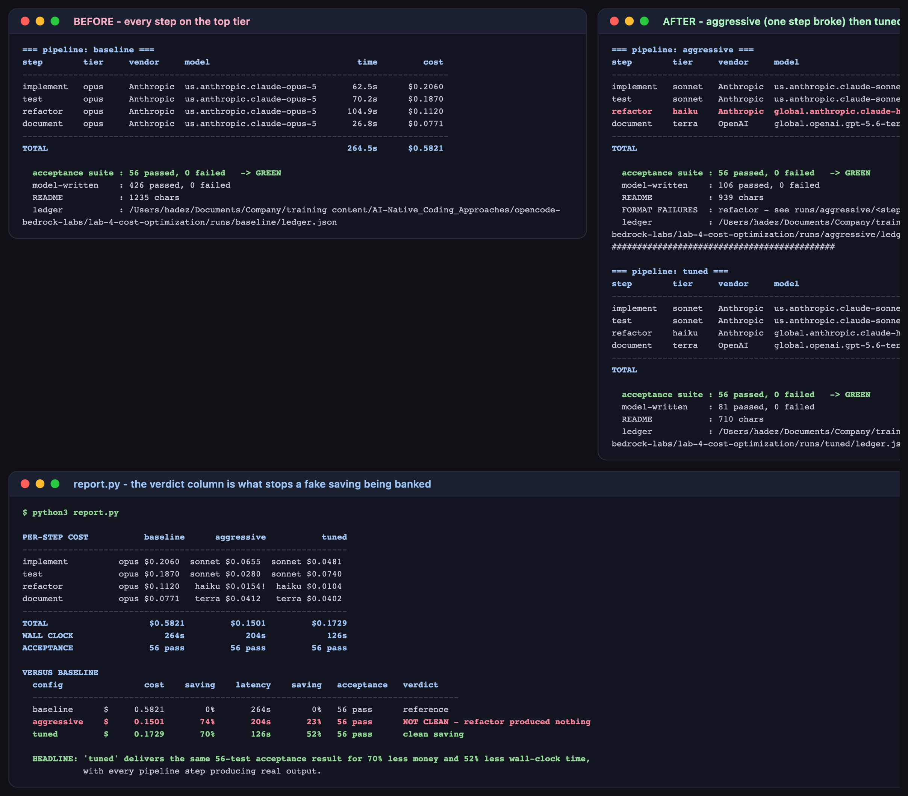

# Lab 4 — Cost-Aware Workflow Optimization

**Maps to:** Module 4, *Enterprise Cost, Governance, and Best Practices*
**Duration:** ~90 minutes
**Prerequisite:** Lab 1 (working OpenCode + Bedrock setup with a `pytest` virtualenv)
**Status:** Tested end-to-end on macOS (Darwin 25.5.0) against live AWS Bedrock. Every cost,
timing and failure below came from real runs — including a first optimisation attempt that broke a
step and still reported the *largest* saving.

---

## 1. Lab Overview & Objectives

Most AI-assisted pipelines are over-provisioned by default: someone picked the best model during
prototyping, it worked, and nothing was ever revisited. Writing a README does not need the same
reasoning tier as satisfying a nine-rule contract, but it usually gets it.

You will build a four-step pipeline — implement, test, refactor, document — run it entirely on the
top tier to establish a baseline, then selectively downgrade steps and measure what that actually
costs you. A fixed acceptance suite the models never see is the constant: **a cheaper pipeline only
counts if the gate stays green.**

Your first optimisation attempt will break a step. That is the interesting part, and the lab is
built around it rather than around a tidy result.

**Learning objectives — by the end of this lab you will be able to:**

1. Instrument a multi-step pipeline so every step reports its own cost, latency and output tokens.
2. Route each step to a model tier independently, and justify each choice against a quality gate
   rather than intuition.
3. Detect a *false* saving — a step that got cheaper because it silently produced nothing — and
   explain why a cost dashboard alone will not catch it.
4. Produce a before/after optimisation report you could hand to a budget owner without
   caveats.

> **Headline result from the tested run:** the same 56-test acceptance result for **70% less
> money** ($0.5821 → $0.1729) and **52% less wall-clock time** (264s → 126s). The step that broke
> was fixed by hardening its prompt, not by moving it back up a tier.

---

## 2. Prerequisites & Environment Setup

### 2.1 From Lab 1

- OpenCode installed (tested `1.18.27`)
- Bedrock access for `claude-opus-5`, `claude-sonnet-5`, `claude-haiku-4-5` and
  `openai.gpt-5.6-terra`
- The Lab 1 virtualenv with `pytest`

```bash
export AWS_REGION=<YOUR_AWS_REGION>
export AWS_PROFILE=<YOUR_AWS_PROFILE>
opencode models | grep -E "claude-opus-5|claude-sonnet-5|claude-haiku-4-5|gpt-5\.6-terra"
```

**Expected output — four tiers across two vendors.** The cross-vendor option matters: the
documentation step has no code gate, which makes it the safest place to leave one vendor entirely.

### 2.2 Lab directory

```bash
mkdir -p lab-4-cost-optimization/{tests,configs,runs,.sandbox}
cd lab-4-cost-optimization
cp ../opencode.json . && cp ../opencode.json .sandbox/
```

Every step runs with `--dir .sandbox`. A model that can read `tests/test_acceptance.py` is not
being gated by it.

### 2.3 Cost and time

| | |
|---|---|
| baseline (4 Opus calls) | ~4.5 min, **$0.58** |
| aggressive (4 mixed calls) | ~3.5 min, **$0.15** |
| tuned (4 mixed calls) | ~2 min, **$0.17** |
| **Total** | **~10 min, $0.91** |

---

## 3. Architecture



*Vector version: [`lab-4-architecture.svg`](artifacts/lab-4/diagrams/lab-4-architecture.svg)*

```
SPEC.md  (9 numbered contract rules for durations.py)
   │
   ▼
1 IMPLEMENT ──> 2 TEST ──> 3 REFACTOR ──> 4 DOCUMENT
   │              │            │              │
   └──── each step's model tier comes from configs/<name>.json ────┘
                              │
                              ▼
          tests/test_acceptance.py — 56 tests, never shown to any model
                              │
          ┌───────────────────┴───────────────────┐
          │  green + every step produced output   │  ->  a real saving
          │  green but a step produced nothing    │  ->  NOT CLEAN
          │  red                                  │  ->  regression
          └───────────────────────────────────────┘
```

**The design decision that matters:** the acceptance suite, the spec and the prompts are identical
across configurations. The *only* variable is which tier runs which step, so any cost difference
between two runs is attributable to routing and nothing else.

---

## 4. Step-by-Step Instructions

### Step 1 — Write the spec and the acceptance gate

**Why:** You cannot safely make a pipeline cheaper without a fixed definition of "still works".

[`SPEC.md`](lab-4-cost-optimization/SPEC.md) defines `durations.py` — `parse_duration` and
`format_duration` — in nine numbered rules covering compound units (`"1h30m"`), bare integers,
case-insensitivity, seven distinct error cases, compact formatting, and a round-trip property.

[`tests/test_acceptance.py`](lab-4-cost-optimization/tests/test_acceptance.py) turns those rules
into **56 parametrised tests**. Verify it is satisfiable before trusting it as a gate:

```bash
cp .reference/durations.py durations.py
../.venv/bin/python -m pytest tests/test_acceptance.py -q    # 56 passed
rm durations.py
```

**Expected output:** `56 passed`. A gate no implementation can pass would make every downgrade
look like a failure.

### Step 2 — Build the pipeline with per-step routing

**Why:** Optimisation requires the routing to be data, not code. If changing a tier means editing
the pipeline, nobody will try five configurations.

[`pipeline.py`](lab-4-cost-optimization/pipeline.py) reads a config, runs four steps, and records
cost and latency for each. Every call goes through the OpenCode CLI, as in every lab in this
course:

```python
subprocess.run(
    ["opencode", "run", "--dir", str(SANDBOX), "--agent", "plan",
     "--model", model_id, "--format", "json", prompt],
    capture_output=True, text=True, timeout=timeout)
```

A config is just a step-to-tier mapping:

```json
{
  "label": "baseline",
  "steps": {
    "implement": "opus", "test": "opus", "refactor": "opus", "document": "opus"
  }
}
```

### Step 3 — Establish the over-provisioned baseline

**Why:** The baseline is not the target. It is the honest starting point most teams are already at
without realising.

```bash
../.venv/bin/python pipeline.py --config configs/baseline.json
```

**Expected output:**

```
=== pipeline: baseline ===
step        tier     vendor     model                             time         cost
------------------------------------------------------------------------------------
implement   opus     Anthropic  us.anthropic.claude-opus-5       62.5s      $0.2060
test        opus     Anthropic  us.anthropic.claude-opus-5       70.2s      $0.1870
refactor    opus     Anthropic  us.anthropic.claude-opus-5      104.9s      $0.1120
document    opus     Anthropic  us.anthropic.claude-opus-5       26.8s      $0.0771
------------------------------------------------------------------------------------
TOTAL                                                           264.5s      $0.5821

  acceptance suite : 56 passed, 0 failed   -> GREEN
  model-written    : 426 passed, 0 failed
  README           : 1235 chars
```

Note the last line of spend: **$0.0771 of top-tier reasoning to write a README.** That is the kind
of line item this lab exists to find.

### Step 4 — Optimise aggressively, and watch a step break

**Why:** The instinct is to push every mechanical step to the cheapest tier available. Do it, and
find out where the floor actually is.

```json
{
  "label": "aggressive",
  "steps": {
    "implement": "sonnet", "test": "sonnet", "refactor": "haiku", "document": "terra"
  }
}
```

```bash
../.venv/bin/python pipeline.py --config configs/aggressive.json
```

**Expected output:**

```
implement   sonnet   Anthropic  us.anthropic.claude-sonnet-5     65.6s      $0.0655
test        sonnet   Anthropic  us.anthropic.claude-sonnet-5    123.1s      $0.0280
refactor    haiku    Anthropic  global.anthropic.claude-haik      8.7s      $0.0154   <- NO FENCED BLOCK
document    terra    OpenAI     global.openai.gpt-5.6-terra       6.8s      $0.0412
------------------------------------------------------------------------------------
TOTAL                                                           204.2s      $0.1501

  acceptance suite : 56 passed, 0 failed   -> GREEN
  FORMAT FAILURES  : refactor - see runs/aggressive/<step>.response.md
```

**Read that carefully. The gate is green, the cost dropped 74% — and the pipeline is broken.**

The refactor step returned no code. `pipeline.py` records `format_ok: false`, keeps the
pre-refactor code, and continues, so the failure is visible rather than a crash. The acceptance
suite still passes because it is testing the *implement* step's output, which was never refactored.

Now look at what Haiku actually said:

```bash
cat runs/aggressive/refactor.response.md
```

**Expected output** — an accurate analysis, then this:

> ### Questions for you:
> 1. Should I add a helper function like `_validate_unit()` to reduce code duplication, or keep
>    the inline validation for performance/simplicity?
>
> Please confirm if these directions align with your refactoring goals, and I'll proceed!

**This is not a capability failure.** Haiku identified real improvements — the naming of the regex
constants, an unclear variable, a redundant length calculation. Then it asked permission and
stopped, in a pipeline with no human to answer it. It is an **instruction-following failure in an
autonomous context**, which is a different problem with a different fix.

### Step 5 — Fix the contract, not the tier

**Why:** The reflex is to move the refactor step back up to Sonnet. Test the cheaper hypothesis
first: the model was never told it was running unattended.

`configs/tuned.json` keeps **exactly the same routing** and sets `"prompt_style": "strict"`, which
appends this to every step's prompt:

```
CRITICAL OUTPUT CONTRACT - you are running inside an automated pipeline with no
human to answer you:
- Do NOT ask questions. Do NOT propose options. Do NOT wait for confirmation.
- Do NOT explain what you plan to do.
- Your entire reply must be ONE fenced code block and nothing outside it.
If you are unsure about a choice, make the most reasonable one and proceed.
```

```bash
../.venv/bin/python pipeline.py --config configs/tuned.json
```

**Expected output:**

```
implement   sonnet   Anthropic  us.anthropic.claude-sonnet-5     42.9s      $0.0481
test        sonnet   Anthropic  us.anthropic.claude-sonnet-5     63.8s      $0.0740
refactor    haiku    Anthropic  global.anthropic.claude-haik     12.9s      $0.0104
document    terra    OpenAI     global.openai.gpt-5.6-terra       6.6s      $0.0402
------------------------------------------------------------------------------------
TOTAL                                                           126.2s      $0.1729

  acceptance suite : 56 passed, 0 failed   -> GREEN
```

No format failure. **The same Haiku tier completed the refactor for $0.0104** — eleven times
cheaper than Opus did it. Confirm it did real work rather than echoing its input:

```bash
diff runs/tuned/durations.impl.py runs/tuned/durations.py | grep -c '^[<>]'
diff -q runs/aggressive/durations.impl.py runs/aggressive/durations.py
```

**Expected output:** `64` changed lines for `tuned`; `aggressive`'s files are identical, because
its refactor genuinely did nothing.

This is the same lesson as Lab 3C from the other direction: **before concluding a cheap model is
not capable enough, check whether it was told clearly enough.**

### Step 6 — Produce the optimisation report

**Why:** The deliverable is not a cheaper pipeline. It is a document that survives a budget
owner asking "and nothing got worse?"

[`report.py`](lab-4-cost-optimization/report.py) joins the three ledgers, and refuses to present a
saving as clean when a step failed its output contract:

```python
if fails:
    verdict = f"NOT CLEAN - {','.join(fails)} produced nothing"
elif l["acceptance"]["green"]:
    verdict = "clean saving"
```

```bash
../.venv/bin/python report.py
```

**Expected output:**

```
PER-STEP COST           baseline      aggressive           tuned
----------------------------------------------------------------
implement          opus $0.2060  sonnet $0.0655  sonnet $0.0481
test               opus $0.1870  sonnet $0.0280  sonnet $0.0740
refactor           opus $0.1120   haiku $0.0154!  haiku $0.0104
document           opus $0.0771   terra $0.0412   terra $0.0402
----------------------------------------------------------------
TOTAL                    $0.5821         $0.1501         $0.1729
WALL CLOCK                  264s            204s            126s
ACCEPTANCE               56 pass         56 pass         56 pass

VERSUS BASELINE
  config                cost    saving    latency    saving   acceptance   verdict
  ------------------------------------------------------------------------------------
  baseline      $     0.5821        0%       264s        0%   56 pass      reference
  aggressive    $     0.1501       74%       204s       23%   56 pass      NOT CLEAN - refactor produced nothing
  tuned         $     0.1729       70%       126s       52%   56 pass      clean saving

  HEADLINE: 'tuned' delivers the same 56-test acceptance result for 70% less money and 52% less
            wall-clock time, with every pipeline step producing real output.
```



**The single most important row is `aggressive`.** It shows the **biggest** headline saving — 74%
against tuned's 70% — and it is the one you must not ship. It is four points cheaper only because
one of its four steps produced nothing. A cost dashboard with no output contract would have
reported it as the winner, and the missing refactor would have been discovered weeks later, by
someone reading code that was supposed to have been cleaned up.

**Where the money actually was:**

| step | baseline | tuned | note |
|---|---|---|---|
| implement | $0.2060 | $0.0481 | largest single win; the gate proves it is safe |
| test | $0.1870 | $0.0740 | |
| refactor | $0.1120 | $0.0104 | **11× cheaper**, gate still green |
| document | $0.0771 | $0.0402 | cross-vendor; no code gate needed for prose |

---

## 5. Validation / Verification

```bash
../.venv/bin/python -c "
import json
from pathlib import Path

L = lambda n: json.loads(Path(f'runs/{n}/ledger.json').read_text())
base, aggressive, tuned = L('baseline'), L('aggressive'), L('tuned')

for name, l in (('baseline', base), ('aggressive', aggressive), ('tuned', tuned)):
    assert l['acceptance']['green'], f'{name} failed the acceptance gate'
print(f\"[1/4] OK: all three configs green on the same {base['acceptance']['passed']}-test gate\")

assert aggressive['format_failures'] == ['refactor'], aggressive['format_failures']
assert not tuned['format_failures'], tuned['format_failures']
print('[2/4] OK: aggressive broke its refactor step; tuned, on the same tier, did not')

impl = Path('runs/tuned/durations.impl.py').read_text()
final = Path('runs/tuned/durations.py').read_text()
assert impl != final, 'the tuned refactor produced no change'
assert Path('runs/aggressive/durations.impl.py').read_text() == \
       Path('runs/aggressive/durations.py').read_text()
print('[3/4] OK: tuned refactored for real; aggressive left the code byte-identical')

cost = (1 - tuned['total_cost_usd'] / base['total_cost_usd']) * 100
lat  = (1 - tuned['total_elapsed_s'] / base['total_elapsed_s']) * 100
assert cost > 50 and lat > 0
print(f'[4/4] OK: clean saving of {cost:.0f}% cost and {lat:.0f}% latency, gate unchanged')
"
```

**Expected output:**

```
[1/4] OK: all three configs green on the same 56-test gate
[2/4] OK: aggressive broke its refactor step; tuned, on the same tier, did not
[3/4] OK: tuned refactored for real; aggressive left the code byte-identical
[4/4] OK: clean saving of 70% cost and 52% latency, gate unchanged
```

Check 3 is the one that does the real work. Checks 1 and 4 would both pass for the broken
`aggressive` config — only comparing the pre- and post-refactor files proves the step happened.

**You have succeeded when you can answer these from your own run:**

1. Which step in your baseline was the worst value for money, and how did you know?
2. Your aggressive config saved more than your tuned one. Why is that not the config you ship?
3. If your refactor step had *silently produced a slightly worse module* instead of nothing, which
   of your checks would have caught it?

---

## 6. Troubleshooting Tips

**`model returned no fenced block`, and the run stops**
It should not stop — `pipeline.py` records the step as `format_ok: false` and continues. If you
see a traceback instead, you are on an older copy of the script. A downgraded tier that stops
honouring the output contract is a *result*, not a crash.

**Every config reports the same cost**
Check the config actually loaded: `ledger.json` records the `config` block it ran with. A typo in
a tier name raises a `KeyError` against `MODELS` rather than silently falling back.

**A cheap tier keeps asking questions**
Set `"prompt_style": "strict"` in the config. If it still converses, the step genuinely needs a
higher tier — but establish that after hardening the prompt, not before.

**The acceptance suite is green but the README is nonsense**
Expected, and worth sitting with. The gate only covers code. The documentation step has no
automated quality check at all, which is exactly why it is the safest step to move to the cheapest
or a cross-vendor tier — and exactly why you should read its output before shipping.

**Costs differ from the numbers here**
Expected — prompt-cache warmth varies between runs (Lab 1, Step 3), and the models are
non-deterministic. Compare configs **within your own session**. The reproducible claim is the
shape: top tier on mechanical steps is poor value, and a broken step can look like a saving.

**A resumed run shows fewer steps than it should**
`--resume` reuses `durations.impl.py` and `test_generated.py` and skips those steps, so their cost
is not re-billed *and not re-recorded*. Use it for iterating on the later steps; for a ledger you
intend to publish, run the config clean.

---

## 7. Cleanup Steps

No cloud infrastructure and no long-running processes. Nothing to tear down in AWS.

```bash
rm -rf __pycache__ tests/__pycache__ .pytest_cache
```

**Keep** all three directories under `runs/` and their `ledger.json` files — the three-way
comparison *is* the deliverable, and the report cannot be regenerated without them. **Keep**
`runs/aggressive/refactor.response.md` in particular: the failure is more instructive than either
success.

To re-run one config cleanly:

```bash
rm -rf runs/tuned && ../.venv/bin/python pipeline.py --config configs/tuned.json
```

---

## Optional extensions

- **Find the actual floor.** Move `implement` to haiku with strict prompts. Does the 56-test gate
  survive? The step where the gate finally goes red is the real boundary of your pipeline, and it
  is worth knowing rather than guessing.
- **Add a documentation gate.** The README currently has no quality check, which is why it was
  safe to downgrade — and why nothing would catch it becoming useless. Write a check (does it
  mention both functions, and every unit in the format table?) and re-run the cheapest tier
  against it.
- **Model the annual number.** This pipeline runs once here. Multiply the $0.41 per-run saving by
  your team's realistic run count — per PR, per day — and put that figure at the top of the report.
  That is the version a budget owner reads.
- **Test the routing under failure.** Combine this with Lab 1B: what does a cost-optimised pipeline
  do when the cheap tier is rate-limited mid-run? A saving that evaporates under a provider
  incident is a different kind of false economy.
