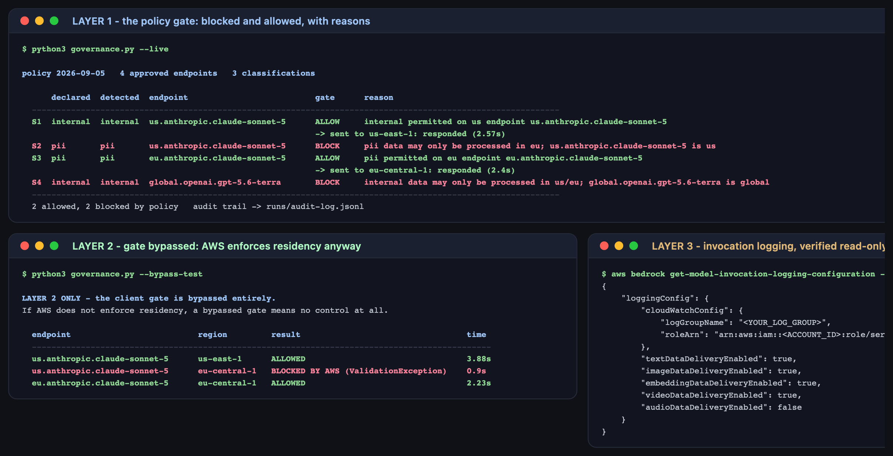

# Lab 4B — Enterprise Governance & Compliance Configuration

**Maps to:** Module 4, *"Leveraging centralized enterprise governance… Navigating data privacy, BAAs, and compliance"*
**Duration:** ~45 minutes
**Prerequisite:** Lab 1 (working AWS credentials with Bedrock access)
**Status:** Tested end-to-end on macOS (Darwin 25.5.0) against live AWS Bedrock. Every allow, block
and error below came from real calls. **No AWS account settings were changed to run this lab** —
see §2.4 for why that constraint made the lab better.

---

## 1. Lab Overview & Objectives

"We only send PII to EU-resident, BAA-covered models" is a sentence in a policy document. This lab
turns it into something you can execute, watch fail, and screenshot.

You will build a policy gate that classifies a payload, decides which model endpoints may process
it, and refuses the non-compliant ones **before any request is sent**. Then you will do the thing
that separates a control from a comment: **bypass your own gate entirely** and check whether AWS
still stops you.

**Learning objectives — by the end of this lab you will be able to:**

1. Express a data-residency and BAA policy as machine-readable configuration, and enforce it in
   front of a model call.
2. Produce an append-only audit trail that records the decision, the reason, and the policy version
   that made it.
3. Distinguish a control you own (advisory) from a control the platform enforces (authoritative),
   and explain why a serious posture needs both.
4. Identify which governance controls genuinely cannot be demonstrated without changing the
   account, and say so rather than faking them.

> **The finding that shapes this lab:** the strongest control here is not the code you write. A
> `us.` inference profile *does not exist* in an EU region — AWS rejects the call whether or not
> your gate ran. Residency is bound to the endpoint identifier itself, which is why it holds when
> your wrapper is bypassed.

---

## 2. Prerequisites & Environment Setup

### 2.1 From Lab 1

- AWS CLI v2 with Bedrock access (tested `2.35.11`)
- Python 3.10+ — standard library only, no installs
- Bedrock model access for `anthropic.claude-sonnet-5` in **both** `us-east-1` and `eu-central-1`

```bash
export AWS_PROFILE=<YOUR_AWS_PROFILE>
aws sts get-caller-identity --query 'Arn' --output text
```

### 2.2 Confirm both regions are reachable

```bash
for r in us-east-1 eu-central-1; do
  printf "%-14s " "$r"
  aws bedrock list-foundation-models --region "$r" --query 'length(modelSummaries)' --output text
done
```

**Expected output:** a model count for each region. If `eu-central-1` errors, request model access
there before continuing — the compliant path in this lab depends on it.

### 2.3 Lab directory

```bash
mkdir -p lab-4b-governance/{configs,runs}
cd lab-4b-governance
```

### 2.4 What this lab deliberately does not do — read this

The obvious way to demonstrate governance is an IAM policy that denies the call. **This lab does
not apply one, for a reason worth understanding.**

The account these labs were tested against uses **root credentials**. An IAM policy cannot restrict
the root user — root is not subject to identity policies attached to itself. Demonstrating an
IAM-based denial requires creating a scoped IAM role or user, or an Organizations SCP: a real,
deliberate change to a live AWS account, which is not something a lab exercise should do to
somebody's environment as a side effect.

So the lab enforces at two layers that need **no account changes at all**, ships the IAM policy as
a reference artifact, and is explicit about the difference. That is the honest shape of this
problem, and it is closer to what you will actually face than a tidy console screenshot.

**Cost:** four short Converse calls, well under **$0.01**.

---

## 3. Architecture


*Vector version: [`lab-4b-architecture.svg`](artifacts/lab-4b/diagrams/lab-4b-architecture.svg)*

```
request payload
   │
   ▼
LAYER 1 — the client gate (governance.py)          ← you own this
   │  classify   regex detectors -> pii | internal
   │  evaluate   residency + BAA rules from policy.json
   │  decide     ALLOW -> send   |   BLOCK -> nothing leaves the process
   │  audit      append-only JSONL, stamped with the policy version
   ▼
LAYER 2 — AWS Bedrock                              ← you do not own this
      a `us.` inference profile does not exist in eu-central-1.
      The call fails even with the gate bypassed entirely.
   ▼
LAYER 3 — account controls
      invocation logging   verified read-only, already enabled
      IAM / SCP            shipped as configs/iam-policy-reference.json, NOT applied
```

---

## 4. Step-by-Step Instructions

### Step 1 — Write the policy as configuration

**Why:** A policy that lives only in prose cannot be tested, versioned, or diffed in a review.

[`configs/policy.json`](lab-4b-governance/configs/policy.json) declares three things: what the
data classifications are, which endpoints exist and where they run, and how to detect each
classification.

```json
"classifications": {
  "internal": { "allowed_residency": ["us", "eu"],  "requires_baa": false },
  "pii":      { "allowed_residency": ["eu"],        "requires_baa": true  }
},
"endpoints": {
  "us.anthropic.claude-sonnet-5": {"region": "us-east-1",    "residency": "us",     "baa": true},
  "eu.anthropic.claude-sonnet-5": {"region": "eu-central-1", "residency": "eu",     "baa": true},
  "global.openai.gpt-5.6-terra":  {"region": "us-east-1",    "residency": "global", "baa": false}
}
```

Note `global.` is treated as its own residency class rather than as "us". A global inference
profile may serve the request from any supported region, so it cannot satisfy a residency
commitment even when you happen to call it from an approved one.

### Step 2 — Build the gate

**Why:** The decision must happen before the payload leaves the process. A control that blocks
*after* the request is a log entry, not a control.

The whole of [`governance.py`](lab-4b-governance/governance.py)'s layer-1 logic:

```python
def classify(text: str) -> str:
    """Lowest-privilege wins: any PII signal classifies the whole payload as PII."""
    for pattern in POLICY["detectors"]["pii"]:
        if re.search(pattern, text):
            return "pii"
    return "internal"


def evaluate(classification: str, endpoint: str) -> tuple[bool, str]:
    rule = POLICY["classifications"].get(classification)
    ep = POLICY["endpoints"].get(endpoint)
    if ep is None:
        return False, f"endpoint {endpoint!r} is not in the approved inventory"
    if ep["residency"] not in rule["allowed_residency"]:
        return False, (f"{classification} data may only be processed in "
                       f"{'/'.join(rule['allowed_residency'])}; {endpoint} is {ep['residency']}")
    if rule["requires_baa"] and not ep["baa"]:
        return False, f"{classification} data requires a BAA-covered endpoint; {endpoint} has none"
    return True, f"{classification} permitted on {ep['residency']} endpoint {endpoint}"
```

Two design choices worth copying. **The default is the stricter class** — an unknown endpoint is
denied rather than allowed, and any PII signal classifies the whole payload. **Every decision
returns a reason**, because "blocked" without a reason produces a ticket, and "blocked because PII
may only be processed in eu" produces a fix.

### Step 3 — Run the policy test

**Why:** This is the deliverable: a blocked request and an allowed request, side by side, from the
same policy.

```bash
python3 governance.py --live
```

**Expected output:**

```
policy 2026-09-05   4 approved endpoints   3 classifications

      declared  detected  endpoint                          gate      reason
  ------------------------------------------------------------------------------------
  S1  internal  internal  us.anthropic.claude-sonnet-5      ALLOW     internal permitted on us endpoint
                                                            -> sent to us-east-1: responded (2.32s)
  S2  pii       pii       us.anthropic.claude-sonnet-5      BLOCK     pii data may only be processed in eu
  S3  pii       pii       eu.anthropic.claude-sonnet-5      ALLOW     pii permitted on eu endpoint
                                                            -> sent to eu-central-1: responded (2.34s)
  S4  internal  internal  global.openai.gpt-5.6-terra       BLOCK     internal data may only be processed in us/eu
  ------------------------------------------------------------------------------------
  2 allowed, 2 blocked by policy   audit trail -> runs/audit-log.jsonl
```

**S2 and S3 are the pair that matters.** Identical payload — a bug report containing an email
address, a date of birth and an SSN. Routed to the US endpoint it is blocked and nothing is sent.
Routed to the EU endpoint it is allowed, sent, and answered in 2.34s.

Now inspect the audit trail:

```bash
python3 -c "
import json
for line in open('runs/audit-log.jsonl'):
    r = json.loads(line)
    if r['layer'] == 1:
        print(f\"{r['scenario']}  {r['detected']:<9}{str(r['allowed']):<7}sent={r['sent']}  {r['reason'][:60]}\")
"
```

**Expected output:** four rows, each stamped with `policy_version` and a UTC timestamp. `sent` is
`false` for both blocked scenarios — the record shows not just that the request was refused, but
that nothing left the process.

### Step 4 — Attack your own control

**Why:** Every gate in this design is code you wrote. Someone who imports the SDK directly is
outside it. Find out what is left when that happens.

```bash
python3 governance.py --bypass-test
```

This ignores `policy.json` completely and calls `aws bedrock-runtime converse` directly.

**Expected output:**

```
LAYER 2 ONLY - the client gate is bypassed entirely.

  endpoint                          region         result                                  time
  ----------------------------------------------------------------------------------------------
  us.anthropic.claude-sonnet-5      us-east-1      ALLOWED                                 3.88s
  us.anthropic.claude-sonnet-5      eu-central-1   BLOCKED BY AWS (ValidationException)    0.9s
  eu.anthropic.claude-sonnet-5      eu-central-1   ALLOWED                                 2.23s
```



**The middle row is the point of the lab.** With your gate removed, AWS still refuses to run a
`us.` inference profile in `eu-central-1`. The residency guarantee is bound to the endpoint
identifier, enforced by the platform, and it required no account configuration from you at all.

That is what makes the control real. Your gate explains *why* a request is refused and costs
nothing to run; AWS is what holds when your gate is not in the path.

### Step 5 — Verify the controls you did not build

**Why:** Governance is not only what you enforce. It is also what you can prove after the fact.

```bash
aws bedrock get-model-invocation-logging-configuration --region us-east-1
```

**Expected output** (identifiers redacted here, and in every captured artifact):

```json
{
  "loggingConfig": {
    "cloudWatchConfig": {
      "logGroupName": "<YOUR_LOG_GROUP>",
      "roleArn": "arn:aws:iam::<ACCOUNT_ID>:role/service-role/<YOUR_LOGGING_ROLE>"
    },
    "textDataDeliveryEnabled": true,
    ...
  }
}
```

If this returns empty, invocation logging is off, and you cannot answer the first question of any
incident: *which model saw that payload, and when?* Your gate's audit log records what **it**
decided; it says nothing about calls that bypassed it. Only Bedrock's own logging covers those.

> **A note on the redaction.** Every captured artifact in `artifacts/lab-4b/` has account IDs, log
> group names and role names replaced with placeholders. A governance lab that leaks the account
> it ran in has failed its own subject.

### Step 6 — Read the control you are not applying

**Why:** Knowing which layer you are missing is part of the posture.

[`configs/iam-policy-reference.json`](lab-4b-governance/configs/iam-policy-reference.json) is the
identity-based control: an allow-list of approved inference-profile ARNs, plus an explicit `Deny`
on any region outside the approved set.

```json
{
  "Sid": "DenyEverythingOutsideApprovedRegions",
  "Effect": "Deny",
  "Action": "bedrock:*",
  "Resource": "*",
  "Condition": {
    "StringNotEquals": { "aws:RequestedRegion": ["us-east-1", "eu-central-1"] }
  }
}
```

**Do not apply this during the lab.** As §2.4 explains, it cannot restrict a root user, and
attaching it to a real role changes a live account. It is here so you can see the shape of the
third layer and take it to whoever owns your IAM.

The three layers, honestly labelled:

| layer | who enforces it | survives a bypass? | tells you *why*? |
|---|---|---|---|
| policy gate (`governance.py`) | you | **no** | **yes**, with a reason string |
| region-bound inference profiles | AWS | **yes** | no — a bare `ValidationException` |
| IAM / SCP (not applied here) | AWS | **yes** | no — `AccessDeniedException` |

---

## 5. Validation / Verification

```bash
python3 -c "
import json, subprocess
from pathlib import Path

log = [json.loads(l) for l in Path('runs/audit-log.jsonl').read_text().splitlines()]
l1 = [r for r in log if r['layer'] == 1]

pii = [r for r in l1 if r['detected'] == 'pii']
assert len(pii) == 2, f'expected 2 PII scenarios, got {len(pii)}'
blocked = [r for r in pii if not r['allowed']]
allowed = [r for r in pii if r['allowed']]
assert len(blocked) == 1 and len(allowed) == 1
print('[1/4] OK: identical PII payload - blocked on the us endpoint, allowed on the eu one')

assert all(not r['sent'] for r in l1 if not r['allowed'])
print('[2/4] OK: nothing was sent for any blocked request')

assert all(r.get('policy_version') for r in log)
print(f\"[3/4] OK: every decision stamped with policy version {log[0]['policy_version']}\")

out = subprocess.run(['aws','bedrock-runtime','converse','--region','eu-central-1',
                      '--model-id','us.anthropic.claude-sonnet-5',
                      '--messages','[{\"role\":\"user\",\"content\":[{\"text\":\"hi\"}]}]',
                      '--inference-config','{\"maxTokens\":5}'],
                     capture_output=True, text=True)
assert out.returncode != 0, 'AWS allowed a us profile in an EU region - residency is NOT enforced'
print('[4/4] OK: with the gate bypassed, AWS still refuses a us profile in eu-central-1')
"
```

**Expected output:**

```
[1/4] OK: identical PII payload - blocked on the us endpoint, allowed on the eu one
[2/4] OK: nothing was sent for any blocked request
[3/4] OK: every decision stamped with policy version 2026-09-05
[4/4] OK: with the gate bypassed, AWS still refuses a us profile in eu-central-1
```

Check 4 is the only one that tests something you do not control. The first three verify your gate
behaved; the fourth verifies the platform would have stopped you regardless.

**You have succeeded when you can answer these from your own run:**

1. Your gate blocked S4 (`internal` → a `global.` endpoint). Would AWS have blocked it too? What
   does your answer imply about which classifications you can enforce technically versus by policy?
2. Someone commits code that calls `bedrock-runtime` directly. Which of your three layers still
   applies, and which of your logs would show it?
3. Your PII detector is four regexes. Name a payload it would misclassify, and decide whether the
   failure mode is safe.

---

## 6. Troubleshooting Tips

**`eu-central-1` returns `AccessDeniedException` rather than answering**
Model access is per-account **and per-region**. Request `anthropic.claude-sonnet-5` in
`eu-central-1` in the Bedrock console. Until then the compliant path in S3 cannot succeed and the
lab has no allowed-PII case.

**The bypass test shows `ALLOWED` for a `us.` profile in an EU region**
Then residency is not enforced the way this lab assumes, and check 4 fails loudly rather than
silently. Verify you passed the `us.`-prefixed profile and not a bare model id — bare ids and
`global.` profiles have different regional behaviour.

**Everything is blocked, including the scenarios that should pass**
Your detector is over-matching. The credit-card pattern `\b(?:\d[ -]*?){13,16}\b` is deliberately
broad and will match long digit runs in ordinary code. Tighten it, and notice that you have just
made a real governance trade-off between false positives and coverage.

**Nothing is blocked**
The detectors never fired. Confirm the payload in S2 still contains the email, DOB and SSN
markers — the point of the scenario is that they are there.

**`get-model-invocation-logging-configuration` returns `{}`**
Logging is not configured. That is a genuine finding about the account rather than a lab error.
Note it, and treat enabling it as a separate, deliberate change with an owner.

---

## 7. Cleanup Steps

**Nothing was created in AWS, so there is nothing to tear down.** That is a deliberate property of
this lab, not an omission — every control demonstrated here is either client-side or already-bound
platform behaviour.

```bash
rm -rf __pycache__
```

**Keep** `runs/audit-log.jsonl` — the audit trail is the artifact an auditor would ask for, and it
is the only record that the blocked requests were never sent. **Keep**
`configs/iam-policy-reference.json` to hand to whoever owns your IAM.

If you re-run and want a clean trail:

```bash
rm -f runs/audit-log.jsonl && python3 governance.py --live
```

---

## Optional extensions

- **Break your own detector.** Write a payload containing personal data that the four regexes miss
  — a name and address in prose, a base64-encoded record, an email split across a string
  concatenation. Then decide: is regex classification the right control, or does it need a model in
  the loop, and what does *that* cost you in latency on every request?
- **Enforce the `global.` rule for real.** Layer 1 blocks `global.` endpoints for internal data,
  but AWS does not. Write the IAM statement that would, and work out what breaks for teams
  legitimately using those models.
- **Wire the gate into Lab 4's pipeline.** Every step there picks a model tier by cost. Add the
  classification check and see which optimisations become non-compliant once residency is a
  constraint — a cheap model in the wrong region is not a saving.
- **Age the policy.** Add a `valid_until` field and make the gate refuse to run against an expired
  policy. An audit trail stamped with a policy version nobody has reviewed in two years is a
  finding in itself.
